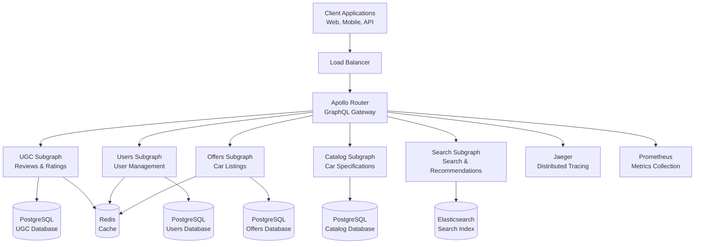
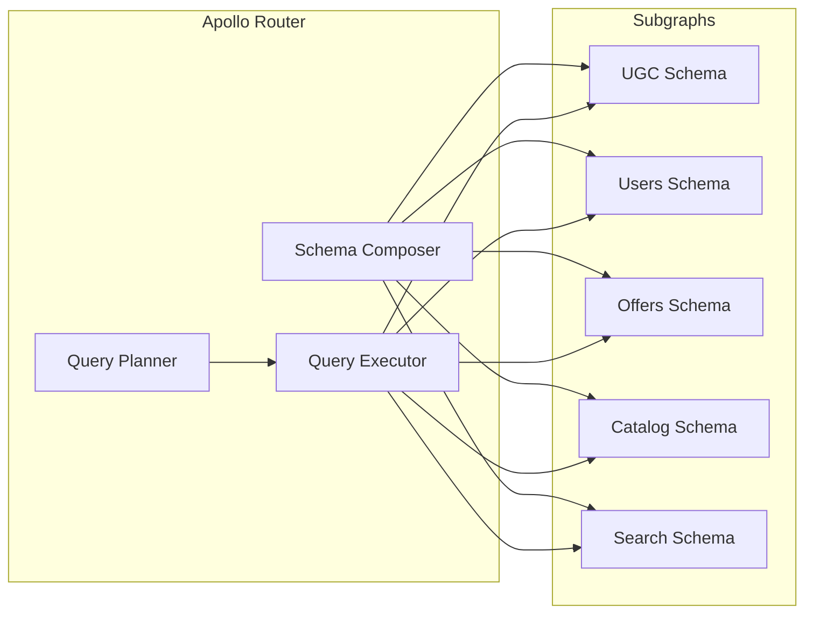
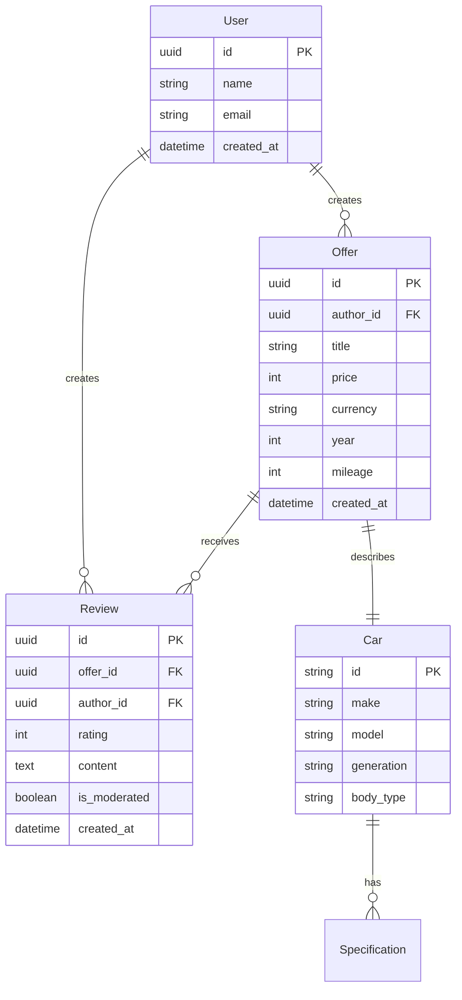
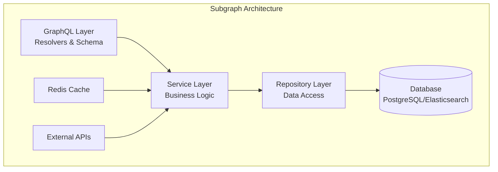
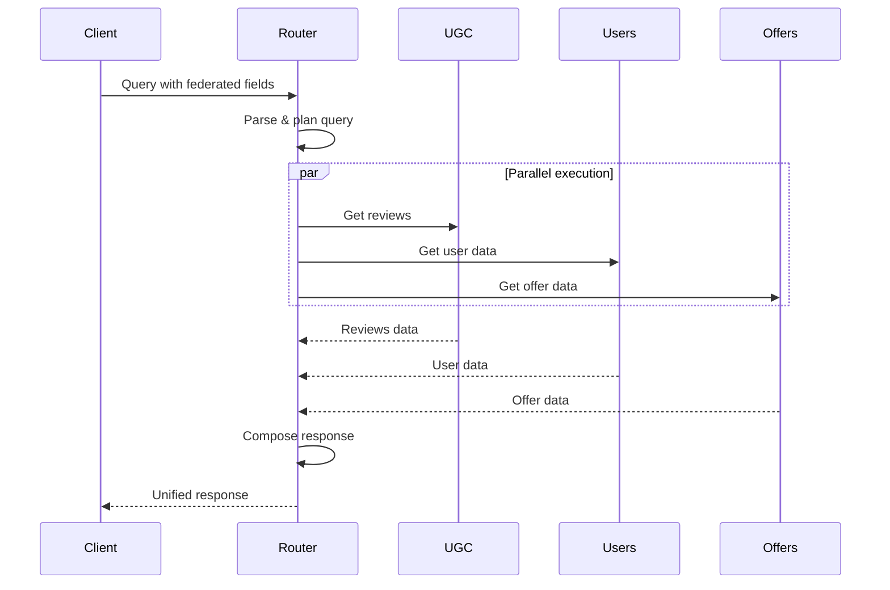
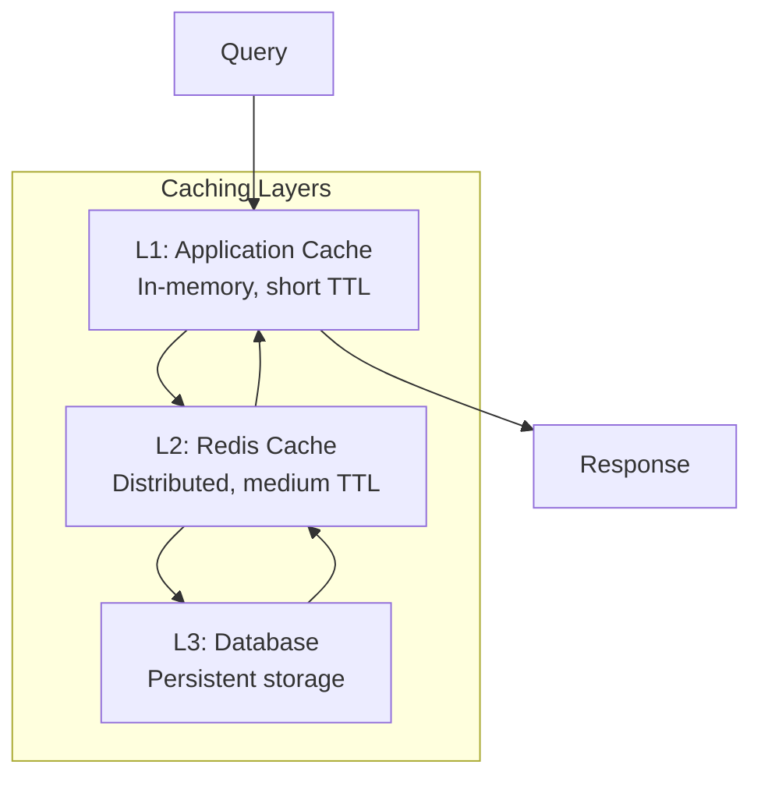
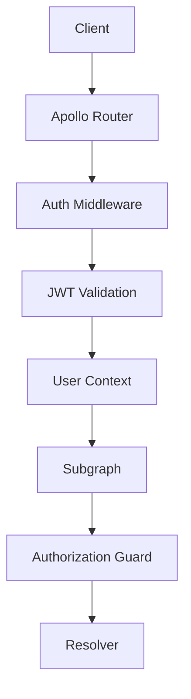
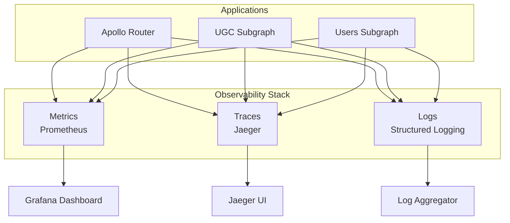
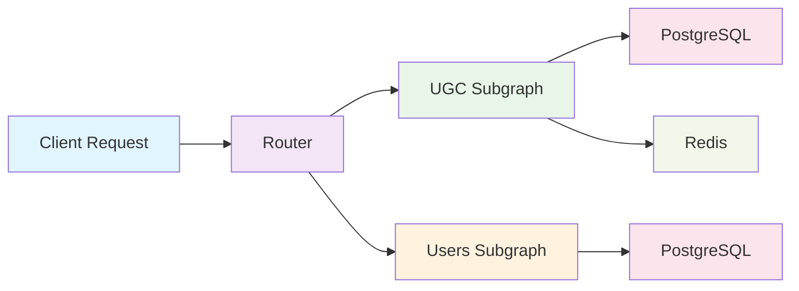

# Architecture Documentation

This document provides a comprehensive overview of the Auto.ru GraphQL Federation architecture, design decisions, and implementation details.

## Table of Contents

- [System Overview](#system-overview)
- [Federation Architecture](#federation-architecture)
- [Service Architecture](#service-architecture)
- [Data Architecture](#data-architecture)
- [Security Architecture](#security-architecture)
- [Observability Architecture](#observability-architecture)
- [Deployment Architecture](#deployment-architecture)
- [Design Decisions](#design-decisions)

## System Overview

The Auto.ru GraphQL Federation system demonstrates a modern, scalable approach to API architecture using Apollo Federation 2.0 with Rust-based subgraphs.

### High-Level Architecture



### Key Principles

1. **Domain-Driven Design**: Each subgraph represents a distinct business domain
2. **Service Independence**: Subgraphs can be developed, deployed, and scaled independently
3. **Type Safety**: End-to-end type safety using Rust and GraphQL
4. **Observability**: Comprehensive monitoring, tracing, and metrics
5. **Resilience**: Circuit breakers, retries, and graceful degradation
6. **Performance**: Caching, query optimization, and efficient data loading

## Federation Architecture

### Apollo Federation 2.0

The system uses Apollo Federation 2.0 for schema composition and query planning:



### Entity Relationships



### Federation Directives

#### Entity Keys
```graphql
# Primary entities with keys
type User @key(fields: "id") {
  id: ID!
  name: String!
  email: String!
}

type Offer @key(fields: "id") {
  id: ID!
  title: String!
  price: Int!
}
```

#### Entity Extensions
```graphql
# Extending entities across subgraphs
extend type Offer @key(fields: "id") {
  id: ID! @external
  reviews: [Review!]!
  averageRating: Float
  reviewsCount: Int!
}

extend type User @key(fields: "id") {
  id: ID! @external
  reviews: [Review!]!
}
```

#### Reference Resolvers
```rust
// Reference resolver implementation
#[Object]
impl User {
    #[graphql(entity)]
    async fn find_by_id(ctx: &Context<'_>, id: ID) -> Result<Option<User>> {
        let service = ctx.data::<UserService>()?;
        service.get_user_by_id(id.parse()?).await
    }
}
```

## Service Architecture

### Subgraph Architecture Pattern

Each subgraph follows a consistent layered architecture:



### Technology Stack

#### Core Technologies
- **Language**: Rust (1.75+)
- **GraphQL**: async-graphql
- **HTTP Server**: Axum
- **Database**: PostgreSQL with SQLx
- **Caching**: Redis
- **Search**: Elasticsearch

#### Supporting Technologies
- **Tracing**: OpenTelemetry + Jaeger
- **Metrics**: Prometheus
- **Logging**: tracing + structured logging
- **Configuration**: Environment variables + YAML
- **Testing**: Built-in Rust testing + testcontainers

### Service Communication



## Data Architecture

### Database Design

#### UGC Database Schema
```sql
-- Reviews table
CREATE TABLE reviews (
    id UUID PRIMARY KEY DEFAULT gen_random_uuid(),
    offer_id UUID NOT NULL,
    author_id UUID NOT NULL,
    rating INTEGER NOT NULL CHECK (rating >= 1 AND rating <= 5),
    text TEXT NOT NULL,
    created_at TIMESTAMPTZ NOT NULL DEFAULT NOW(),
    updated_at TIMESTAMPTZ NOT NULL DEFAULT NOW(),
    is_moderated BOOLEAN NOT NULL DEFAULT FALSE,
    moderation_status VARCHAR(20) DEFAULT 'pending',
    
    INDEX idx_reviews_offer_id (offer_id),
    INDEX idx_reviews_author_id (author_id),
    INDEX idx_reviews_created_at (created_at DESC)
);

-- Aggregated ratings for performance
CREATE TABLE offer_ratings (
    offer_id UUID PRIMARY KEY,
    average_rating DECIMAL(3,2) NOT NULL,
    reviews_count INTEGER NOT NULL DEFAULT 0,
    rating_distribution JSONB,
    updated_at TIMESTAMPTZ NOT NULL DEFAULT NOW()
);
```

#### Data Consistency Patterns

1. **Eventual Consistency**: Cross-subgraph data is eventually consistent
2. **Aggregate Caching**: Pre-computed aggregates for performance
3. **Event Sourcing**: Critical events are logged for audit trails
4. **CQRS**: Separate read and write models where appropriate

### Caching Strategy



#### Cache Patterns
- **Query Result Caching**: Cache GraphQL query results
- **Entity Caching**: Cache individual entities by ID
- **Aggregate Caching**: Cache computed values (ratings, counts)
- **Negative Caching**: Cache "not found" results briefly

## Security Architecture

### Authentication & Authorization



#### JWT Token Structure
```json
{
  "sub": "user-uuid",
  "name": "User Name",
  "email": "user@example.com",
  "roles": ["user", "moderator"],
  "exp": 1640995200,
  "iat": 1640908800
}
```

#### Authorization Patterns
- **Role-Based Access Control (RBAC)**: Users have roles with permissions
- **Field-Level Authorization**: Sensitive fields require specific permissions
- **Resource-Level Authorization**: Users can only access their own resources
- **Rate Limiting**: Prevent abuse with request limits

### Security Measures

1. **Input Validation**: All inputs are validated and sanitized
2. **SQL Injection Prevention**: Parameterized queries with SQLx
3. **XSS Prevention**: Output encoding and CSP headers
4. **CSRF Protection**: CSRF tokens for state-changing operations
5. **Secrets Management**: Environment variables and secret stores
6. **TLS Encryption**: All communication encrypted in transit

## Observability Architecture

### Three Pillars of Observability



### Metrics Collection

#### Business Metrics
- Request count and latency
- Error rates by service
- Review creation rate
- User activity metrics
- Cache hit/miss ratios

#### Technical Metrics
- CPU and memory usage
- Database connection pool status
- Queue lengths and processing times
- Network I/O metrics

### Distributed Tracing

Traces follow requests across all services:



## Deployment Architecture

### Container Architecture

```mermaid
graph TB
    subgraph "Kubernetes Cluster"
        subgraph "Ingress"
            Ingress[NGINX Ingress]
        end
        
        subgraph "Application Tier"
            Router[Apollo Router Pods]
            UGC[UGC Subgraph Pods]
            Users[Users Subgraph Pods]
            Offers[Offers Subgraph Pods]
        end
        
        subgraph "Data Tier"
            PostgreSQL[PostgreSQL Cluster]
            Redis[Redis Cluster]
            Elasticsearch[Elasticsearch Cluster]
        end
        
        subgraph "Observability"
            Prometheus[Prometheus]
            Jaeger[Jaeger]
            Grafana[Grafana]
        end
    end
    
    Ingress --> Router
    Router --> UGC
    Router --> Users
    Router --> Offers
    
    UGC --> PostgreSQL
    Users --> PostgreSQL
    Offers --> PostgreSQL
    
    UGC --> Redis
    Users --> Redis
    
    Offers --> Elasticsearch
```

### Deployment Strategies

#### Blue-Green Deployment
- Zero-downtime deployments
- Full environment switching
- Easy rollback capability

#### Rolling Updates
- Gradual service updates
- Continuous availability
- Resource-efficient

#### Canary Deployments
- Risk mitigation
- Performance validation
- Gradual traffic shifting

## Design Decisions

### Technology Choices

#### Why Rust?
- **Performance**: Near C++ performance with memory safety
- **Type Safety**: Compile-time error prevention
- **Concurrency**: Excellent async/await support
- **Ecosystem**: Rich crate ecosystem for web services
- **Reliability**: Memory safety prevents common bugs

#### Why Apollo Federation?
- **Schema Composition**: Automatic schema stitching
- **Query Planning**: Optimized cross-service queries
- **Type Safety**: End-to-end type checking
- **Tooling**: Excellent developer tools and ecosystem
- **Standards**: Industry-standard federation approach

#### Why PostgreSQL?
- **ACID Compliance**: Strong consistency guarantees
- **JSON Support**: Native JSON/JSONB for flexible schemas
- **Performance**: Excellent query optimization
- **Extensions**: Rich extension ecosystem
- **Reliability**: Battle-tested in production

### Architectural Patterns

#### Domain-Driven Design
- Clear domain boundaries
- Ubiquitous language
- Bounded contexts
- Domain events

#### CQRS (Command Query Responsibility Segregation)
- Separate read and write models
- Optimized query performance
- Scalable architecture
- Event sourcing compatibility

#### Event-Driven Architecture
- Loose coupling between services
- Asynchronous processing
- Scalability and resilience
- Audit trail capabilities

### Trade-offs

#### Consistency vs. Availability
- **Choice**: Eventual consistency for cross-service data
- **Reason**: Better availability and partition tolerance
- **Mitigation**: Careful UX design and user expectations

#### Complexity vs. Flexibility
- **Choice**: Microservices architecture
- **Reason**: Independent scaling and development
- **Mitigation**: Comprehensive tooling and documentation

#### Performance vs. Maintainability
- **Choice**: Balanced approach with caching
- **Reason**: Both performance and code clarity matter
- **Mitigation**: Performance monitoring and optimization

## Future Considerations

### Scalability Improvements
- Horizontal pod autoscaling
- Database sharding strategies
- CDN integration
- Edge computing

### Feature Enhancements
- Real-time subscriptions
- Advanced search capabilities
- Machine learning recommendations
- Mobile-first optimizations

### Operational Improvements
- Automated testing pipelines
- Chaos engineering
- Advanced monitoring
- Self-healing systems