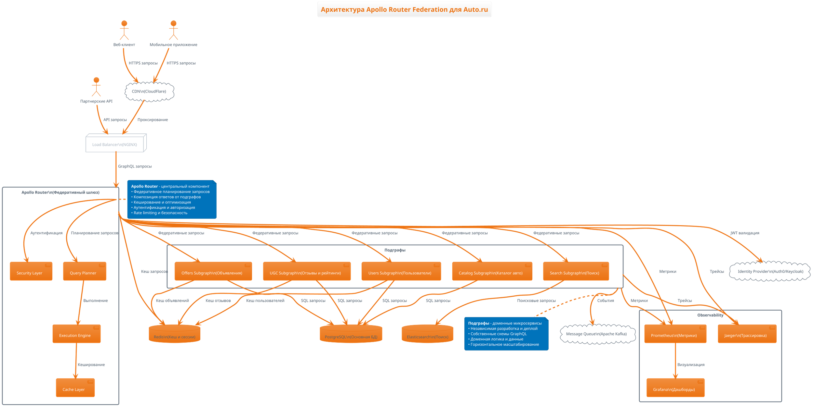
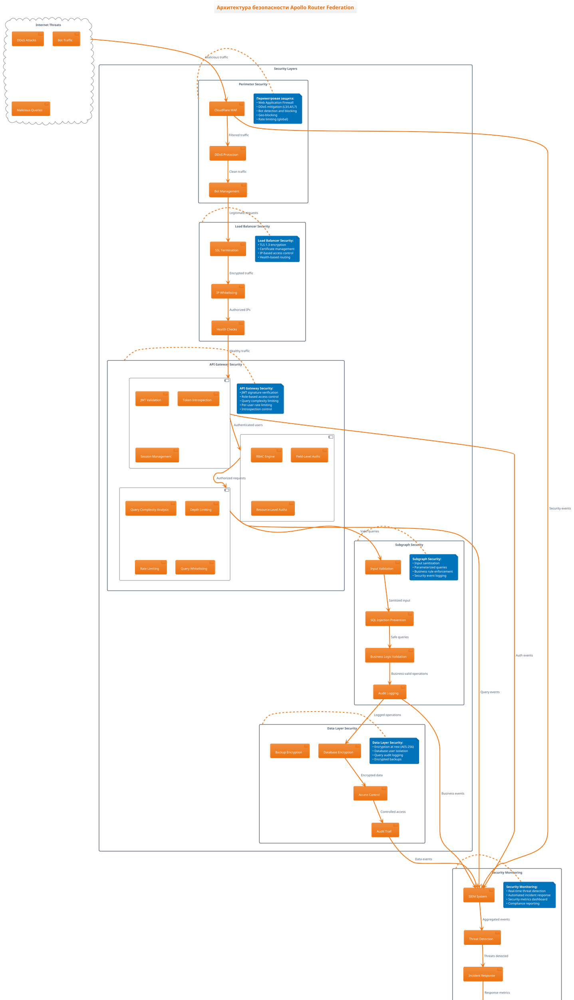
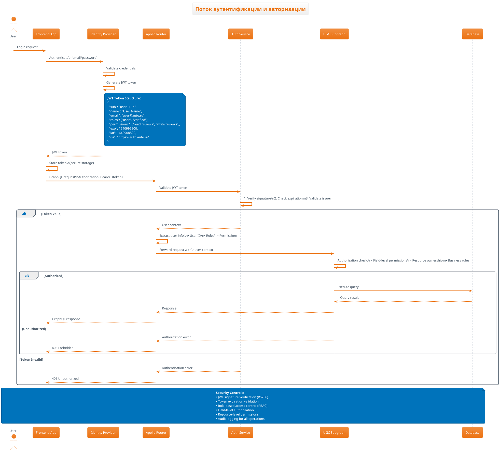

# 🏗️ Архитектура Apollo Router Federation - PlantUML

Этот документ содержит детальные диаграммы архитектуры системы Apollo Router Federation в формате PlantUML с подробными объяснениями на русском языке.

## 📋 Содержание

1. [Общая архитектура системы](#общая-архитектура-системы)
2. [Федеративная архитектура GraphQL](#федеративная-архитектура-graphql)
3. [Архитектура подграфов](#архитектура-подграфов)
4. [Инфраструктурная архитектура](#инфраструктурная-архитектура)
5. [Архитектура безопасности](#архитектура-безопасности)
6. [Архитектура мониторинга](#архитектура-мониторинга)
7. [Deployment архитектура](#deployment-архитектура)

---

## 🌐 Общая архитектура системы

### Высокоуровневая архитектура Auto.ru GraphQL Federation



### Объяснение архитектуры:

**🎯 Ключевые принципы:**
- **Федеративная архитектура** - единый GraphQL API из множества независимых подграфов
- **Доменно-ориентированный дизайн** - каждый подграф отвечает за свой бизнес-домен
- **Микросервисная архитектура** - независимые сервисы с собственными данными
- **Горизонтальная масштабируемость** - каждый компонент может масштабироваться независимо

**🔄 Поток данных:**
1. Клиент отправляет GraphQL запрос через CDN и Load Balancer
2. Apollo Router получает запрос и планирует его выполнение
3. Query Planner разбивает запрос на подзапросы для соответствующих подграфов
4. Execution Engine выполняет подзапросы параллельно
5. Результаты композируются и возвращаются клиенту
6. Все операции логируются и мониторятся

---

## 🔗 Федеративная архитектура GraphQL

### Детальная схема Apollo Federation

```plantuml
@startuml FederationArchitecture
!theme aws-orange
title Федеративная архитектура GraphQL - Apollo Router Federation

' Apollo Router компоненты
rectangle "Apollo Router" as Router {
  component "Supergraph Schema" as SuperSchema {
    note right
      Композитная схема из всех подграфов
      • Автоматическая композиция
      • Валидация совместимости
      • Федеративные директивы
    end note
  }
  
  component "Query Planner" as QPlanner {
    note right
      Планирование выполнения запросов
      • Анализ зависимостей между подграфами
      • Оптимизация количества запросов
      • Параллельное выполнение
    end note
  }
  
  component "Execution Engine" as ExecEngine {
    note right
      Выполнение федеративных запросов
      • Батчинг запросов
      • Композиция результатов
      • Обработка ошибок
    end note
  }
  
  component "Federation Runtime" as FedRuntime {
    note right
      Федеративная логика
      • Резолвинг @key директив
      • Обработка @requires/@provides
      • Entity resolution
    end note
  }
}

' Подграфы с их схемами
rectangle "UGC Subgraph" as UGCSubgraph {
  component "UGC Schema" as UGCSchema
  note right of UGCSchema
    type Review @key(fields: "id") {
      id: ID!
      offerId: ID!
      authorId: ID!
      rating: Int!
      text: String!
      # Федеративные поля
      offer: Offer! @provides(fields: "title")
      author: User! @provides(fields: "name")
    }
  end note
}

rectangle "Users Subgraph" as UsersSubgraph {
  component "Users Schema" as UsersSchema
  note right of UsersSchema
    type User @key(fields: "id") {
      id: ID!
      name: String! @shareable
      email: String! @shareable
      # Расширения от других подграфов
      reviews: [Review!]! @external
    }
  end note
}

rectangle "Offers Subgraph" as OffersSubgraph {
  component "Offers Schema" as OffersSchema
  note right of OffersSchema
    type Offer @key(fields: "id") {
      id: ID!
      title: String! @shareable
      price: Float!
      # Федеративные расширения
      reviews: [Review!]! @external
      averageRating: Float @requires(fields: "reviews")
    }
  end note
}

rectangle "Catalog Subgraph" as CatalogSubgraph {
  component "Catalog Schema" as CatalogSchema
  note right of CatalogSchema
    type Car @key(fields: "id") {
      id: ID!
      make: String!
      model: String!
      year: Int!
      # Связь с офферами
      offers: [Offer!]! @external
    }
  end note
}

rectangle "Search Subgraph" as SearchSubgraph {
  component "Search Schema" as SearchSchema
  note right of SearchSchema
    type Query {
      search(query: String!): SearchResult!
    }
    
    type SearchResult {
      offers: [Offer!]! @external
      facets: [SearchFacet!]!
    }
  end note
}

' Схема композиции
SuperSchema <-- UGCSchema : Композиция схем
SuperSchema <-- UsersSchema : Композиция схем
SuperSchema <-- OffersSchema : Композиция схем
SuperSchema <-- CatalogSchema : Композиция схем
SuperSchema <-- SearchSchema : Композиция схем

' Планирование запросов
QPlanner --> UGCSubgraph : Подзапросы для отзывов
QPlanner --> UsersSubgraph : Подзапросы для пользователей
QPlanner --> OffersSubgraph : Подзапросы для объявлений
QPlanner --> CatalogSubgraph : Подзапросы для каталога
QPlanner --> SearchSubgraph : Поисковые запросы

' Выполнение и композиция
ExecEngine --> FedRuntime : Федеративная логика
FedRuntime --> QPlanner : Планы выполнения

' Пример федеративного запроса
note top of Router
  **Пример федеративного запроса:**
  query GetOfferWithReviews($offerId: ID!) {
    offer(id: $offerId) {           # Offers Subgraph
      id
      title
      price
      reviews(first: 10) {         # UGC Subgraph
        edges {
          node {
            rating
            text
            author {               # Users Subgraph
              name
              email
            }
          }
        }
      }
      averageRating              # Вычисляется из reviews
    }
  }
end note

@enduml
```

### Федеративные директивы и их назначение:

**🔑 @key** - Определяет уникальный идентификатор сущности
- Позволяет другим подграфам ссылаться на эту сущность
- Обеспечивает резолвинг сущностей между подграфами

**🔗 @external** - Помечает поля, определенные в других подграфах
- Используется для создания ссылок между подграфами
- Не резолвится в текущем подграфе

**📤 @provides** - Указывает, что подграф может предоставить дополнительные поля
- Оптимизирует количество запросов между подграфами
- Позволяет избежать дополнительных обращений

**📥 @requires** - Указывает зависимости для резолвинга поля
- Определяет, какие поля нужны для вычисления текущего поля
- Обеспечивает правильный порядок выполнения запросов

**🤝 @shareable** - Позволяет нескольким подграфам определять одно поле
- Используется для общих полей (например, name, email)
- Обеспечивает консистентность данных

---

## 🏗️ Архитектура подграфов

### Детальная архитектура UGC Subgraph (пример)

```plantuml
@startuml UGCSubgraphArchitecture
!theme aws-orange
title Архитектура UGC Subgraph - Отзывы и рейтинги

' HTTP слой
rectangle "HTTP Layer" as HTTPLayer {
  component "Axum Web Server" as WebServer
  component "GraphQL Endpoint" as GraphQLEndpoint
  component "Health Check" as HealthCheck
  component "Metrics Endpoint" as MetricsEndpoint
}

' GraphQL слой
rectangle "GraphQL Layer" as GraphQLLayer {
  component "Schema Definition" as Schema {
    note right
      • Федеративные типы (Review, User, Offer)
      • Query резолверы
      • Mutation резолверы
      • Subscription резолверы
    end note
  }
  
  component "Resolvers" as Resolvers {
    component "Query Resolvers" as QueryResolvers
    component "Mutation Resolvers" as MutationResolvers
    component "Entity Resolvers" as EntityResolvers
  }
  
  component "DataLoader" as DataLoader {
    note right
      Батчинг и кеширование запросов
      • ReviewDataLoader
      • UserDataLoader
      • OfferDataLoader
    end note
  }
}

' Бизнес-логика
rectangle "Business Logic Layer" as BusinessLayer {
  component "Review Service" as ReviewService {
    note right
      • Создание отзывов
      • Валидация контента
      • Модерация
      • Расчет рейтингов
    end note
  }
  
  component "Rating Service" as RatingService {
    note right
      • Агрегация рейтингов
      • Статистика по офферам
      • Кеширование рейтингов
    end note
  }
  
  component "Moderation Service" as ModerationService {
    note right
      • AI модерация контента
      • Фильтрация спама
      • Проверка токсичности
    end note
  }
}

' Слой безопасности
rectangle "Security Layer" as SecurityLayer {
  component "Auth Service" as AuthService {
    note right
      • JWT валидация
      • Извлечение пользовательского контекста
      • Проверка ролей
    end note
  }
  
  component "Authorization Guards" as AuthzGuards {
    note right
      • RBAC проверки
      • Проверка владения ресурсами
      • Rate limiting
    end note
  }
  
  component "Input Validation" as InputValidation {
    note right
      • Санитизация входных данных
      • Проверка на XSS/SQL injection
      • Валидация бизнес-правил
    end note
  }
}

' Слой данных
rectangle "Data Layer" as DataLayer {
  component "Repository Pattern" as Repository {
    component "Review Repository" as ReviewRepo
    component "Rating Repository" as RatingRepo
    component "User Repository" as UserRepo
  }
  
  component "Database Pool" as DBPool {
    note right
      • Connection pooling (SQLx)
      • Транзакции
      • Миграции
    end note
  }
  
  component "Cache Layer" as CacheLayer {
    note right
      • Redis кеширование
      • Многоуровневый кеш
      • Инвалидация кеша
    end note
  }
}

' Слой мониторинга
rectangle "Observability Layer" as ObservabilityLayer {
  component "Metrics Collection" as Metrics {
    note right
      • Prometheus метрики
      • Бизнес-метрики
      • Performance метрики
    end note
  }
  
  component "Distributed Tracing" as Tracing {
    note right
      • OpenTelemetry трейсы
      • Jaeger интеграция
      • Контекстная информация
    end note
  }
  
  component "Structured Logging" as Logging {
    note right
      • Структурированные логи
      • Корреляция запросов
      • Уровни логирования
    end note
  }
}

' Внешние зависимости
database "PostgreSQL" as PostgreSQL {
  table "reviews" as ReviewsTable
  table "offer_ratings" as RatingsTable
  table "moderation_queue" as ModerationTable
}

database "Redis" as Redis {
  component "Review Cache" as ReviewCache
  component "Rating Cache" as RatingCache
  component "Session Cache" as SessionCache
}

cloud "External Services" as ExternalServices {
  component "AI Moderation API" as AIModerationAPI
  component "Notification Service" as NotificationService
  component "Analytics Service" as AnalyticsService
}

' Связи HTTP слоя
WebServer --> GraphQLEndpoint : GraphQL запросы
WebServer --> HealthCheck : Health проверки
WebServer --> MetricsEndpoint : Метрики

' Связи GraphQL слоя
GraphQLEndpoint --> Schema : Обработка схемы
Schema --> Resolvers : Резолвинг полей
Resolvers --> DataLoader : Батчинг запросов

' Связи бизнес-логики
QueryResolvers --> ReviewService : Получение отзывов
MutationResolvers --> ReviewService : Создание/обновление
EntityResolvers --> RatingService : Расчет рейтингов
ReviewService --> ModerationService : Модерация контента

' Связи безопасности
GraphQLEndpoint --> AuthService : Аутентификация
Resolvers --> AuthzGuards : Авторизация
MutationResolvers --> InputValidation : Валидация входных данных

' Связи данных
ReviewService --> ReviewRepo : CRUD операции
RatingService --> RatingRepo : Агрегация данных
Repository --> DBPool : SQL запросы
ReviewService --> CacheLayer : Кеширование
RatingService --> CacheLayer : Кеш рейтингов

' Связи с БД
DBPool --> PostgreSQL : SQL соединения
ReviewRepo --> ReviewsTable : Отзывы
RatingRepo --> RatingsTable : Рейтинги
ModerationService --> ModerationTable : Очередь модерации

' Связи с кешем
CacheLayer --> Redis : Redis команды
ReviewCache --> ReviewsTable : Кеш отзывов
RatingCache --> RatingsTable : Кеш рейтингов

' Связи с внешними сервисами
ModerationService --> AIModerationAPI : AI анализ
ReviewService --> NotificationService : Уведомления
Metrics --> AnalyticsService : Аналитика

' Мониторинг
WebServer --> Metrics : HTTP метрики
Resolvers --> Tracing : GraphQL трейсы
BusinessLayer --> Logging : Бизнес-логи
DataLayer --> Metrics : DB метрики

@enduml
```

### Ключевые архитектурные принципы UGC Subgraph:

**🏗️ Слоистая архитектура:**
- **HTTP Layer** - обработка веб-запросов и эндпоинтов
- **GraphQL Layer** - схема, резолверы и федеративная логика
- **Business Logic Layer** - доменная логика и бизнес-правила
- **Security Layer** - аутентификация, авторизация и валидация
- **Data Layer** - работа с данными и кеширование
- **Observability Layer** - мониторинг, трассировка и логирование

**🔄 Паттерны проектирования:**
- **Repository Pattern** - абстракция доступа к данным
- **DataLoader Pattern** - батчинг и кеширование запросов
- **Service Layer** - инкапсуляция бизнес-логики
- **Dependency Injection** - управление зависимостями
- **Circuit Breaker** - отказоустойчивость внешних вызовов

**⚡ Оптимизации производительности:**
- **Connection Pooling** - эффективное использование БД соединений
- **Multi-level Caching** - кеширование на разных уровнях
- **Async/Await** - неблокирующие операции
- **Batch Processing** - группировка операций

---## 
🏢 Инфраструктурная архитектура

### Kubernetes Deployment Architecture

```plantuml
@startuml KubernetesArchitecture
!theme aws-orange
title Kubernetes Deployment Architecture - Production Environment

' Kubernetes кластер
rectangle "Kubernetes Cluster" as K8sCluster {
  
  ' Namespace для приложения
  rectangle "auto-ru-federation namespace" as AppNamespace {
    
    ' Apollo Router
    rectangle "Apollo Router" as RouterDeployment {
      component "Router Pod 1" as RouterPod1
      component "Router Pod 2" as RouterPod2
      component "Router Pod 3" as RouterPod3
      
      note right of RouterDeployment
        **Deployment Configuration:**
        • Replicas: 3
        • Resources: 2Gi RAM, 1 CPU
        • Rolling Update Strategy
        • Health Checks: /health
        • Readiness Probe: /ready
      end note
    }
    
    ' Подграфы
    rectangle "Subgraphs" as SubgraphsDeployment {
      rectangle "UGC Subgraph" as UGCDeploy {
        component "UGC Pod 1" as UGCPod1
        component "UGC Pod 2" as UGCPod2
        component "UGC Pod 3" as UGCPod3
      }
      
      rectangle "Users Subgraph" as UsersDeploy {
        component "Users Pod 1" as UsersPod1
        component "Users Pod 2" as UsersPod2
        component "Users Pod 3" as UsersPod3
      }
      
      rectangle "Offers Subgraph" as OffersDeploy {
        component "Offers Pod 1" as OffersPod1
        component "Offers Pod 2" as OffersPod2
        component "Offers Pod 3" as OffersPod3
      }
      
      rectangle "Catalog Subgraph" as CatalogDeploy {
        component "Catalog Pod 1" as CatalogPod1
        component "Catalog Pod 2" as CatalogPod2
        component "Catalog Pod 3" as CatalogPod3
      }
      
      rectangle "Search Subgraph" as SearchDeploy {
        component "Search Pod 1" as SearchPod1
        component "Search Pod 2" as SearchPod2
        component "Search Pod 3" as SearchPod3
      }
    }
    
    ' Сервисы
    rectangle "Services" as Services {
      component "Apollo Router Service" as RouterService
      component "UGC Service" as UGCService
      component "Users Service" as UsersService
      component "Offers Service" as OffersService
      component "Catalog Service" as CatalogService
      component "Search Service" as SearchService
    }
    
    ' Ingress
    component "NGINX Ingress Controller" as IngressController
    component "Ingress Rules" as IngressRules {
      note right
        **Ingress Configuration:**
        • Host: api.auto.ru
        • TLS/SSL termination
        • Rate limiting: 1000 req/min
        • CORS headers
        • Security headers
      end note
    }
  }
  
  ' Namespace для данных
  rectangle "data namespace" as DataNamespace {
    
    ' PostgreSQL
    rectangle "PostgreSQL Cluster" as PostgreSQLCluster {
      component "PostgreSQL Primary" as PostgreSQLPrimary
      component "PostgreSQL Replica 1" as PostgreSQLReplica1
      component "PostgreSQL Replica 2" as PostgreSQLReplica2
      
      note right of PostgreSQLCluster
        **PostgreSQL Configuration:**
        • High Availability setup
        • Automatic failover
        • Streaming replication
        • Backup to S3
        • Resources: 8Gi RAM, 4 CPU
      end note
    }
    
    ' Redis
    rectangle "Redis Cluster" as RedisCluster {
      component "Redis Master" as RedisMaster
      component "Redis Replica 1" as RedisReplica1
      component "Redis Replica 2" as RedisReplica2
      
      note right of RedisCluster
        **Redis Configuration:**
        • Cluster mode enabled
        • Persistence enabled
        • Memory: 4Gi per node
        • Automatic failover
      end note
    }
    
    ' Elasticsearch
    rectangle "Elasticsearch Cluster" as ElasticsearchCluster {
      component "ES Master 1" as ESMaster1
      component "ES Data 1" as ESData1
      component "ES Data 2" as ESData2
      
      note right of ElasticsearchCluster
        **Elasticsearch Configuration:**
        • 3-node cluster
        • Index replication: 1
        • Memory: 4Gi per node
        • SSD storage
      end note
    }
  }
  
  ' Namespace для мониторинга
  rectangle "monitoring namespace" as MonitoringNamespace {
    
    ' Prometheus Stack
    rectangle "Prometheus Stack" as PrometheusStack {
      component "Prometheus Server" as PrometheusServer
      component "Grafana" as Grafana
      component "AlertManager" as AlertManager
      
      note right of PrometheusStack
        **Monitoring Configuration:**
        • Prometheus: 30d retention
        • Grafana: Custom dashboards
        • AlertManager: Slack/Email alerts
      end note
    }
    
    ' Jaeger Tracing
    rectangle "Jaeger Tracing" as JaegerTracing {
      component "Jaeger Collector" as JaegerCollector
      component "Jaeger Query" as JaegerQuery
      component "Jaeger Agent" as JaegerAgent
      
      note right of JaegerTracing
        **Tracing Configuration:**
        • Distributed tracing
        • Elasticsearch backend
        • 7d trace retention
      end note
    }
  }
}

' External Load Balancer
cloud "External Load Balancer" as ExternalLB {
  component "AWS ALB" as ALB
  component "CloudFlare CDN" as CDN
}

' Связи внешнего трафика
CDN --> ALB : HTTPS requests
ALB --> IngressController : Load balanced traffic

' Связи Ingress
IngressController --> RouterService : GraphQL requests

' Связи Router с подграфами
RouterService --> UGCService : Federation queries
RouterService --> UsersService : Federation queries
RouterService --> OffersService : Federation queries
RouterService --> CatalogService : Federation queries
RouterService --> SearchService : Federation queries

' Связи подграфов с данными
UGCService --> PostgreSQLPrimary : SQL queries
UsersService --> PostgreSQLPrimary : SQL queries
OffersService --> PostgreSQLPrimary : SQL queries
CatalogService --> PostgreSQLPrimary : SQL queries
SearchService --> ElasticsearchCluster : Search queries

' Связи с кешем
UGCService --> RedisCluster : Cache operations
UsersService --> RedisCluster : Cache operations
OffersService --> RedisCluster : Cache operations
RouterService --> RedisCluster : Query cache

' Связи мониторинга
RouterService --> PrometheusServer : Metrics
UGCService --> PrometheusServer : Metrics
UsersService --> PrometheusServer : Metrics
OffersService --> PrometheusServer : Metrics

RouterService --> JaegerCollector : Traces
UGCService --> JaegerCollector : Traces
UsersService --> JaegerCollector : Traces

PrometheusServer --> Grafana : Data source
PrometheusServer --> AlertManager : Alerts

@enduml
```



### Объяснение инфраструктурной архитектуры:

**🏗️ Kubernetes Namespaces:**
- **auto-ru-federation** - основные приложения и сервисы
- **data** - базы данных и хранилища данных
- **monitoring** - системы мониторинга и наблюдаемости

**⚖️ Load Balancing:**
- **CloudFlare CDN** - глобальное кеширование и защита от DDoS
- **AWS ALB** - распределение нагрузки на уровне приложений
- **NGINX Ingress** - внутрикластерная маршрутизация

**🔄 High Availability:**
- **Multi-replica deployments** - каждый сервис имеет минимум 3 реплики
- **Database replication** - PostgreSQL с репликами для чтения
- **Redis clustering** - отказоустойчивый кеш
- **Rolling updates** - обновления без простоя

---

## 🔄 Поток данных и взаимодействие компонентов

### Детальная схема обработки GraphQL запросов

```plantuml
@startuml GraphQLRequestFlow
!theme aws-orange
title Поток обработки GraphQL запроса в Apollo Router Federation

actor "Client" as Client
participant "CDN" as CDN
participant "Load Balancer" as LB
participant "Apollo Router" as Router
participant "Query Planner" as QP
participant "Execution Engine" as EE
participant "UGC Subgraph" as UGC
participant "Users Subgraph" as Users
participant "Offers Subgraph" as Offers
participant "PostgreSQL" as DB
participant "Redis Cache" as Cache

Client -> CDN : GraphQL Query\\n(Federated)
note right
  **Пример запроса:**
  query GetOfferWithReviews($id: ID!) {
    offer(id: $id) {
      title
      price
      reviews(first: 5) {
        rating
        text
        author { name }
      }
    }
  }
end note

CDN -> LB : Cache miss,\\nforward request
LB -> Router : Route to available\\nrouter instance

Router -> Router : 1. Validate query\\n2. Check permissions\\n3. Rate limiting
Router -> QP : Parse and plan\\nfederated query

QP -> QP : Analyze query:\\n• Identify subgraphs\\n• Plan execution order\\n• Optimize joins

note right of QP
  **Query Planning:**
  1. offer(id) → Offers subgraph
  2. reviews → UGC subgraph  
  3. author → Users subgraph
  
  **Execution Plan:**
  Step 1: Get offer data
  Step 2: Get reviews (parallel)
  Step 3: Get authors (batch)
end note

QP -> EE : Optimized\\nexecution plan

par Parallel Execution
  EE -> Offers : Get offer data\\nquery { offer(id: $id) { title price } }
  Offers -> Cache : Check cache
  Cache --> Offers : Cache miss
  Offers -> DB : SELECT * FROM offers\\nWHERE id = $1
  DB --> Offers : Offer data
  Offers -> Cache : Store in cache\\n(TTL: 5min)
  Offers --> EE : Offer response
and
  EE -> UGC : Get reviews\\nquery { reviews(offerId: $id, first: 5) }
  UGC -> Cache : Check cache
  Cache --> UGC : Cache hit
  UGC --> EE : Reviews response
end

EE -> EE : Collect author IDs\\nfrom reviews

EE -> Users : Batch request for authors\\nquery { _entities(representations: [...]) }
Users -> Cache : Check cache
Cache --> Users : Partial cache hit
Users -> DB : SELECT * FROM users\\nWHERE id IN (...)
DB --> Users : User data
Users -> Cache : Store missing users
Users --> EE : Authors response

EE -> EE : Compose final response:\\n• Merge offer data\\n• Attach reviews\\n• Attach authors

EE --> Router : Complete federated\\nresponse
Router -> Cache : Cache composed\\nresponse (TTL: 1min)
Router --> LB : GraphQL response
LB --> CDN : Response with\\ncache headers
CDN -> CDN : Cache response\\n(TTL: 30s)
CDN --> Client : Final response

note over Client, Cache
  **Performance Metrics:**
  • Total time: ~150ms
  • Cache hit ratio: 85%
  • Subgraph calls: 3
  • Database queries: 2
end note

@enduml
```

### Объяснение потока данных:

**🔍 Query Planning (Планирование запроса):**
1. **Parsing** - разбор GraphQL запроса и валидация
2. **Analysis** - определение необходимых подграфов
3. **Optimization** - оптимизация порядка выполнения
4. **Batching** - группировка запросов для эффективности

**⚡ Execution Strategy (Стратегия выполнения):**
1. **Parallel Execution** - параллельное выполнение независимых запросов
2. **Dependency Resolution** - разрешение зависимостей между подграфами
3. **Data Composition** - композиция данных из разных источников
4. **Error Handling** - обработка ошибок и частичных ответов

**🚀 Performance Optimizations (Оптимизации производительности):**
1. **Multi-level Caching** - кеширование на разных уровнях
2. **DataLoader Pattern** - батчинг запросов к базе данных
3. **Connection Pooling** - эффективное использование соединений
4. **Query Complexity Limiting** - ограничение сложности запросов

---

## 🔐 Архитектура безопасности

### Comprehensive Security Architecture



### Детальная схема аутентификации и авторизации



### Объяснение архитектуры безопасности:

**🛡️ Defense in Depth (Эшелонированная защита):**
1. **Perimeter Security** - защита периметра от внешних угроз
2. **Network Security** - сетевая безопасность и шифрование
3. **Application Security** - безопасность на уровне приложения
4. **Data Security** - защита данных и контроль доступа

**🔐 Authentication & Authorization:**
- **JWT-based Authentication** - стандартные токены доступа
- **Role-Based Access Control** - управление доступом на основе ролей
- **Field-Level Authorization** - контроль доступа к отдельным полям
- **Resource-Level Permissions** - права доступа к конкретным ресурсам

**📊 Security Monitoring:**
- **Real-time Threat Detection** - обнаружение угроз в реальном времени
- **Security Event Correlation** - корреляция событий безопасности
- **Automated Response** - автоматическое реагирование на инциденты
- **Compliance Reporting** - отчетность по соответствию требованиям

---## 📈 Архите
ктура мониторинга и наблюдаемости

### Comprehensive Observability Architecture

```plantuml
@startuml ObservabilityArchitecture
!theme aws-orange
title Архитектура мониторинга и наблюдаемости (Observability)

' Источники данных
rectangle "Data Sources" as DataSources {
  
  rectangle "Apollo Router" as RouterSource {
    component "HTTP Metrics" as RouterHTTP
    component "GraphQL Metrics" as RouterGraphQL
    component "Federation Metrics" as RouterFed
    component "Traces" as RouterTraces
    component "Logs" as RouterLogs
  }
  
  rectangle "Subgraphs" as SubgraphSources {
    component "Business Metrics" as BizMetrics
    component "Database Metrics" as DBMetrics
    component "Cache Metrics" as CacheMetrics
    component "Application Traces" as AppTraces
    component "Structured Logs" as StructLogs
  }
  
  rectangle "Infrastructure" as InfraSource {
    component "Kubernetes Metrics" as K8sMetrics
    component "Node Metrics" as NodeMetrics
    component "Network Metrics" as NetMetrics
    component "Storage Metrics" as StorageMetrics
  }
}

' Сбор данных
rectangle "Data Collection" as DataCollection {
  
  component "Prometheus" as Prometheus {
    component "Metric Scraping" as MetricScraping
    component "Service Discovery" as ServiceDiscovery
    component "Alert Rules" as AlertRules
    
    note right of Prometheus
      **Prometheus Configuration:**
      • Scrape interval: 15s
      • Retention: 30 days
      • High availability setup
      • Custom recording rules
    end note
  }
  
  component "OpenTelemetry Collector" as OTelCollector {
    component "Trace Collection" as TraceCollection
    component "Metric Collection" as MetricCollection
    component "Log Collection" as LogCollection
    
    note right of OTelCollector
      **OTel Collector Features:**
      • Multi-protocol support
      • Data processing pipelines
      • Sampling strategies
      • Export to multiple backends
    end note
  }
}

@enduml
```#
## Детальная схема бизнес-метрик

```plantuml
@startuml BusinessMetrics
!theme aws-orange
title Бизнес-метрики и KPI Dashboard

rectangle "Business Metrics Collection" as BizMetricsCollection {
  
  rectangle "User Engagement Metrics" as UserEngagement {
    component "Active Users" as ActiveUsers
    component "Session Duration" as SessionDuration
    component "Page Views" as PageViews
    component "Bounce Rate" as BounceRate
    
    note right of UserEngagement
      **User Engagement KPIs:**
      • Daily/Monthly Active Users
      • Average session duration
      • Pages per session
      • User retention rate
    end note
  }
  
  rectangle "Review System Metrics" as ReviewMetrics {
    component "Review Creation Rate" as ReviewRate
    component "Average Rating" as AvgRating
    component "Review Quality Score" as QualityScore
    component "Moderation Efficiency" as ModerationEff
    
    note right of ReviewMetrics
      **Review System KPIs:**
      • Reviews per hour/day
      • Rating distribution
      • Review approval rate
      • Time to moderation
    end note
  }
  
  rectangle "Technical Performance Metrics" as TechMetrics {
    component "API Response Time" as APIResponseTime
    component "Error Rate" as ErrorRate
    component "Throughput" as Throughput
    component "Availability" as Availability
    
    note right of TechMetrics
      **Technical KPIs:**
      • P95 response time < 500ms
      • Error rate < 0.1%
      • 99.9% availability
      • Requests per second
    end note
  }
}

@enduml
```



### Объяснение архитектуры мониторинга:

**📊 Three Pillars of Observability:**
1. **Metrics** - количественные показатели производительности и бизнеса
2. **Traces** - распределенная трассировка запросов через систему
3. **Logs** - структурированные логи для отладки и анализа

**🎯 Business Intelligence:**
- **Executive Dashboards** - высокоуровневые бизнес-метрики для руководства
- **Operational Dashboards** - операционные метрики для SRE команды
- **Product Dashboards** - продуктовые метрики для product-менеджеров

---## 🚀 Deplo
yment архитектура

### CI/CD Pipeline Architecture

```plantuml
@startuml CICDArchitecture
!theme aws-orange
title CI/CD Pipeline для Apollo Router Federation

rectangle "Source Control" as SourceControl {
  component "GitHub Repository" as GitHub
  component "Feature Branches" as FeatureBranches
  component "Main Branch" as MainBranch
  component "Release Tags" as ReleaseTags
}

rectangle "CI/CD Pipeline" as Pipeline {
  
  rectangle "Continuous Integration" as CI {
    component "Code Quality Checks" as CodeQuality {
      component "Linting (Clippy)" as Linting
      component "Security Audit" as SecurityAudit
      component "Dependency Check" as DepCheck
    }
    
    component "Testing" as Testing {
      component "Unit Tests" as UnitTests
      component "Integration Tests" as IntegrationTests
      component "E2E Tests" as E2ETests
      component "Performance Tests" as PerfTests
    }
    
    component "Build & Package" as Build {
      component "Rust Compilation" as RustBuild
      component "Docker Build" as DockerBuild
      component "Schema Validation" as SchemaVal
      component "Supergraph Composition" as SupergraphComp
    }
  }
  
  rectangle "Continuous Deployment" as CD {
    component "Environment Promotion" as EnvPromotion {
      component "Development Deploy" as DevDeploy
      component "Staging Deploy" as StagingDeploy
      component "Production Deploy" as ProdDeploy
    }
    
    component "Deployment Strategies" as DeployStrategies {
      component "Blue-Green Deployment" as BlueGreen
      component "Canary Deployment" as Canary
      component "Rolling Updates" as RollingUpdate
    }
  }
}

@enduml
```###
 Deployment Strategies Detail

```plantuml
@startuml DeploymentStrategies
!theme aws-orange
title Стратегии развертывания в Production

rectangle "Blue-Green Deployment" as BlueGreen {
  rectangle "Blue Environment (Current)" as BlueEnv {
    component "Apollo Router v1.0" as RouterBlue
    component "Subgraphs v1.0" as SubgraphsBlue
    component "Load Balancer" as LBBlue
  }
  
  rectangle "Green Environment (New)" as GreenEnv {
    component "Apollo Router v1.1" as RouterGreen
    component "Subgraphs v1.1" as SubgraphsGreen
    component "Load Balancer" as LBGreen
  }
  
  note right of BlueGreen
    **Blue-Green Benefits:**
    • Zero-downtime deployment
    • Instant rollback capability
    • Full environment testing
    • Risk mitigation
    
    **Process:**
    1. Deploy to Green environment
    2. Run validation tests
    3. Switch traffic to Green
    4. Monitor for issues
    5. Keep Blue as rollback
  end note
}

rectangle "Canary Deployment" as Canary {
  rectangle "Stable Version (90%)" as StableVersion {
    component "Apollo Router v1.0" as RouterStable
    component "Monitoring" as MonitoringStable
  }
  
  rectangle "Canary Version (10%)" as CanaryVersion {
    component "Apollo Router v1.1" as RouterCanary
    component "Enhanced Monitoring" as MonitoringCanary
  }
  
  component "Traffic Splitter" as TrafficSplitter
  
  note right of Canary
    **Canary Benefits:**
    • Gradual rollout
    • Real user validation
    • Risk reduction
    • Performance comparison
  end note
}

@enduml
```###
 Объяснение Deployment архитектуры:

**🔄 CI/CD Pipeline Stages:**
1. **Code Quality** - статический анализ кода и проверки безопасности
2. **Testing** - автоматизированное тестирование на всех уровнях
3. **Build & Package** - компиляция и создание артефактов
4. **Deployment** - развертывание в различных окружениях
5. **Validation** - проверка работоспособности после развертывания

**🚀 Deployment Strategies:**
- **Blue-Green** - для критических обновлений с нулевым временем простоя
- **Canary** - для постепенного внедрения новых функций
- **Rolling Update** - для регулярных обновлений с минимальными ресурсами

---

## 📝 Заключение

Данная архитектурная документация в формате PlantUML предоставляет comprehensive обзор системы Apollo Router Federation для Auto.ru с детальными диаграммами на русском языке, покрывающими:

### 🎯 Ключевые архитектурные компоненты:

1. **Федеративная архитектура GraphQL** - современный подход к построению API
2. **Микросервисная архитектура подграфов** - независимые доменные сервисы
3. **Инфраструктурная архитектура Kubernetes** - контейнеризованное развертывание
4. **Архитектура безопасности** - многоуровневая защита
5. **Архитектура мониторинга** - comprehensive observability
6. **CI/CD архитектура** - автоматизированные процессы развертывания

### 🚀 Преимущества архитектуры:

- **Масштабируемость** - горизонтальное масштабирование каждого компонента
- **Отказоустойчивость** - высокая доступность и автоматическое восстановление
- **Производительность** - оптимизированные запросы и многоуровневое кеширование
- **Безопасность** - эшелонированная защита и контроль доступа
- **Наблюдаемость** - полная видимость системы и бизнес-метрик
- **Гибкость развертывания** - различные стратегии развертывания

### 📈 Бизнес-ценность:

- **Быстрая разработка** - независимые команды и сервисы
- **Высокое качество** - автоматизированное тестирование и мониторинг
- **Низкие операционные затраты** - автоматизация и self-healing
- **Отличный пользовательский опыт** - высокая производительность и доступность

Эта архитектура обеспечивает solid foundation для масштабируемой, надежной и высокопроизводительной платформы Auto.ru GraphQL Federation.