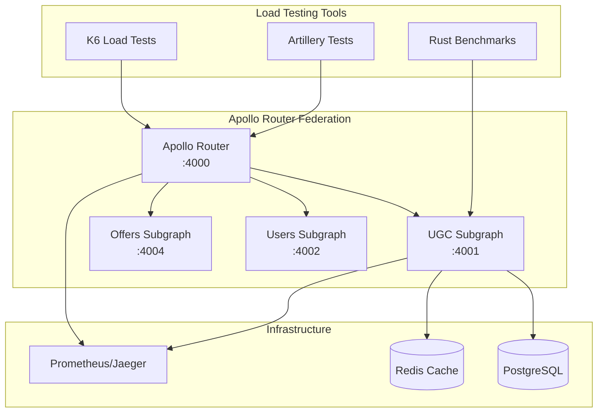

# Load Testing Guide for Apollo Router Federation

This document provides comprehensive guidance for load testing the Apollo Router Federation setup, including test scenarios, tools, and performance optimization strategies.

## Overview

Load testing is crucial for ensuring the Apollo Router Federation can handle production-scale traffic while maintaining acceptable performance and reliability. This guide covers:

- Load testing tools and scenarios
- Performance benchmarking
- Bottleneck identification
- Optimization recommendations
- Continuous performance monitoring

## Test Architecture



## Test Scenarios

### 1. Simple Queries (40% of traffic)
Basic GraphQL queries targeting single subgraphs:

```graphql
query GetReview($id: ID!) {
  review(id: $id) {
    id
    rating
    text
    createdAt
  }
}
```

**Expected Performance:**
- Response time: <100ms (P95)
- Success rate: >99.5%
- Throughput: >100 req/s

### 2. Federated Queries (30% of traffic)
Queries spanning multiple subgraphs:

```graphql
query GetOfferWithReviews($offerId: ID!) {
  offer(id: $offerId) {
    id
    title
    price
    reviews(first: 10) {
      edges {
        node {
          id
          rating
          text
          author {
            id
            name
          }
        }
      }
    }
    averageRating
  }
}
```

**Expected Performance:**
- Response time: <500ms (P95)
- Success rate: >99%
- Throughput: >50 req/s

### 3. Complex Federated Queries (20% of traffic)
Deep nested queries with multiple subgraph interactions:

```graphql
query ComplexFederatedQuery($first: Int!) {
  offers(first: $first) {
    edges {
      node {
        id
        title
        reviews(first: 5) {
          edges {
            node {
              id
              rating
              author {
                id
                name
                reviews(first: 3) {
                  edges {
                    node {
                      id
                      rating
                      offer {
                        id
                        title
                      }
                    }
                  }
                }
              }
            }
          }
        }
        averageRating
      }
    }
  }
}
```

**Expected Performance:**
- Response time: <1000ms (P95)
- Success rate: >98%
- Throughput: >20 req/s

### 4. Mutations (10% of traffic)
Write operations that modify data:

```graphql
mutation CreateReview($input: CreateReviewInput!) {
  createReview(input: $input) {
    id
    rating
    text
    author {
      id
      name
    }
    offer {
      id
      title
      averageRating
    }
  }
}
```

**Expected Performance:**
- Response time: <800ms (P95)
- Success rate: >99%
- Throughput: >10 req/s

## Load Testing Tools

### 1. K6 Load Tests

K6 is used for comprehensive load testing with multiple scenarios:

```bash
# Run all K6 test scenarios
./scripts/load-testing/run-load-tests.sh k6

# Run specific scenario
K6_SCENARIO=federated k6 run scripts/load-testing/k6-load-tests.js

# Run with custom configuration
ROUTER_URL=http://localhost:4000 \
TEST_DURATION=600 \
k6 run scripts/load-testing/k6-load-tests.js
```

**K6 Test Phases:**
1. **Baseline Load:** 10 VUs for 5 minutes
2. **Spike Test:** Ramp from 0 to 100 VUs
3. **Stress Test:** 100 VUs for 10 minutes
4. **Soak Test:** 20 VUs for 30 minutes

### 2. Artillery Load Tests

Artillery provides scenario-based load testing:

```bash
# Run Artillery tests
artillery run scripts/load-testing/artillery-load-tests.yml

# Generate HTML report
artillery report artillery-results.json --output report.html
```

**Artillery Test Phases:**
1. **Warm-up:** 5 req/s for 1 minute
2. **Ramp-up:** 10-50 req/s over 5 minutes
3. **Sustained Load:** 50 req/s for 10 minutes
4. **Peak Load:** 100 req/s for 3 minutes
5. **Cool-down:** 100-10 req/s over 2 minutes

### 3. Rust Benchmarks

Micro-benchmarks for critical code paths:

```bash
# Run Rust benchmarks
cd ugc-subgraph
cargo bench --bench review_benchmarks

# Run performance tests
cargo test --release --test performance_tests
```

## Running Load Tests

### Prerequisites

1. **Install Testing Tools:**
```bash
# Install K6
curl https://github.com/grafana/k6/releases/download/v0.47.0/k6-v0.47.0-linux-amd64.tar.gz -L | tar xvz --strip-components 1

# Install Artillery
npm install -g artillery

# Install Python dependencies for analysis
pip install matplotlib pandas seaborn
```

2. **Start the System:**
```bash
# Start all services
docker-compose up -d

# Verify health
curl http://localhost:4000/health
```

### Execute Load Tests

```bash
# Run comprehensive load tests
./scripts/load-testing/run-load-tests.sh

# Run specific test types
./scripts/load-testing/run-load-tests.sh k6
./scripts/load-testing/run-load-tests.sh artillery
./scripts/load-testing/run-load-tests.sh benchmarks
```

### Analyze Results

```bash
# Analyze test results
python3 scripts/load-testing/performance-analyzer.py ./load-test-results/20240829_143022

# View generated reports
open load-test-results/20240829_143022/performance-report.html
```

## Performance Metrics

### Key Performance Indicators (KPIs)

1. **Response Time Metrics:**
   - Average response time
   - P95 response time (95th percentile)
   - P99 response time (99th percentile)
   - Maximum response time

2. **Throughput Metrics:**
   - Requests per second (RPS)
   - Concurrent users supported
   - Query complexity handling

3. **Reliability Metrics:**
   - Success rate (%)
   - Error rate (%)
   - Availability (%)

4. **Resource Utilization:**
   - CPU usage (%)
   - Memory usage (%)
   - Database connections
   - Cache hit ratio

### Performance Targets

| Metric | Target | Acceptable | Poor |
|--------|--------|------------|------|
| P95 Response Time | <500ms | <1000ms | >1000ms |
| Success Rate | >99.5% | >99% | <99% |
| Throughput | >100 RPS | >50 RPS | <50 RPS |
| CPU Usage | <70% | <85% | >85% |
| Memory Usage | <70% | <85% | >85% |
| Cache Hit Ratio | >80% | >60% | <60% |

## Performance Optimization

### 1. Query Optimization

**DataLoader Pattern:**
```rust
// Implement batching to prevent N+1 queries
pub struct ReviewDataLoader {
    pool: PgPool,
}

impl ReviewDataLoader {
    pub async fn load_batch(&self, ids: Vec<Uuid>) -> Vec<Option<Review>> {
        // Batch load reviews in single query
        let reviews = sqlx::query_as!(
            Review,
            "SELECT * FROM reviews WHERE id = ANY($1)",
            &ids
        )
        .fetch_all(&self.pool)
        .await?;
        
        // Return in same order as requested
        ids.into_iter()
            .map(|id| reviews.iter().find(|r| r.id == id).cloned())
            .collect()
    }
}
```

**Query Complexity Analysis:**
```rust
// Limit query depth and complexity
pub struct QueryComplexityAnalyzer {
    max_depth: usize,
    max_complexity: usize,
}

impl QueryComplexityAnalyzer {
    pub fn analyze(&self, query: &str) -> Result<(), QueryError> {
        let depth = self.calculate_depth(query);
        let complexity = self.calculate_complexity(query);
        
        if depth > self.max_depth {
            return Err(QueryError::TooDeep(depth));
        }
        
        if complexity > self.max_complexity {
            return Err(QueryError::TooComplex(complexity));
        }
        
        Ok(())
    }
}
```

### 2. Caching Strategy

**Redis Caching:**
```rust
// Implement distributed caching
pub struct CacheService {
    redis: redis::Client,
    default_ttl: Duration,
}

impl CacheService {
    pub async fn get_or_set<T>(&self, key: &str, fetcher: impl Future<Output = T>) -> T 
    where 
        T: Serialize + DeserializeOwned 
    {
        // Try cache first
        if let Ok(cached) = self.get::<T>(key).await {
            return cached;
        }
        
        // Fetch and cache
        let value = fetcher.await;
        let _ = self.set(key, &value, self.default_ttl).await;
        value
    }
}
```

**Cache Invalidation:**
```rust
// Implement cache invalidation on mutations
impl ReviewService {
    pub async fn create_review(&self, input: CreateReviewInput) -> Result<Review, UgcError> {
        let review = self.repository.create_review(input).await?;
        
        // Invalidate related caches
        self.cache.invalidate(&format!("offer_reviews:{}", input.offer_id)).await?;
        self.cache.invalidate(&format!("offer_rating:{}", input.offer_id)).await?;
        
        Ok(review)
    }
}
```

### 3. Database Optimization

**Connection Pooling:**
```rust
// Optimize database connection pool
let pool = PgPoolOptions::new()
    .max_connections(20)
    .min_connections(5)
    .acquire_timeout(Duration::from_secs(30))
    .idle_timeout(Duration::from_secs(600))
    .max_lifetime(Duration::from_secs(1800))
    .connect(&database_url)
    .await?;
```

**Query Optimization:**
```sql
-- Add performance indexes
CREATE INDEX CONCURRENTLY idx_reviews_offer_moderated_created 
ON reviews (offer_id, is_moderated, created_at DESC) 
WHERE is_moderated = true;

CREATE INDEX CONCURRENTLY idx_reviews_author_created 
ON reviews (author_id, created_at DESC) 
WHERE is_moderated = true;

-- Optimize aggregation queries
CREATE MATERIALIZED VIEW offer_rating_summary AS
SELECT 
    offer_id,
    AVG(rating) as average_rating,
    COUNT(*) as reviews_count,
    jsonb_object_agg(rating, rating_count) as rating_distribution
FROM (
    SELECT 
        offer_id,
        rating,
        COUNT(*) as rating_count
    FROM reviews 
    WHERE is_moderated = true
    GROUP BY offer_id, rating
) grouped
GROUP BY offer_id;

-- Refresh materialized view periodically
CREATE OR REPLACE FUNCTION refresh_rating_summary()
RETURNS void AS $$
BEGIN
    REFRESH MATERIALIZED VIEW CONCURRENTLY offer_rating_summary;
END;
$$ LANGUAGE plpgsql;
```

### 4. Federation Optimization

**Subgraph Communication:**
```rust
// Optimize subgraph communication with connection pooling
pub struct SubgraphClient {
    client: reqwest::Client,
    base_url: String,
}

impl SubgraphClient {
    pub fn new(base_url: String) -> Self {
        let client = reqwest::Client::builder()
            .pool_max_idle_per_host(10)
            .pool_idle_timeout(Duration::from_secs(30))
            .timeout(Duration::from_secs(30))
            .build()
            .expect("Failed to create HTTP client");
        
        Self { client, base_url }
    }
}
```

**Query Planning:**
```yaml
# Apollo Router configuration for optimization
supergraph:
  query_planning:
    cache:
      in_memory:
        limit: 512
    experimental_reuse_query_fragments: true
  
subgraphs:
  ugc:
    routing_url: http://ugc-service:4001/graphql
    timeout: 30s
    retry:
      min_per_sec: 10
      ttl: 10s
```

## Monitoring and Alerting

### Performance Monitoring

**Prometheus Metrics:**
```rust
// Custom metrics for performance monitoring
lazy_static! {
    static ref QUERY_DURATION: HistogramVec = register_histogram_vec!(
        "graphql_query_duration_seconds",
        "GraphQL query execution time",
        &["operation_name", "subgraph"]
    ).unwrap();
    
    static ref FEDERATED_QUERIES: CounterVec = register_counter_vec!(
        "federated_queries_total",
        "Total federated queries executed",
        &["complexity_level"]
    ).unwrap();
    
    static ref CACHE_HITS: CounterVec = register_counter_vec!(
        "cache_hits_total",
        "Cache hit/miss statistics",
        &["cache_type", "result"]
    ).unwrap();
}
```

**Grafana Dashboard:**
```json
{
  "dashboard": {
    "title": "Apollo Router Federation Performance",
    "panels": [
      {
        "title": "Response Time (P95)",
        "type": "stat",
        "targets": [
          {
            "expr": "histogram_quantile(0.95, rate(graphql_query_duration_seconds_bucket[5m]))"
          }
        ]
      },
      {
        "title": "Throughput",
        "type": "graph",
        "targets": [
          {
            "expr": "rate(graphql_queries_total[1m])"
          }
        ]
      },
      {
        "title": "Error Rate",
        "type": "graph",
        "targets": [
          {
            "expr": "rate(graphql_errors_total[1m]) / rate(graphql_queries_total[1m])"
          }
        ]
      }
    ]
  }
}
```

### Alerting Rules

```yaml
# Prometheus alerting rules
groups:
  - name: apollo_router_performance
    rules:
      - alert: HighResponseTime
        expr: histogram_quantile(0.95, rate(graphql_query_duration_seconds_bucket[5m])) > 1
        for: 2m
        labels:
          severity: warning
        annotations:
          summary: "High GraphQL response time"
          description: "P95 response time is {{ $value }}s"
      
      - alert: HighErrorRate
        expr: rate(graphql_errors_total[5m]) / rate(graphql_queries_total[5m]) > 0.05
        for: 1m
        labels:
          severity: critical
        annotations:
          summary: "High GraphQL error rate"
          description: "Error rate is {{ $value | humanizePercentage }}"
      
      - alert: LowThroughput
        expr: rate(graphql_queries_total[5m]) < 10
        for: 5m
        labels:
          severity: warning
        annotations:
          summary: "Low GraphQL throughput"
          description: "Throughput is {{ $value }} req/s"
```

## Continuous Performance Testing

### CI/CD Integration

```yaml
# GitHub Actions workflow for performance testing
name: Performance Tests
on:
  push:
    branches: [main]
  pull_request:
    branches: [main]

jobs:
  performance-test:
    runs-on: ubuntu-latest
    steps:
      - uses: actions/checkout@v3
      
      - name: Start services
        run: docker-compose up -d
      
      - name: Wait for services
        run: |
          timeout 60 bash -c 'until curl -f http://localhost:4000/health; do sleep 2; done'
      
      - name: Install K6
        run: |
          curl https://github.com/grafana/k6/releases/download/v0.47.0/k6-v0.47.0-linux-amd64.tar.gz -L | tar xvz --strip-components 1
          sudo mv k6 /usr/local/bin/
      
      - name: Run performance tests
        run: |
          K6_SCENARIO=simple k6 run --quiet scripts/load-testing/k6-load-tests.js
      
      - name: Check performance thresholds
        run: |
          # Fail if performance degrades significantly
          python3 scripts/check-performance-regression.py
```

### Performance Regression Detection

```python
# Performance regression detection
import json
import sys

def check_performance_regression(current_results, baseline_results):
    """Check if current results show performance regression"""
    
    # Define acceptable degradation thresholds
    thresholds = {
        'p95_response_time': 1.2,  # 20% degradation allowed
        'success_rate': 0.99,      # Must maintain 99% success rate
        'throughput': 0.8          # 20% throughput reduction allowed
    }
    
    regressions = []
    
    for metric, threshold in thresholds.items():
        current = current_results.get(metric, 0)
        baseline = baseline_results.get(metric, 0)
        
        if metric == 'success_rate':
            if current < threshold:
                regressions.append(f"Success rate dropped to {current:.2%}")
        elif metric == 'throughput':
            if current < baseline * threshold:
                regressions.append(f"Throughput dropped to {current:.2f} (baseline: {baseline:.2f})")
        else:
            if current > baseline * threshold:
                regressions.append(f"{metric} increased to {current:.2f} (baseline: {baseline:.2f})")
    
    return regressions

if __name__ == '__main__':
    # Load and compare results
    with open('current-results.json') as f:
        current = json.load(f)
    
    with open('baseline-results.json') as f:
        baseline = json.load(f)
    
    regressions = check_performance_regression(current, baseline)
    
    if regressions:
        print("❌ Performance regressions detected:")
        for regression in regressions:
            print(f"  - {regression}")
        sys.exit(1)
    else:
        print("✅ No performance regressions detected")
```

## Troubleshooting Performance Issues

### Common Performance Problems

1. **High Response Times:**
   - Check database query performance
   - Verify cache hit rates
   - Monitor subgraph communication
   - Analyze query complexity

2. **Low Throughput:**
   - Check connection pool settings
   - Monitor resource utilization
   - Verify load balancer configuration
   - Analyze bottlenecks in critical path

3. **High Error Rates:**
   - Check timeout configurations
   - Monitor external service health
   - Verify circuit breaker settings
   - Analyze error patterns

4. **Memory Issues:**
   - Check for memory leaks
   - Monitor cache size
   - Verify connection pool limits
   - Analyze object allocation patterns

### Performance Debugging Tools

```bash
# Database performance analysis
SELECT query, mean_time, calls, total_time 
FROM pg_stat_statements 
ORDER BY mean_time DESC 
LIMIT 10;

# Redis performance monitoring
redis-cli --latency-history -i 1

# Application profiling
cargo flamegraph --bin ugc-subgraph

# Network analysis
tcpdump -i any -w network-trace.pcap port 4000

# System resource monitoring
htop
iotop
nethogs
```

## Best Practices

### Load Testing Best Practices

1. **Test Environment:**
   - Use production-like data volumes
   - Mirror production infrastructure
   - Include realistic network latency
   - Test with actual client patterns

2. **Test Design:**
   - Start with baseline tests
   - Gradually increase load
   - Test different query patterns
   - Include error scenarios

3. **Monitoring:**
   - Monitor all system components
   - Track business metrics
   - Set up real-time alerting
   - Analyze trends over time

4. **Automation:**
   - Integrate with CI/CD pipeline
   - Automate result analysis
   - Set performance gates
   - Track performance over time

### Performance Optimization Best Practices

1. **Caching:**
   - Cache at multiple levels
   - Implement cache warming
   - Monitor cache hit rates
   - Plan cache invalidation strategy

2. **Database:**
   - Optimize query patterns
   - Use appropriate indexes
   - Monitor connection pools
   - Implement read replicas

3. **Federation:**
   - Minimize subgraph calls
   - Batch related operations
   - Implement query planning
   - Monitor federation overhead

4. **Monitoring:**
   - Track key performance metrics
   - Set up proactive alerting
   - Analyze performance trends
   - Plan capacity scaling

## Conclusion

Load testing is essential for ensuring the Apollo Router Federation can handle production traffic effectively. By following this guide and implementing the recommended practices, you can:

- Identify performance bottlenecks before they impact users
- Optimize system performance through data-driven decisions
- Ensure reliable operation under various load conditions
- Plan for future scaling needs

Regular load testing and performance monitoring should be integral parts of your development and operations processes to maintain optimal system performance.