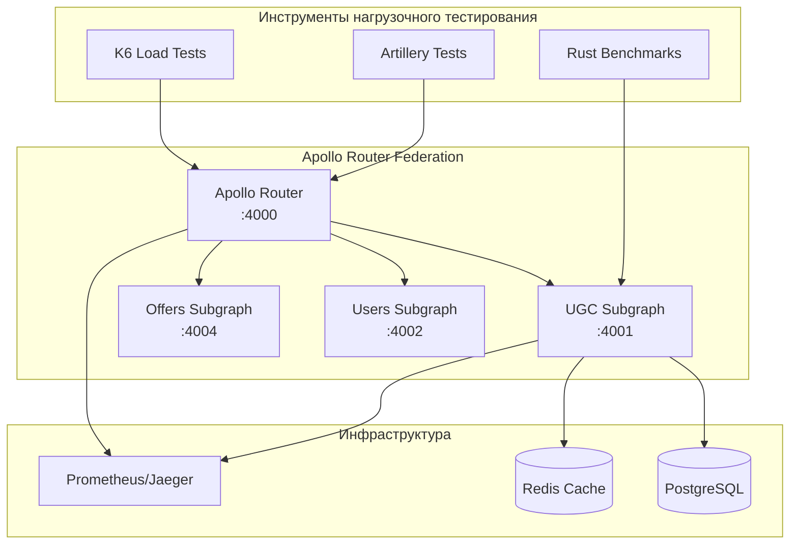

# Руководство по нагрузочному тестированию Apollo Router Federation

Этот документ предоставляет comprehensive руководство по нагрузочному тестированию настройки Apollo Router Federation, включая тестовые сценарии, инструменты и стратегии оптимизации производительности.

## 📋 Обзор

Нагрузочное тестирование критически важно для обеспечения способности Apollo Router Federation обрабатывать продакшн-уровень трафика при сохранении приемлемой производительности и надежности. Это руководство покрывает:

- Инструменты и сценарии нагрузочного тестирования
- Бенчмаркинг производительности
- Идентификация узких мест
- Рекомендации по оптимизации
- Непрерывный мониторинг производительности

## Архитектура тестирования



## Тестовые сценарии

### 1. Простые запросы (40% трафика)
Базовые GraphQL запросы, нацеленные на отдельные подграфы:

```graphql
query GetReview($id: ID!) {
  review(id: $id) {
    id
    rating
    text
    createdAt
  }
}
```

**Ожидаемая производительность:**
- Время отклика: <100ms (P95)
- Успешность: >99.5%
- Пропускная способность: >100 req/s

### 2. Федеративные запросы (30% трафика)
Запросы, охватывающие несколько подграфов:

```graphql
query GetOfferWithReviews($offerId: ID!) {
  offer(id: $offerId) {
    id
    title
    price
    reviews(first: 10) {
      edges {
        node {
          id
          rating
          text
          author {
            id
            name
          }
        }
      }
    }
    averageRating
  }
}
```

**Ожидаемая производительность:**
- Время отклика: <500ms (P95)
- Успешность: >99%
- Пропускная способность: >50 req/s

### 3. Сложные федеративные запросы (20% трафика)
Глубоко вложенные запросы с множественными взаимодействиями подграфов:

```graphql
query ComplexFederatedQuery($first: Int!) {
  offers(first: $first) {
    edges {
      node {
        id
        title
        reviews(first: 5) {
          edges {
            node {
              id
              rating
              author {
                id
                name
                reviews(first: 3) {
                  edges {
                    node {
                      id
                      rating
                      offer {
                        id
                        title
                      }
                    }
                  }
                }
              }
            }
          }
        }
        averageRating
      }
    }
  }
}
```

**Ожидаемая производительность:**
- Время отклика: <1000ms (P95)
- Успешность: >98%
- Пропускная способность: >20 req/s

### 4. Мутации (10% трафика)
Операции записи, изменяющие данные:

```graphql
mutation CreateReview($input: CreateReviewInput!) {
  createReview(input: $input) {
    id
    rating
    text
    author {
      id
      name
    }
    offer {
      id
      title
      averageRating
    }
  }
}
```

**Ожидаемая производительность:**
- Время отклика: <800ms (P95)
- Успешность: >99%
- Пропускная способность: >10 req/s

## Инструменты нагрузочного тестирования

### 1. K6 нагрузочные тесты

K6 используется для comprehensive нагрузочного тестирования с множественными сценариями:

```bash
# Запуск всех K6 тестовых сценариев
./scripts/load-testing/run-load-tests.sh k6

# Запуск конкретного сценария
K6_SCENARIO=federated k6 run scripts/load-testing/k6-load-tests.js

# Запуск с пользовательской конфигурацией
ROUTER_URL=http://localhost:4000 \
TEST_DURATION=600 \
k6 run scripts/load-testing/k6-load-tests.js
```

**Фазы K6 тестов:**
1. **Базовая нагрузка:** 10 VUs в течение 5 минут
2. **Спайк тест:** Нарастание от 0 до 100 VUs
3. **Стресс тест:** 100 VUs в течение 10 минут
4. **Soak тест:** 20 VUs в течение 30 минут

### 2. Artillery нагрузочные тесты

Artillery предоставляет сценарно-ориентированное нагрузочное тестирование:

```bash
# Запуск Artillery тестов
artillery run scripts/load-testing/artillery-load-tests.yml

# Генерация HTML отчета
artillery report artillery-results.json --output report.html
```

**Фазы Artillery тестов:**
1. **Разогрев:** 5 req/s в течение 1 минуты
2. **Нарастание:** 10-50 req/s в течение 5 минут
3. **Устойчивая нагрузка:** 50 req/s в течение 10 минут
4. **Пиковая нагрузка:** 100 req/s в течение 3 минут
5. **Снижение:** 100-10 req/s в течение 2 минут

### 3. Rust бенчмарки

Микро-бенчмарки для критических путей кода:

```bash
# Запуск Rust бенчмарков
cd ugc-subgraph
cargo bench --bench review_benchmarks

# Запуск тестов производительности
cargo test --release --test performance_tests
```

## Запуск нагрузочных тестов

### Предварительные требования

1. **Установка инструментов тестирования:**
```bash
# Установка K6
curl https://github.com/grafana/k6/releases/download/v0.47.0/k6-v0.47.0-linux-amd64.tar.gz -L | tar xvz --strip-components 1

# Установка Artillery
npm install -g artillery

# Установка Python зависимостей для анализа
pip install matplotlib pandas seaborn
```

2. **Запуск системы:**
```bash
# Запуск всех сервисов
docker-compose up -d

# Проверка здоровья
curl http://localhost:4000/health
```

### Выполнение нагрузочных тестов

```bash
# Запуск comprehensive нагрузочных тестов
./scripts/load-testing/run-load-tests.sh

# Запуск конкретных типов тестов
./scripts/load-testing/run-load-tests.sh k6
./scripts/load-testing/run-load-tests.sh artillery
./scripts/load-testing/run-load-tests.sh benchmarks
```

### Анализ результатов

```bash
# Анализ результатов тестов
python3 scripts/load-testing/performance-analyzer.py ./load-test-results/20240829_143022

# Просмотр сгенерированных отчетов
open load-test-results/20240829_143022/performance-report.html
```

## Метрики производительности

### Ключевые показатели производительности (KPIs)

1. **Метрики времени отклика:**
   - Среднее время отклика
   - P95 время отклика (95-й процентиль)
   - P99 время отклика (99-й процентиль)
   - Максимальное время отклика

2. **Метрики пропускной способности:**
   - Запросов в секунду (RPS)
   - Поддерживаемые одновременные пользователи
   - Обработка сложности запросов

3. **Метрики надежности:**
   - Успешность (%)
   - Уровень ошибок (%)
   - Доступность (%)

4. **Использование ресурсов:**
   - Использование CPU (%)
   - Использование памяти (%)
   - Соединения с базой данных
   - Коэффициент попаданий в кеш

### Целевые показатели производительности

| Метрика | Цель | Приемлемо | Плохо |
|---------|------|-----------|-------|
| P95 Время отклика | <500ms | <1000ms | >1000ms |
| Успешность | >99.5% | >99% | <99% |
| Пропускная способность | >100 RPS | >50 RPS | <50 RPS |
| Использование CPU | <70% | <85% | >85% |
| Использование памяти | <70% | <85% | >85% |
| Коэффициент попаданий в кеш | >80% | >60% | <60% |

## Оптимизация производительности

### 1. Оптимизация запросов

**Паттерн DataLoader:**
```rust
// Реализация батчинга для предотвращения N+1 запросов
pub struct ReviewDataLoader {
    pool: PgPool,
}

impl ReviewDataLoader {
    pub async fn load_batch(&self, ids: Vec<Uuid>) -> Vec<Option<Review>> {
        // Батчевая загрузка отзывов одним запросом
        let reviews = sqlx::query_as!(
            Review,
            "SELECT * FROM reviews WHERE id = ANY($1)",
            &ids
        )
        .fetch_all(&self.pool)
        .await?;
        
        // Возврат в том же порядке, что и запрошено
        ids.into_iter()
            .map(|id| reviews.iter().find(|r| r.id == id).cloned())
            .collect()
    }
}
```

**Анализ сложности запросов:**
```rust
// Ограничение глубины и сложности запросов
pub struct QueryComplexityAnalyzer {
    max_depth: usize,
    max_complexity: usize,
}

impl QueryComplexityAnalyzer {
    pub fn analyze(&self, query: &str) -> Result<(), QueryError> {
        let depth = self.calculate_depth(query);
        let complexity = self.calculate_complexity(query);
        
        if depth > self.max_depth {
            return Err(QueryError::TooDeep(depth));
        }
        
        if complexity > self.max_complexity {
            return Err(QueryError::TooComplex(complexity));
        }
        
        Ok(())
    }
}
```

### 2. Стратегия кеширования

**Redis кеширование:**
```rust
// Реализация распределенного кеширования
pub struct CacheService {
    redis: redis::Client,
    default_ttl: Duration,
}

impl CacheService {
    pub async fn get_or_set<T>(&self, key: &str, fetcher: impl Future<Output = T>) -> T 
    where 
        T: Serialize + DeserializeOwned 
    {
        // Сначала попробовать кеш
        if let Ok(cached) = self.get::<T>(key).await {
            return cached;
        }
        
        // Получить и закешировать
        let value = fetcher.await;
        let _ = self.set(key, &value, self.default_ttl).await;
        value
    }
}
```

**Инвалидация кеша:**
```rust
// Реализация инвалидации кеша при мутациях
impl ReviewService {
    pub async fn create_review(&self, input: CreateReviewInput) -> Result<Review, UgcError> {
        let review = self.repository.create_review(input).await?;
        
        // Инвалидация связанных кешей
        self.cache.invalidate(&format!("offer_reviews:{}", input.offer_id)).await?;
        self.cache.invalidate(&format!("offer_rating:{}", input.offer_id)).await?;
        
        Ok(review)
    }
}
```

### 3. Оптимизация базы данных

**Пулинг соединений:**
```rust
// Оптимизация пула соединений с базой данных
let pool = PgPoolOptions::new()
    .max_connections(20)
    .min_connections(5)
    .acquire_timeout(Duration::from_secs(30))
    .idle_timeout(Duration::from_secs(600))
    .max_lifetime(Duration::from_secs(1800))
    .connect(&database_url)
    .await?;
```

**Оптимизация запросов:**
```sql
-- Добавление индексов производительности
CREATE INDEX CONCURRENTLY idx_reviews_offer_moderated_created 
ON reviews (offer_id, is_moderated, created_at DESC) 
WHERE is_moderated = true;

CREATE INDEX CONCURRENTLY idx_reviews_author_created 
ON reviews (author_id, created_at DESC) 
WHERE is_moderated = true;

-- Оптимизация агрегационных запросов
CREATE MATERIALIZED VIEW offer_rating_summary AS
SELECT 
    offer_id,
    AVG(rating) as average_rating,
    COUNT(*) as reviews_count,
    jsonb_object_agg(rating, rating_count) as rating_distribution
FROM (
    SELECT 
        offer_id,
        rating,
        COUNT(*) as rating_count
    FROM reviews 
    WHERE is_moderated = true
    GROUP BY offer_id, rating
) grouped
GROUP BY offer_id;

-- Периодическое обновление материализованного представления
CREATE OR REPLACE FUNCTION refresh_rating_summary()
RETURNS void AS $
BEGIN
    REFRESH MATERIALIZED VIEW CONCURRENTLY offer_rating_summary;
END;
$ LANGUAGE plpgsql;
```

### 4. Оптимизация федерации

**Коммуникация подграфов:**
```rust
// Оптимизация коммуникации подграфов с пулингом соединений
pub struct SubgraphClient {
    client: reqwest::Client,
    base_url: String,
}

impl SubgraphClient {
    pub fn new(base_url: String) -> Self {
        let client = reqwest::Client::builder()
            .pool_max_idle_per_host(10)
            .pool_idle_timeout(Duration::from_secs(30))
            .timeout(Duration::from_secs(30))
            .build()
            .expect("Не удалось создать HTTP клиент");
        
        Self { client, base_url }
    }
}
```

**Планирование запросов:**
```yaml
# Конфигурация Apollo Router для оптимизации
supergraph:
  query_planning:
    cache:
      in_memory:
        limit: 512
    experimental_reuse_query_fragments: true
  
subgraphs:
  ugc:
    routing_url: http://ugc-service:4001/graphql
    timeout: 30s
    retry:
      min_per_sec: 10
      ttl: 10s
```## Монитор
инг и алертинг

### Мониторинг производительности

**Prometheus метрики:**
```rust
// Пользовательские метрики для мониторинга производительности
lazy_static! {
    static ref QUERY_DURATION: HistogramVec = register_histogram_vec!(
        "graphql_query_duration_seconds",
        "Время выполнения GraphQL запроса",
        &["operation_name", "subgraph"]
    ).unwrap();
    
    static ref FEDERATED_QUERIES: CounterVec = register_counter_vec!(
        "federated_queries_total",
        "Общее количество выполненных федеративных запросов",
        &["complexity_level"]
    ).unwrap();
    
    static ref CACHE_HITS: CounterVec = register_counter_vec!(
        "cache_hits_total",
        "Статистика попаданий/промахов кеша",
        &["cache_type", "result"]
    ).unwrap();
}
```

**Grafana дашборд:**
```json
{
  "dashboard": {
    "title": "Производительность Apollo Router Federation",
    "panels": [
      {
        "title": "Время отклика (P95)",
        "type": "stat",
        "targets": [
          {
            "expr": "histogram_quantile(0.95, rate(graphql_query_duration_seconds_bucket[5m]))"
          }
        ]
      },
      {
        "title": "Пропускная способность",
        "type": "graph",
        "targets": [
          {
            "expr": "rate(graphql_queries_total[1m])"
          }
        ]
      },
      {
        "title": "Уровень ошибок",
        "type": "graph",
        "targets": [
          {
            "expr": "rate(graphql_errors_total[1m]) / rate(graphql_queries_total[1m])"
          }
        ]
      }
    ]
  }
}
```

### Правила алертинга

```yaml
# Правила алертинга Prometheus
groups:
  - name: apollo_router_performance
    rules:
      - alert: HighResponseTime
        expr: histogram_quantile(0.95, rate(graphql_query_duration_seconds_bucket[5m])) > 1
        for: 2m
        labels:
          severity: warning
        annotations:
          summary: "Высокое время отклика GraphQL"
          description: "P95 время отклика составляет {{ $value }}с"
      
      - alert: HighErrorRate
        expr: rate(graphql_errors_total[5m]) / rate(graphql_queries_total[5m]) > 0.05
        for: 1m
        labels:
          severity: critical
        annotations:
          summary: "Высокий уровень ошибок GraphQL"
          description: "Уровень ошибок составляет {{ $value | humanizePercentage }}"
      
      - alert: LowThroughput
        expr: rate(graphql_queries_total[5m]) < 10
        for: 5m
        labels:
          severity: warning
        annotations:
          summary: "Низкая пропускная способность GraphQL"
          description: "Пропускная способность составляет {{ $value }} req/s"
```

## Непрерывное тестирование производительности

### Интеграция с CI/CD

```yaml
# GitHub Actions workflow для тестирования производительности
name: Performance Tests
on:
  push:
    branches: [main]
  pull_request:
    branches: [main]

jobs:
  performance-test:
    runs-on: ubuntu-latest
    steps:
      - uses: actions/checkout@v3
      
      - name: Запуск сервисов
        run: docker-compose up -d
      
      - name: Ожидание готовности сервисов
        run: |
          timeout 60 bash -c 'until curl -f http://localhost:4000/health; do sleep 2; done'
      
      - name: Установка K6
        run: |
          curl https://github.com/grafana/k6/releases/download/v0.47.0/k6-v0.47.0-linux-amd64.tar.gz -L | tar xvz --strip-components 1
          sudo mv k6 /usr/local/bin/
      
      - name: Запуск тестов производительности
        run: |
          K6_SCENARIO=simple k6 run --quiet scripts/load-testing/k6-load-tests.js
      
      - name: Проверка пороговых значений производительности
        run: |
          # Провал при значительной деградации производительности
          python3 scripts/check-performance-regression.py
```

### Обнаружение регрессии производительности

```python
# Обнаружение регрессии производительности
import json
import sys

def check_performance_regression(current_results, baseline_results):
    """Проверка показывают ли текущие результаты регрессию производительности"""
    
    # Определение приемлемых пороговых значений деградации
    thresholds = {
        'p95_response_time': 1.2,  # Допустимая деградация на 20%
        'success_rate': 0.99,      # Должна поддерживаться 99% успешность
        'throughput': 0.8          # Допустимое снижение пропускной способности на 20%
    }
    
    regressions = []
    
    for metric, threshold in thresholds.items():
        current = current_results.get(metric, 0)
        baseline = baseline_results.get(metric, 0)
        
        if metric == 'success_rate':
            if current < threshold:
                regressions.append(f"Успешность упала до {current:.2%}")
        elif metric == 'throughput':
            if current < baseline * threshold:
                regressions.append(f"Пропускная способность упала до {current:.2f} (базовая: {baseline:.2f})")
        else:
            if current > baseline * threshold:
                regressions.append(f"{metric} увеличилась до {current:.2f} (базовая: {baseline:.2f})")
    
    return regressions

if __name__ == '__main__':
    # Загрузка и сравнение результатов
    with open('current-results.json') as f:
        current = json.load(f)
    
    with open('baseline-results.json') as f:
        baseline = json.load(f)
    
    regressions = check_performance_regression(current, baseline)
    
    if regressions:
        print("❌ Обнаружены регрессии производительности:")
        for regression in regressions:
            print(f"  - {regression}")
        sys.exit(1)
    else:
        print("✅ Регрессии производительности не обнаружены")
```

## Устранение проблем производительности

### Распространенные проблемы производительности

1. **Высокое время отклика:**
   - Проверить производительность запросов к базе данных
   - Проверить коэффициент попаданий в кеш
   - Мониторить коммуникацию подграфов
   - Анализировать сложность запросов

2. **Низкая пропускная способность:**
   - Проверить настройки пула соединений
   - Мониторить использование ресурсов
   - Проверить конфигурацию балансировщика нагрузки
   - Анализировать узкие места в критическом пути

3. **Высокий уровень ошибок:**
   - Проверить конфигурации таймаутов
   - Мониторить здоровье внешних сервисов
   - Проверить настройки circuit breaker
   - Анализировать паттерны ошибок

4. **Проблемы с памятью:**
   - Проверить на утечки памяти
   - Мониторить размер кеша
   - Проверить лимиты пула соединений
   - Анализировать паттерны выделения объектов

### Инструменты отладки производительности

```bash
# Анализ производительности базы данных
SELECT query, mean_time, calls, total_time 
FROM pg_stat_statements 
ORDER BY mean_time DESC 
LIMIT 10;

# Мониторинг производительности Redis
redis-cli --latency-history -i 1

# Профилирование приложения
cargo flamegraph --bin ugc-subgraph

# Анализ сети
tcpdump -i any -w network-trace.pcap port 4000

# Мониторинг системных ресурсов
htop
iotop
nethogs
```

## Лучшие практики

### Лучшие практики нагрузочного тестирования

1. **Тестовое окружение:**
   - Использовать объемы данных, похожие на продакшн
   - Отражать продакшн инфраструктуру
   - Включать реалистичную сетевую задержку
   - Тестировать с реальными паттернами клиентов

2. **Дизайн тестов:**
   - Начинать с базовых тестов
   - Постепенно увеличивать нагрузку
   - Тестировать различные паттерны запросов
   - Включать сценарии ошибок

3. **Мониторинг:**
   - Мониторить все компоненты системы
   - Отслеживать бизнес-метрики
   - Настроить алертинг в реальном времени
   - Анализировать тренды во времени

4. **Автоматизация:**
   - Интегрировать с CI/CD пайплайном
   - Автоматизировать анализ результатов
   - Установить пороговые значения производительности
   - Отслеживать производительность во времени

### Лучшие практики оптимизации производительности

1. **Кеширование:**
   - Кешировать на нескольких уровнях
   - Реализовать прогрев кеша
   - Мониторить коэффициент попаданий в кеш
   - Планировать стратегию инвалидации кеша

2. **База данных:**
   - Оптимизировать паттерны запросов
   - Использовать подходящие индексы
   - Мониторить пулы соединений
   - Реализовать реплики для чтения

3. **Федерация:**
   - Минимизировать вызовы подграфов
   - Батчить связанные операции
   - Реализовать планирование запросов
   - Мониторить накладные расходы федерации

4. **Мониторинг:**
   - Отслеживать ключевые метрики производительности
   - Настроить проактивный алертинг
   - Анализировать тренды производительности
   - Планировать масштабирование мощностей

## 🎯 Дополнительные инструменты и техники

### Продвинутые сценарии тестирования

```javascript
// K6 скрипт для сложного сценария тестирования
import http from 'k6/http';
import { check, sleep } from 'k6';
import { Rate } from 'k6/metrics';

// Пользовательские метрики
export let errorRate = new Rate('errors');

export let options = {
  stages: [
    { duration: '2m', target: 10 }, // Разогрев
    { duration: '5m', target: 50 }, // Нарастание
    { duration: '10m', target: 100 }, // Стабильная нагрузка
    { duration: '3m', target: 200 }, // Пиковая нагрузка
    { duration: '5m', target: 0 }, // Снижение
  ],
  thresholds: {
    http_req_duration: ['p(95)<500'], // 95% запросов должны быть быстрее 500ms
    http_req_failed: ['rate<0.01'], // Менее 1% ошибок
    errors: ['rate<0.01'], // Менее 1% бизнес-ошибок
  },
};

export default function() {
  // Сценарий 1: Простой запрос отзыва (40% трафика)
  if (Math.random() < 0.4) {
    let response = http.post('http://localhost:4000/graphql', JSON.stringify({
      query: `
        query GetReview($id: ID!) {
          review(id: $id) {
            id
            rating
            text
            createdAt
          }
        }
      `,
      variables: { id: `review-${Math.floor(Math.random() * 1000)}` }
    }), {
      headers: { 'Content-Type': 'application/json' },
    });
    
    check(response, {
      'статус 200': (r) => r.status === 200,
      'нет ошибок GraphQL': (r) => !JSON.parse(r.body).errors,
    }) || errorRate.add(1);
  }
  
  // Сценарий 2: Федеративный запрос (30% трафика)
  else if (Math.random() < 0.7) {
    let response = http.post('http://localhost:4000/graphql', JSON.stringify({
      query: `
        query GetOfferWithReviews($offerId: ID!) {
          offer(id: $offerId) {
            id
            title
            price
            reviews(first: 10) {
              edges {
                node {
                  rating
                  text
                  author { name }
                }
              }
            }
            averageRating
          }
        }
      `,
      variables: { offerId: `offer-${Math.floor(Math.random() * 500)}` }
    }), {
      headers: { 'Content-Type': 'application/json' },
    });
    
    check(response, {
      'федеративный запрос успешен': (r) => r.status === 200 && !JSON.parse(r.body).errors,
      'время отклика приемлемо': (r) => r.timings.duration < 1000,
    }) || errorRate.add(1);
  }
  
  // Сценарий 3: Мутация создания отзыва (10% трафика)
  else {
    let response = http.post('http://localhost:4000/graphql', JSON.stringify({
      query: `
        mutation CreateReview($input: CreateReviewInput!) {
          createReview(input: $input) {
            id
            rating
            text
          }
        }
      `,
      variables: {
        input: {
          offerId: `offer-${Math.floor(Math.random() * 500)}`,
          rating: Math.floor(Math.random() * 5) + 1,
          text: "Тестовый отзыв для нагрузочного тестирования"
        }
      }
    }), {
      headers: { 
        'Content-Type': 'application/json',
        'Authorization': 'Bearer test-token'
      },
    });
    
    check(response, {
      'мутация успешна': (r) => r.status === 200,
      'отзыв создан': (r) => JSON.parse(r.body).data?.createReview?.id,
    }) || errorRate.add(1);
  }
  
  sleep(1); // Пауза между запросами
}
```

### Анализ результатов тестирования

```python
# Скрипт для анализа результатов нагрузочного тестирования
import json
import pandas as pd
import matplotlib.pyplot as plt
import seaborn as sns
from datetime import datetime

class PerformanceAnalyzer:
    def __init__(self, results_file):
        with open(results_file, 'r') as f:
            self.results = json.load(f)
    
    def analyze_response_times(self):
        """Анализ времени отклика"""
        response_times = self.results.get('response_times', [])
        df = pd.DataFrame(response_times)
        
        # Статистика
        stats = {
            'среднее': df['duration'].mean(),
            'медиана': df['duration'].median(),
            'p95': df['duration'].quantile(0.95),
            'p99': df['duration'].quantile(0.99),
            'максимум': df['duration'].max()
        }
        
        print("📊 Статистика времени отклика:")
        for metric, value in stats.items():
            print(f"  {metric}: {value:.2f}ms")
        
        # Визуализация
        plt.figure(figsize=(12, 6))
        
        plt.subplot(1, 2, 1)
        plt.hist(df['duration'], bins=50, alpha=0.7)
        plt.title('Распределение времени отклика')
        plt.xlabel('Время отклика (ms)')
        plt.ylabel('Частота')
        
        plt.subplot(1, 2, 2)
        df['timestamp'] = pd.to_datetime(df['timestamp'])
        plt.plot(df['timestamp'], df['duration'])
        plt.title('Время отклика во времени')
        plt.xlabel('Время')
        plt.ylabel('Время отклика (ms)')
        plt.xticks(rotation=45)
        
        plt.tight_layout()
        plt.savefig('response_times_analysis.png')
        plt.show()
        
        return stats
    
    def analyze_throughput(self):
        """Анализ пропускной способности"""
        requests = self.results.get('requests', [])
        df = pd.DataFrame(requests)
        df['timestamp'] = pd.to_datetime(df['timestamp'])
        
        # Группировка по секундам
        df_grouped = df.groupby(df['timestamp'].dt.floor('S')).size()
        
        stats = {
            'средний_rps': df_grouped.mean(),
            'максимальный_rps': df_grouped.max(),
            'минимальный_rps': df_grouped.min()
        }
        
        print("🚀 Статистика пропускной способности:")
        for metric, value in stats.items():
            print(f"  {metric}: {value:.2f} req/s")
        
        # Визуализация
        plt.figure(figsize=(12, 4))
        plt.plot(df_grouped.index, df_grouped.values)
        plt.title('Пропускная способность во времени')
        plt.xlabel('Время')
        plt.ylabel('Запросов в секунду')
        plt.xticks(rotation=45)
        plt.tight_layout()
        plt.savefig('throughput_analysis.png')
        plt.show()
        
        return stats
    
    def analyze_errors(self):
        """Анализ ошибок"""
        errors = self.results.get('errors', [])
        if not errors:
            print("✅ Ошибок не обнаружено!")
            return
        
        df = pd.DataFrame(errors)
        error_counts = df['type'].value_counts()
        
        print("❌ Статистика ошибок:")
        for error_type, count in error_counts.items():
            print(f"  {error_type}: {count}")
        
        # Визуализация
        plt.figure(figsize=(10, 6))
        error_counts.plot(kind='bar')
        plt.title('Распределение типов ошибок')
        plt.xlabel('Тип ошибки')
        plt.ylabel('Количество')
        plt.xticks(rotation=45)
        plt.tight_layout()
        plt.savefig('errors_analysis.png')
        plt.show()
    
    def generate_report(self):
        """Генерация comprehensive отчета"""
        print("📋 Отчет о нагрузочном тестировании")
        print("=" * 50)
        
        response_stats = self.analyze_response_times()
        throughput_stats = self.analyze_throughput()
        self.analyze_errors()
        
        # Оценка производительности
        performance_grade = self.calculate_performance_grade(
            response_stats, throughput_stats
        )
        
        print(f"\n🎯 Общая оценка производительности: {performance_grade}")
    
    def calculate_performance_grade(self, response_stats, throughput_stats):
        """Расчет общей оценки производительности"""
        score = 0
        
        # Оценка времени отклика
        if response_stats['p95'] < 500:
            score += 40
        elif response_stats['p95'] < 1000:
            score += 25
        else:
            score += 10
        
        # Оценка пропускной способности
        if throughput_stats['средний_rps'] > 100:
            score += 30
        elif throughput_stats['средний_rps'] > 50:
            score += 20
        else:
            score += 10
        
        # Оценка стабильности
        if len(self.results.get('errors', [])) == 0:
            score += 30
        elif len(self.results.get('errors', [])) < 10:
            score += 20
        else:
            score += 5
        
        if score >= 90:
            return "Отлично 🌟"
        elif score >= 70:
            return "Хорошо ✅"
        elif score >= 50:
            return "Удовлетворительно ⚠️"
        else:
            return "Требует улучшения ❌"

# Использование
if __name__ == "__main__":
    analyzer = PerformanceAnalyzer('load_test_results.json')
    analyzer.generate_report()
```

---

## 📝 Заключение

Нагрузочное тестирование является essential для обеспечения способности Apollo Router Federation эффективно обрабатывать продакшн трафик. Следуя этому руководству и реализуя рекомендуемые практики, вы можете:

- Идентифицировать узкие места производительности до того, как они повлияют на пользователей
- Оптимизировать производительность системы через решения, основанные на данных
- Обеспечить надежную работу при различных условиях нагрузки
- Планировать будущие потребности в масштабировании

Регулярное нагрузочное тестирование и мониторинг производительности должны быть неотъемлемой частью ваших процессов разработки и эксплуатации для поддержания оптимальной производительности системы.

### 🎯 Ключевые принципы:

- **Непрерывность** - регулярное тестирование на всех этапах разработки
- **Реалистичность** - использование реальных данных и паттернов нагрузки
- **Автоматизация** - интеграция в CI/CD для раннего обнаружения проблем
- **Мониторинг** - постоянное отслеживание ключевых метрик производительности
- **Оптимизация** - итеративное улучшение на основе результатов тестирования

Успешного тестирования! 🚀