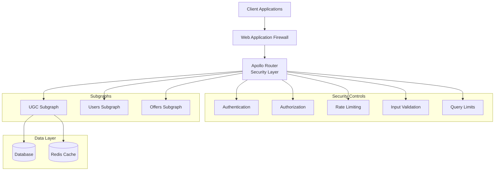

# Security Guide for Apollo Router Federation

This document provides comprehensive security guidance for the Apollo Router Federation setup, including security best practices, vulnerability prevention, and security testing procedures.

## Table of Contents

1. [Security Overview](#security-overview)
2. [Authentication & Authorization](#authentication--authorization)
3. [GraphQL Security](#graphql-security)
4. [OWASP Top 10 Protection](#owasp-top-10-protection)
5. [Input Validation](#input-validation)
6. [Rate Limiting & DoS Protection](#rate-limiting--dos-protection)
7. [Security Headers](#security-headers)
8. [Monitoring & Logging](#monitoring--logging)
9. [Security Testing](#security-testing)
10. [Incident Response](#incident-response)

## Security Overview

The Apollo Router Federation implements multiple layers of security to protect against common web application vulnerabilities and GraphQL-specific attacks.

### Security Architecture



### Security Principles

1. **Defense in Depth**: Multiple security layers
2. **Least Privilege**: Minimal required permissions
3. **Zero Trust**: Verify everything, trust nothing
4. **Fail Secure**: Secure defaults and error handling
5. **Security by Design**: Built-in security controls

## Authentication & Authorization

### JWT Authentication

The system uses JSON Web Tokens (JWT) for authentication:

```rust
use jsonwebtoken::{decode, DecodingKey, Validation, Algorithm};

#[derive(Debug, Serialize, Deserialize)]
pub struct Claims {
    pub sub: String,      // User ID
    pub name: String,     // User name
    pub email: String,    // User email
    pub roles: Vec<String>, // User roles
    pub exp: usize,       // Expiration time
    pub iat: usize,       // Issued at
    pub iss: String,      // Issuer
}

pub struct AuthService {
    decoding_key: DecodingKey,
    validation: Validation,
}

impl AuthService {
    pub fn new(secret: &str) -> Self {
        let mut validation = Validation::new(Algorithm::HS256);
        validation.set_issuer(&["auto-ru-federation"]);
        validation.validate_exp = true;
        validation.validate_nbf = true;
        
        Self {
            decoding_key: DecodingKey::from_secret(secret.as_ref()),
            validation,
        }
    }
    
    pub fn validate_token(&self, token: &str) -> Result<Claims, AuthError> {
        let token_data = decode::<Claims>(
            token,
            &self.decoding_key,
            &self.validation,
        )?;
        
        // Additional validation
        self.validate_claims(&token_data.claims)?;
        
        Ok(token_data.claims)
    }
    
    fn validate_claims(&self, claims: &Claims) -> Result<(), AuthError> {
        // Check token age
        let current_time = SystemTime::now()
            .duration_since(UNIX_EPOCH)?
            .as_secs() as usize;
        
        if current_time - claims.iat > 86400 { // 24 hours
            return Err(AuthError::TokenTooOld);
        }
        
        // Validate user exists and is active
        // This would typically involve a database check
        
        Ok(())
    }
}
```

### Role-Based Access Control (RBAC)

```rust
use async_graphql::{Context, Guard, Result};

#[derive(Debug, Clone)]
pub enum Role {
    User,
    Moderator,
    Admin,
}

pub struct RequireRole {
    required_role: Role,
}

impl RequireRole {
    pub fn new(role: Role) -> Self {
        Self { required_role: role }
    }
}

#[async_trait::async_trait]
impl Guard for RequireRole {
    async fn check(&self, ctx: &Context<'_>) -> Result<()> {
        let user_context = ctx.data::<UserContext>()?;
        
        let has_permission = match self.required_role {
            Role::User => user_context.roles.contains(&"user".to_string()),
            Role::Moderator => user_context.roles.contains(&"moderator".to_string()) ||
                              user_context.roles.contains(&"admin".to_string()),
            Role::Admin => user_context.roles.contains(&"admin".to_string()),
        };
        
        if has_permission {
            Ok(())
        } else {
            Err("Insufficient permissions".into())
        }
    }
}

// Usage in resolvers
#[Object]
impl Mutation {
    #[graphql(guard = "RequireRole::new(Role::Moderator)")]
    async fn moderate_review(
        &self,
        ctx: &Context<'_>,
        review_id: Uuid,
        status: ModerationStatus,
    ) -> Result<Review> {
        let service = ctx.data::<ReviewService>()?;
        service.moderate_review(review_id, status).await
    }
}
```

### Field-Level Authorization

```rust
#[Object]
impl User {
    async fn id(&self) -> &Uuid {
        &self.id
    }
    
    async fn name(&self) -> &str {
        &self.name
    }
    
    // Sensitive field - only accessible by owner or admin
    async fn email(&self, ctx: &Context<'_>) -> Result<Option<&str>> {
        let user_context = ctx.data::<UserContext>()?;
        
        if user_context.user_id == self.id || 
           user_context.roles.contains(&"admin".to_string()) {
            Ok(Some(&self.email))
        } else {
            Ok(None)
        }
    }
    
    // Very sensitive field - only accessible by owner
    async fn phone(&self, ctx: &Context<'_>) -> Result<Option<&str>> {
        let user_context = ctx.data::<UserContext>()?;
        
        if user_context.user_id == self.id {
            Ok(self.phone.as_deref())
        } else {
            Ok(None)
        }
    }
}
```

## GraphQL Security

### Query Depth Limiting

```rust
use async_graphql::{extensions::Extension, ServerResult, Variables};

pub struct QueryDepthLimit {
    max_depth: usize,
}

impl QueryDepthLimit {
    pub fn new(max_depth: usize) -> Self {
        Self { max_depth }
    }
}

#[async_trait::async_trait]
impl Extension for QueryDepthLimit {
    async fn parse_query(
        &self,
        ctx: &ExtensionContext<'_>,
        query: &str,
        variables: &Variables,
    ) -> ServerResult<ExecutableDocument> {
        let document = ctx.parse_query(query, variables).await?;
        
        // Calculate query depth
        let depth = calculate_query_depth(&document);
        
        if depth > self.max_depth {
            return Err(ServerError::new(
                format!("Query depth {} exceeds maximum allowed depth {}", depth, self.max_depth),
                Some(ErrorExtensions::new().set("code", "QUERY_TOO_DEEP"))
            ));
        }
        
        Ok(document)
    }
}

fn calculate_query_depth(document: &ExecutableDocument) -> usize {
    // Implementation to calculate query depth
    // This would traverse the query AST and find the maximum depth
    0 // Simplified
}
```

### Query Complexity Analysis

```rust
pub struct QueryComplexityLimit {
    max_complexity: usize,
    field_costs: HashMap<String, usize>,
}

impl QueryComplexityLimit {
    pub fn new(max_complexity: usize) -> Self {
        let mut field_costs = HashMap::new();
        
        // Define field costs
        field_costs.insert("reviews".to_string(), 5);
        field_costs.insert("reviewsConnection".to_string(), 10);
        field_costs.insert("offers".to_string(), 3);
        field_costs.insert("users".to_string(), 2);
        field_costs.insert("createReview".to_string(), 10);
        field_costs.insert("updateReview".to_string(), 8);
        
        Self {
            max_complexity,
            field_costs,
        }
    }
}

#[async_trait::async_trait]
impl Extension for QueryComplexityLimit {
    async fn parse_query(
        &self,
        ctx: &ExtensionContext<'_>,
        query: &str,
        variables: &Variables,
    ) -> ServerResult<ExecutableDocument> {
        let document = ctx.parse_query(query, variables).await?;
        
        // Calculate query complexity
        let complexity = self.calculate_complexity(&document, variables);
        
        if complexity > self.max_complexity {
            return Err(ServerError::new(
                format!("Query complexity {} exceeds maximum allowed complexity {}", 
                       complexity, self.max_complexity),
                Some(ErrorExtensions::new().set("code", "QUERY_TOO_COMPLEX"))
            ));
        }
        
        Ok(document)
    }
}
```

### Introspection Control

```rust
pub struct IntrospectionControl {
    enabled: bool,
    allowed_roles: Vec<String>,
}

impl IntrospectionControl {
    pub fn new(enabled: bool, allowed_roles: Vec<String>) -> Self {
        Self { enabled, allowed_roles }
    }
}

#[async_trait::async_trait]
impl Extension for IntrospectionControl {
    async fn parse_query(
        &self,
        ctx: &ExtensionContext<'_>,
        query: &str,
        variables: &Variables,
    ) -> ServerResult<ExecutableDocument> {
        // Check if query contains introspection
        if query.contains("__schema") || query.contains("__type") {
            if !self.enabled {
                return Err(ServerError::new(
                    "Introspection is disabled",
                    Some(ErrorExtensions::new().set("code", "INTROSPECTION_DISABLED"))
                ));
            }
            
            // Check user permissions for introspection
            if let Ok(user_context) = ctx.data::<UserContext>() {
                let has_permission = self.allowed_roles.iter()
                    .any(|role| user_context.roles.contains(role));
                
                if !has_permission {
                    return Err(ServerError::new(
                        "Insufficient permissions for introspection",
                        Some(ErrorExtensions::new().set("code", "INTROSPECTION_FORBIDDEN"))
                    ));
                }
            } else {
                return Err(ServerError::new(
                    "Authentication required for introspection",
                    Some(ErrorExtensions::new().set("code", "AUTHENTICATION_REQUIRED"))
                ));
            }
        }
        
        ctx.parse_query(query, variables).await
    }
}
```

## OWASP Top 10 Protection

### A01: Broken Access Control

**Protection Measures:**
- Implement RBAC at all levels
- Validate permissions for every operation
- Use field-level authorization
- Implement proper session management

```rust
// Example: Preventing horizontal privilege escalation
async fn get_user_reviews(&self, ctx: &Context<'_>, user_id: Uuid) -> Result<Vec<Review>> {
    let current_user = ctx.data::<UserContext>()?;
    
    // Users can only access their own reviews unless they're admin
    if current_user.user_id != user_id && 
       !current_user.roles.contains(&"admin".to_string()) {
        return Err("Access denied".into());
    }
    
    self.review_service.get_reviews_by_user(user_id).await
}
```

### A02: Cryptographic Failures

**Protection Measures:**
- Use HTTPS for all communications
- Implement proper JWT signature verification
- Use strong encryption algorithms
- Secure key management

```rust
// JWT configuration with strong security
let mut validation = Validation::new(Algorithm::RS256); // Use RSA instead of HMAC
validation.set_issuer(&["auto-ru-federation"]);
validation.validate_exp = true;
validation.validate_nbf = true;
validation.validate_aud = true;
validation.set_audience(&["auto-ru-api"]);
```

### A03: Injection

**Protection Measures:**
- Use parameterized queries
- Input validation and sanitization
- GraphQL query validation

```rust
// Safe database query using sqlx
async fn get_reviews_by_offer(&self, offer_id: Uuid) -> Result<Vec<Review>, sqlx::Error> {
    sqlx::query_as!(
        Review,
        "SELECT * FROM reviews WHERE offer_id = $1 AND is_moderated = true ORDER BY created_at DESC",
        offer_id
    )
    .fetch_all(&self.pool)
    .await
}

// Input validation
#[derive(InputObject)]
pub struct CreateReviewInput {
    pub offer_id: Uuid,
    #[graphql(validator(range(min = 1, max = 5)))]
    pub rating: i32,
    #[graphql(validator(min_length = 1, max_length = 5000))]
    pub text: String,
}
```

### A04: Insecure Design

**Protection Measures:**
- Implement business logic validation
- Add concurrency controls
- Rate limiting per user/operation

```rust
// Business logic validation
async fn create_review(&self, input: CreateReviewInput, user_id: Uuid) -> Result<Review> {
    // Check if user already reviewed this offer
    if self.has_user_reviewed_offer(user_id, input.offer_id).await? {
        return Err(UgcError::DuplicateReview);
    }
    
    // Check if user owns the offer (can't review own offer)
    if self.is_offer_owner(user_id, input.offer_id).await? {
        return Err(UgcError::CannotReviewOwnOffer);
    }
    
    // Rate limiting check
    self.rate_limiter.check_user_rate_limit(user_id, "create_review").await?;
    
    self.repository.create_review(input, user_id).await
}
```

### A05: Security Misconfiguration

**Protection Measures:**
- Disable introspection in production
- Remove verbose error messages
- Implement security headers

```yaml
# Apollo Router configuration
supergraph:
  introspection: false  # Disable in production
  
plugins:
  cors:
    origins:
      - https://auto.ru
      - https://m.auto.ru
    credentials: true
  
  headers:
    request:
      - propagate:
          named: "authorization"
    response:
      - insert:
          name: "x-content-type-options"
          value: "nosniff"
      - insert:
          name: "x-frame-options"
          value: "DENY"
      - insert:
          name: "x-xss-protection"
          value: "1; mode=block"
```

### A06: Vulnerable Components

**Protection Measures:**
- Regular dependency updates
- Vulnerability scanning
- Component inventory

```toml
# Cargo.toml - Keep dependencies updated
[dependencies]
async-graphql = "7.0"  # Latest stable version
sqlx = { version = "0.7", features = ["runtime-tokio-rustls", "postgres", "uuid", "chrono"] }
tokio = { version = "1.0", features = ["full"] }
serde = { version = "1.0", features = ["derive"] }
```

### A07: Authentication Failures

**Protection Measures:**
- Strong password policies
- Account lockout mechanisms
- Session management

```rust
// Account lockout implementation
pub struct LoginAttemptTracker {
    attempts: Arc<Mutex<HashMap<String, LoginAttempts>>>,
    max_attempts: u32,
    lockout_duration: Duration,
}

#[derive(Debug)]
struct LoginAttempts {
    count: u32,
    last_attempt: Instant,
    locked_until: Option<Instant>,
}

impl LoginAttemptTracker {
    pub async fn check_login_allowed(&self, username: &str) -> Result<(), AuthError> {
        let mut attempts = self.attempts.lock().await;
        
        if let Some(user_attempts) = attempts.get(username) {
            if let Some(locked_until) = user_attempts.locked_until {
                if Instant::now() < locked_until {
                    return Err(AuthError::AccountLocked);
                }
            }
        }
        
        Ok(())
    }
    
    pub async fn record_failed_attempt(&self, username: &str) {
        let mut attempts = self.attempts.lock().await;
        let user_attempts = attempts.entry(username.to_string()).or_insert(LoginAttempts {
            count: 0,
            last_attempt: Instant::now(),
            locked_until: None,
        });
        
        user_attempts.count += 1;
        user_attempts.last_attempt = Instant::now();
        
        if user_attempts.count >= self.max_attempts {
            user_attempts.locked_until = Some(Instant::now() + self.lockout_duration);
        }
    }
}
```

### A08: Software and Data Integrity Failures

**Protection Measures:**
- JWT signature verification
- Data validation
- Secure update mechanisms

```rust
// Comprehensive JWT validation
impl AuthService {
    pub fn validate_token(&self, token: &str) -> Result<Claims, AuthError> {
        // Verify signature
        let token_data = decode::<Claims>(token, &self.decoding_key, &self.validation)?;
        
        // Additional integrity checks
        self.validate_token_integrity(&token_data.claims)?;
        
        Ok(token_data.claims)
    }
    
    fn validate_token_integrity(&self, claims: &Claims) -> Result<(), AuthError> {
        // Check token hasn't been tampered with
        let expected_hash = self.calculate_claims_hash(claims);
        let actual_hash = claims.hash.as_ref().ok_or(AuthError::MissingHash)?;
        
        if expected_hash != *actual_hash {
            return Err(AuthError::TokenTampered);
        }
        
        // Validate against revocation list
        if self.is_token_revoked(&claims.jti)? {
            return Err(AuthError::TokenRevoked);
        }
        
        Ok(())
    }
}
```

### A09: Security Logging and Monitoring Failures

**Protection Measures:**
- Comprehensive security logging
- Real-time monitoring
- Alerting on suspicious activities

```rust
use tracing::{info, warn, error};

// Security event logging
pub struct SecurityLogger {
    logger: Logger,
}

impl SecurityLogger {
    pub fn log_authentication_success(&self, user_id: &str, ip: &str) {
        info!(
            user_id = user_id,
            ip_address = ip,
            event_type = "authentication_success",
            "User authenticated successfully"
        );
    }
    
    pub fn log_authentication_failure(&self, username: &str, ip: &str, reason: &str) {
        warn!(
            username = username,
            ip_address = ip,
            reason = reason,
            event_type = "authentication_failure",
            "Authentication failed"
        );
    }
    
    pub fn log_authorization_failure(&self, user_id: &str, resource: &str, action: &str) {
        warn!(
            user_id = user_id,
            resource = resource,
            action = action,
            event_type = "authorization_failure",
            "Authorization denied"
        );
    }
    
    pub fn log_suspicious_activity(&self, user_id: &str, activity: &str, details: &str) {
        error!(
            user_id = user_id,
            activity = activity,
            details = details,
            event_type = "suspicious_activity",
            "Suspicious activity detected"
        );
    }
}
```

### A10: Server-Side Request Forgery (SSRF)

**Protection Measures:**
- URL validation and whitelisting
- Network segmentation
- Input sanitization

```rust
use url::Url;
use std::net::IpAddr;

pub struct UrlValidator {
    allowed_domains: Vec<String>,
    blocked_ips: Vec<IpAddr>,
}

impl UrlValidator {
    pub fn validate_url(&self, url_str: &str) -> Result<Url, ValidationError> {
        let url = Url::parse(url_str)?;
        
        // Check scheme
        if !matches!(url.scheme(), "http" | "https") {
            return Err(ValidationError::InvalidScheme);
        }
        
        // Check domain whitelist
        if let Some(domain) = url.domain() {
            if !self.allowed_domains.iter().any(|allowed| domain.ends_with(allowed)) {
                return Err(ValidationError::DomainNotAllowed);
            }
        }
        
        // Check for private/internal IPs
        if let Ok(ip) = url.host_str().unwrap_or("").parse::<IpAddr>() {
            if self.is_private_ip(&ip) || self.blocked_ips.contains(&ip) {
                return Err(ValidationError::PrivateIpNotAllowed);
            }
        }
        
        Ok(url)
    }
    
    fn is_private_ip(&self, ip: &IpAddr) -> bool {
        match ip {
            IpAddr::V4(ipv4) => {
                ipv4.is_private() || ipv4.is_loopback() || ipv4.is_link_local()
            }
            IpAddr::V6(ipv6) => {
                ipv6.is_loopback() || ipv6.is_unspecified()
            }
        }
    }
}
```

## Input Validation

### GraphQL Input Validation

```rust
use async_graphql::{InputObject, validator::*};

#[derive(InputObject)]
pub struct CreateReviewInput {
    #[graphql(validator(custom = "validate_uuid"))]
    pub offer_id: String,
    
    #[graphql(validator(range(min = 1, max = 5)))]
    pub rating: i32,
    
    #[graphql(validator(
        min_length = 1,
        max_length = 5000,
        custom = "validate_review_text"
    ))]
    pub text: String,
}

fn validate_uuid(value: &str) -> Result<(), String> {
    Uuid::parse_str(value)
        .map_err(|_| "Invalid UUID format".to_string())?;
    Ok(())
}

fn validate_review_text(text: &str) -> Result<(), String> {
    // Check for malicious content
    let dangerous_patterns = [
        "<script", "javascript:", "data:", "vbscript:",
        "onload=", "onerror=", "onclick=", "onmouseover="
    ];
    
    let text_lower = text.to_lowercase();
    for pattern in &dangerous_patterns {
        if text_lower.contains(pattern) {
            return Err("Text contains potentially dangerous content".to_string());
        }
    }
    
    // Check for SQL injection patterns
    let sql_patterns = ["'", "\"", ";", "--", "/*", "*/", "xp_", "sp_"];
    for pattern in &sql_patterns {
        if text.contains(pattern) {
            return Err("Text contains potentially malicious SQL patterns".to_string());
        }
    }
    
    Ok(())
}
```

### Content Sanitization

```rust
use ammonia::Builder;

pub struct ContentSanitizer {
    html_sanitizer: Builder<'static>,
}

impl ContentSanitizer {
    pub fn new() -> Self {
        let html_sanitizer = Builder::default()
            .tags(hashset!["b", "i", "em", "strong", "p", "br"])
            .clean_content_tags(hashset!["script", "style"])
            .strip_comments(true);
        
        Self { html_sanitizer }
    }
    
    pub fn sanitize_html(&self, input: &str) -> String {
        self.html_sanitizer.clean(input).to_string()
    }
    
    pub fn sanitize_text(&self, input: &str) -> String {
        // Remove control characters
        let cleaned: String = input.chars()
            .filter(|c| !c.is_control() || *c == '\n' || *c == '\r' || *c == '\t')
            .collect();
        
        // Normalize whitespace
        let normalized = cleaned.split_whitespace().collect::<Vec<_>>().join(" ");
        
        // Limit length
        if normalized.len() > 5000 {
            normalized[..5000].to_string()
        } else {
            normalized
        }
    }
}
```

## Rate Limiting & DoS Protection

### User-Based Rate Limiting

```rust
use governor::{Quota, RateLimiter, state::InMemoryState, clock::DefaultClock};
use std::num::NonZeroU32;

pub struct RateLimitService {
    limiters: HashMap<String, RateLimiter<String, InMemoryState, DefaultClock>>,
}

impl RateLimitService {
    pub fn new() -> Self {
        let mut limiters = HashMap::new();
        
        // Different limits for different operations
        limiters.insert(
            "query".to_string(),
            RateLimiter::keyed(Quota::per_minute(NonZeroU32::new(60).unwrap()))
        );
        
        limiters.insert(
            "mutation".to_string(),
            RateLimiter::keyed(Quota::per_minute(NonZeroU32::new(10).unwrap()))
        );
        
        limiters.insert(
            "create_review".to_string(),
            RateLimiter::keyed(Quota::per_hour(NonZeroU32::new(5).unwrap()))
        );
        
        Self { limiters }
    }
    
    pub async fn check_rate_limit(&self, user_id: &str, operation: &str) -> Result<(), RateLimitError> {
        if let Some(limiter) = self.limiters.get(operation) {
            match limiter.check_key(user_id) {
                Ok(_) => Ok(()),
                Err(_) => Err(RateLimitError::LimitExceeded {
                    operation: operation.to_string(),
                    user_id: user_id.to_string(),
                }),
            }
        } else {
            Ok(()) // No limit defined for this operation
        }
    }
}
```

### Query Timeout Protection

```rust
use tokio::time::{timeout, Duration};

pub struct QueryTimeoutExtension {
    timeout_duration: Duration,
}

impl QueryTimeoutExtension {
    pub fn new(timeout_seconds: u64) -> Self {
        Self {
            timeout_duration: Duration::from_secs(timeout_seconds),
        }
    }
}

#[async_trait::async_trait]
impl Extension for QueryTimeoutExtension {
    async fn execute(
        &self,
        ctx: &ExtensionContext<'_>,
        operation_name: Option<&str>,
        next: NextExecute<'_>,
    ) -> Response {
        match timeout(self.timeout_duration, next.run(ctx, operation_name)).await {
            Ok(response) => response,
            Err(_) => Response::from_errors(vec![ServerError::new(
                "Query execution timeout",
                Some(ErrorExtensions::new().set("code", "QUERY_TIMEOUT"))
            )]),
        }
    }
}
```

## Security Headers

### HTTP Security Headers

```rust
use axum::{
    http::{HeaderMap, HeaderName, HeaderValue},
    middleware::Next,
    response::Response,
    extract::Request,
};

pub async fn security_headers_middleware(
    request: Request,
    next: Next,
) -> Response {
    let mut response = next.run(request).await;
    
    let headers = response.headers_mut();
    
    // Content Security Policy
    headers.insert(
        HeaderName::from_static("content-security-policy"),
        HeaderValue::from_static(
            "default-src 'self'; script-src 'self' 'unsafe-inline'; style-src 'self' 'unsafe-inline'; img-src 'self' data: https:; connect-src 'self'; font-src 'self'; object-src 'none'; media-src 'self'; frame-src 'none';"
        ),
    );
    
    // X-Content-Type-Options
    headers.insert(
        HeaderName::from_static("x-content-type-options"),
        HeaderValue::from_static("nosniff"),
    );
    
    // X-Frame-Options
    headers.insert(
        HeaderName::from_static("x-frame-options"),
        HeaderValue::from_static("DENY"),
    );
    
    // X-XSS-Protection
    headers.insert(
        HeaderName::from_static("x-xss-protection"),
        HeaderValue::from_static("1; mode=block"),
    );
    
    // Strict-Transport-Security (HSTS)
    headers.insert(
        HeaderName::from_static("strict-transport-security"),
        HeaderValue::from_static("max-age=31536000; includeSubDomains; preload"),
    );
    
    // Referrer-Policy
    headers.insert(
        HeaderName::from_static("referrer-policy"),
        HeaderValue::from_static("strict-origin-when-cross-origin"),
    );
    
    // Permissions-Policy
    headers.insert(
        HeaderName::from_static("permissions-policy"),
        HeaderValue::from_static("geolocation=(), microphone=(), camera=()"),
    );
    
    response
}
```

## Monitoring & Logging

### Security Event Monitoring

```rust
use prometheus::{Counter, Histogram, register_counter, register_histogram};

lazy_static! {
    static ref SECURITY_EVENTS: Counter = register_counter!(
        "security_events_total",
        "Total number of security events"
    ).unwrap();
    
    static ref AUTH_FAILURES: Counter = register_counter!(
        "auth_failures_total",
        "Total number of authentication failures"
    ).unwrap();
    
    static ref RATE_LIMIT_HITS: Counter = register_counter!(
        "rate_limit_hits_total",
        "Total number of rate limit violations"
    ).unwrap();
    
    static ref QUERY_COMPLEXITY_VIOLATIONS: Counter = register_counter!(
        "query_complexity_violations_total",
        "Total number of query complexity violations"
    ).unwrap();
}

pub struct SecurityMonitor {
    alert_threshold: u64,
    alert_window: Duration,
}

impl SecurityMonitor {
    pub fn record_auth_failure(&self, user_id: &str, reason: &str) {
        AUTH_FAILURES.inc();
        SECURITY_EVENTS.inc();
        
        warn!(
            user_id = user_id,
            reason = reason,
            event_type = "auth_failure",
            "Authentication failure recorded"
        );
        
        // Check if we need to alert
        self.check_alert_threshold("auth_failure").await;
    }
    
    pub fn record_rate_limit_violation(&self, user_id: &str, operation: &str) {
        RATE_LIMIT_HITS.inc();
        SECURITY_EVENTS.inc();
        
        warn!(
            user_id = user_id,
            operation = operation,
            event_type = "rate_limit_violation",
            "Rate limit violation recorded"
        );
    }
    
    async fn check_alert_threshold(&self, event_type: &str) {
        // Implementation to check if alert threshold is exceeded
        // and send alerts to security team
    }
}
```

## Security Testing

### Running Security Tests

```bash
# Run comprehensive security audit
./scripts/security-audit/run-security-audit.sh

# Run specific security tests
./scripts/security-audit/run-security-audit.sh graphql
./scripts/security-audit/run-security-audit.sh owasp

# Run with custom configuration
ROUTER_URL=https://api.auto.ru \
JWT_TOKEN=your-token \
./scripts/security-audit/run-security-audit.sh
```

### Automated Security Testing

```yaml
# GitHub Actions security testing
name: Security Tests
on:
  push:
    branches: [main]
  pull_request:
    branches: [main]
  schedule:
    - cron: '0 2 * * 0'  # Weekly security scan

jobs:
  security-scan:
    runs-on: ubuntu-latest
    steps:
      - uses: actions/checkout@v3
      
      - name: Start services
        run: docker-compose up -d
      
      - name: Wait for services
        run: |
          timeout 60 bash -c 'until curl -f http://localhost:4000/health; do sleep 2; done'
      
      - name: Run security audit
        run: |
          ./scripts/security-audit/run-security-audit.sh
      
      - name: Upload security report
        uses: actions/upload-artifact@v3
        with:
          name: security-report
          path: security-audit-results/
      
      - name: Check for critical vulnerabilities
        run: |
          if grep -q "CRITICAL" security-audit-results/*/security-audit-report.md; then
            echo "Critical vulnerabilities found!"
            exit 1
          fi
```

### Penetration Testing Checklist

- [ ] **Authentication Testing**
  - [ ] JWT token validation
  - [ ] Session management
  - [ ] Password policies
  - [ ] Account lockout mechanisms

- [ ] **Authorization Testing**
  - [ ] Role-based access control
  - [ ] Horizontal privilege escalation
  - [ ] Vertical privilege escalation
  - [ ] Field-level authorization

- [ ] **Input Validation Testing**
  - [ ] SQL injection
  - [ ] NoSQL injection
  - [ ] XSS attacks
  - [ ] Command injection
  - [ ] Path traversal

- [ ] **GraphQL Security Testing**
  - [ ] Introspection exposure
  - [ ] Query depth limits
  - [ ] Query complexity limits
  - [ ] Rate limiting
  - [ ] Batch query attacks

- [ ] **Business Logic Testing**
  - [ ] Workflow bypasses
  - [ ] Race conditions
  - [ ] Data validation
  - [ ] State manipulation

- [ ] **Infrastructure Testing**
  - [ ] Network security
  - [ ] SSL/TLS configuration
  - [ ] Security headers
  - [ ] Error handling

## Incident Response

### Security Incident Response Plan

1. **Detection and Analysis**
   - Monitor security alerts
   - Analyze suspicious activities
   - Determine incident severity

2. **Containment**
   - Isolate affected systems
   - Prevent further damage
   - Preserve evidence

3. **Eradication**
   - Remove malicious code
   - Patch vulnerabilities
   - Update security controls

4. **Recovery**
   - Restore systems
   - Monitor for recurring issues
   - Validate security controls

5. **Lessons Learned**
   - Document incident
   - Update procedures
   - Improve security controls

### Emergency Response Procedures

```rust
pub struct IncidentResponse {
    alert_channels: Vec<AlertChannel>,
    emergency_contacts: Vec<Contact>,
}

impl IncidentResponse {
    pub async fn handle_security_incident(&self, incident: SecurityIncident) {
        match incident.severity {
            Severity::Critical => {
                self.trigger_emergency_response(&incident).await;
                self.notify_security_team(&incident).await;
                self.initiate_containment(&incident).await;
            }
            Severity::High => {
                self.notify_security_team(&incident).await;
                self.log_incident(&incident).await;
            }
            Severity::Medium | Severity::Low => {
                self.log_incident(&incident).await;
            }
        }
    }
    
    async fn trigger_emergency_response(&self, incident: &SecurityIncident) {
        // Implement emergency response procedures
        // - Disable affected accounts
        // - Block malicious IPs
        // - Activate incident response team
    }
}
```

## Security Best Practices

### Development Security Guidelines

1. **Secure Coding Practices**
   - Use parameterized queries
   - Validate all inputs
   - Implement proper error handling
   - Follow principle of least privilege

2. **Code Review Security Checklist**
   - Authentication and authorization checks
   - Input validation and sanitization
   - SQL injection prevention
   - XSS prevention
   - Sensitive data handling

3. **Security Testing Integration**
   - Automated security tests in CI/CD
   - Regular dependency updates
   - Vulnerability scanning
   - Penetration testing

4. **Production Security**
   - Disable debug features
   - Remove test accounts
   - Enable security monitoring
   - Regular security audits

### Security Configuration Checklist

- [ ] **Authentication**
  - [ ] JWT signature verification enabled
  - [ ] Strong secret keys
  - [ ] Appropriate token expiration
  - [ ] Account lockout mechanisms

- [ ] **Authorization**
  - [ ] Role-based access control
  - [ ] Field-level authorization
  - [ ] Resource-level permissions
  - [ ] Admin access restrictions

- [ ] **GraphQL Security**
  - [ ] Introspection disabled in production
  - [ ] Query depth limiting
  - [ ] Query complexity analysis
  - [ ] Rate limiting per user

- [ ] **Input Validation**
  - [ ] All inputs validated
  - [ ] Content sanitization
  - [ ] File upload restrictions
  - [ ] URL validation

- [ ] **Infrastructure Security**
  - [ ] HTTPS enforced
  - [ ] Security headers configured
  - [ ] CORS properly configured
  - [ ] Error messages sanitized

- [ ] **Monitoring**
  - [ ] Security event logging
  - [ ] Real-time monitoring
  - [ ] Alert thresholds configured
  - [ ] Incident response procedures

This comprehensive security guide provides the foundation for maintaining a secure Apollo Router Federation deployment. Regular security audits, testing, and updates are essential for maintaining strong security posture.