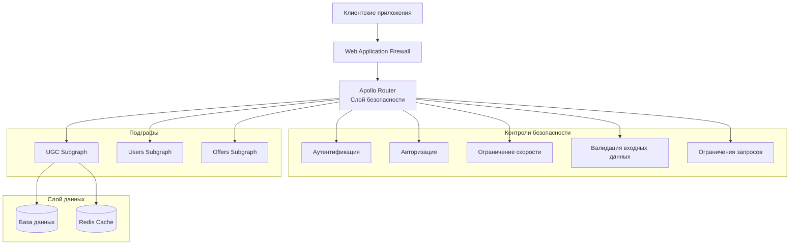

# Руководство по безопасности Apollo Router Federation

Этот документ предоставляет comprehensive руководство по безопасности для настройки Apollo Router Federation, включая лучшие практики безопасности, предотвращение уязвимостей и процедуры тестирования безопасности.

## 📋 Содержание

1. [Обзор безопасности](#обзор-безопасности)
2. [Аутентификация и авторизация](#аутентификация-и-авторизация)
3. [Безопасность GraphQL](#безопасность-graphql)
4. [Защита от OWASP Top 10](#защита-от-owasp-top-10)
5. [Валидация входных данных](#валидация-входных-данных)
6. [Ограничение скорости и защита от DoS](#ограничение-скорости-и-защита-от-dos)
7. [Заголовки безопасности](#заголовки-безопасности)
8. [Мониторинг и логирование](#мониторинг-и-логирование)
9. [Тестирование безопасности](#тестирование-безопасности)
10. [Реагирование на инциденты](#реагирование-на-инциденты)

## Обзор безопасности

Apollo Router Federation реализует множественные слои безопасности для защиты от распространенных уязвимостей веб-приложений и специфических атак на GraphQL.

### Архитектура безопасности



### Принципы безопасности

1. **Эшелонированная защита**: Множественные слои безопасности
2. **Минимальные привилегии**: Минимально необходимые разрешения
3. **Нулевое доверие**: Проверять все, не доверять ничему
4. **Безопасный отказ**: Безопасные настройки по умолчанию и обработка ошибок
5. **Безопасность по дизайну**: Встроенные контроли безопасности

## Аутентификация и авторизация

### JWT аутентификация

Система использует JSON Web Tokens (JWT) для аутентификации:

```rust
use jsonwebtoken::{decode, DecodingKey, Validation, Algorithm};

#[derive(Debug, Serialize, Deserialize)]
pub struct Claims {
    pub sub: String,      // ID пользователя
    pub name: String,     // Имя пользователя
    pub email: String,    // Email пользователя
    pub roles: Vec<String>, // Роли пользователя
    pub exp: usize,       // Время истечения
    pub iat: usize,       // Время выдачи
    pub iss: String,      // Издатель
}

pub struct AuthService {
    decoding_key: DecodingKey,
    validation: Validation,
}

impl AuthService {
    pub fn new(secret: &str) -> Self {
        let mut validation = Validation::new(Algorithm::HS256);
        validation.set_issuer(&["auto-ru-federation"]);
        validation.validate_exp = true;
        validation.validate_nbf = true;
        
        Self {
            decoding_key: DecodingKey::from_secret(secret.as_ref()),
            validation,
        }
    }
    
    pub fn validate_token(&self, token: &str) -> Result<Claims, AuthError> {
        let token_data = decode::<Claims>(
            token,
            &self.decoding_key,
            &self.validation,
        )?;
        
        // Дополнительная валидация
        self.validate_claims(&token_data.claims)?;
        
        Ok(token_data.claims)
    }
    
    fn validate_claims(&self, claims: &Claims) -> Result<(), AuthError> {
        // Проверка возраста токена
        let current_time = SystemTime::now()
            .duration_since(UNIX_EPOCH)?
            .as_secs() as usize;
        
        if current_time - claims.iat > 86400 { // 24 часа
            return Err(AuthError::TokenTooOld);
        }
        
        // Валидация существования и активности пользователя
        // Обычно это включает проверку в базе данных
        
        Ok(())
    }
}
```

### Контроль доступа на основе ролей (RBAC)

```rust
use async_graphql::{Context, Guard, Result};

#[derive(Debug, Clone)]
pub enum Role {
    User,      // Пользователь
    Moderator, // Модератор
    Admin,     // Администратор
}

pub struct RequireRole {
    required_role: Role,
}

impl RequireRole {
    pub fn new(role: Role) -> Self {
        Self { required_role: role }
    }
}

#[async_trait::async_trait]
impl Guard for RequireRole {
    async fn check(&self, ctx: &Context<'_>) -> Result<()> {
        let user_context = ctx.data::<UserContext>()?;
        
        let has_permission = match self.required_role {
            Role::User => user_context.roles.contains(&"user".to_string()),
            Role::Moderator => user_context.roles.contains(&"moderator".to_string()) ||
                              user_context.roles.contains(&"admin".to_string()),
            Role::Admin => user_context.roles.contains(&"admin".to_string()),
        };
        
        if has_permission {
            Ok(())
        } else {
            Err("Недостаточно прав доступа".into())
        }
    }
}

// Использование в резолверах
#[Object]
impl Mutation {
    #[graphql(guard = "RequireRole::new(Role::Moderator)")]
    async fn moderate_review(
        &self,
        ctx: &Context<'_>,
        review_id: Uuid,
        status: ModerationStatus,
    ) -> Result<Review> {
        let service = ctx.data::<ReviewService>()?;
        service.moderate_review(review_id, status).await
    }
}
```

### Авторизация на уровне полей

```rust
#[Object]
impl User {
    async fn id(&self) -> &Uuid {
        &self.id
    }
    
    async fn name(&self) -> &str {
        &self.name
    }
    
    // Чувствительное поле - доступно только владельцу или админу
    async fn email(&self, ctx: &Context<'_>) -> Result<Option<&str>> {
        let user_context = ctx.data::<UserContext>()?;
        
        if user_context.user_id == self.id || 
           user_context.roles.contains(&"admin".to_string()) {
            Ok(Some(&self.email))
        } else {
            Ok(None)
        }
    }
    
    // Очень чувствительное поле - доступно только владельцу
    async fn phone(&self, ctx: &Context<'_>) -> Result<Option<&str>> {
        let user_context = ctx.data::<UserContext>()?;
        
        if user_context.user_id == self.id {
            Ok(self.phone.as_deref())
        } else {
            Ok(None)
        }
    }
}
```

## Безопасность GraphQL

### Ограничение глубины запросов

```rust
use async_graphql::{extensions::Extension, ServerResult, Variables};

pub struct QueryDepthLimit {
    max_depth: usize,
}

impl QueryDepthLimit {
    pub fn new(max_depth: usize) -> Self {
        Self { max_depth }
    }
}

#[async_trait::async_trait]
impl Extension for QueryDepthLimit {
    async fn parse_query(
        &self,
        ctx: &ExtensionContext<'_>,
        query: &str,
        variables: &Variables,
    ) -> ServerResult<ExecutableDocument> {
        let document = ctx.parse_query(query, variables).await?;
        
        // Вычисление глубины запроса
        let depth = calculate_query_depth(&document);
        
        if depth > self.max_depth {
            return Err(ServerError::new(
                format!("Глубина запроса {} превышает максимально допустимую глубину {}", depth, self.max_depth),
                Some(ErrorExtensions::new().set("code", "QUERY_TOO_DEEP"))
            ));
        }
        
        Ok(document)
    }
}

fn calculate_query_depth(document: &ExecutableDocument) -> usize {
    // Реализация вычисления глубины запроса
    // Обходит AST запроса и находит максимальную глубину
    0 // Упрощенная версия
}
```

### Анализ сложности запросов

```rust
pub struct QueryComplexityLimit {
    max_complexity: usize,
    field_costs: HashMap<String, usize>,
}

impl QueryComplexityLimit {
    pub fn new(max_complexity: usize) -> Self {
        let mut field_costs = HashMap::new();
        
        // Определение стоимости полей
        field_costs.insert("reviews".to_string(), 5);
        field_costs.insert("reviewsConnection".to_string(), 10);
        field_costs.insert("offers".to_string(), 3);
        field_costs.insert("users".to_string(), 2);
        field_costs.insert("createReview".to_string(), 10);
        field_costs.insert("updateReview".to_string(), 8);
        
        Self {
            max_complexity,
            field_costs,
        }
    }
}

#[async_trait::async_trait]
impl Extension for QueryComplexityLimit {
    async fn parse_query(
        &self,
        ctx: &ExtensionContext<'_>,
        query: &str,
        variables: &Variables,
    ) -> ServerResult<ExecutableDocument> {
        let document = ctx.parse_query(query, variables).await?;
        
        // Вычисление сложности запроса
        let complexity = self.calculate_complexity(&document, variables);
        
        if complexity > self.max_complexity {
            return Err(ServerError::new(
                format!("Сложность запроса {} превышает максимально допустимую сложность {}", 
                       complexity, self.max_complexity),
                Some(ErrorExtensions::new().set("code", "QUERY_TOO_COMPLEX"))
            ));
        }
        
        Ok(document)
    }
}
```

### Контроль интроспекции

```rust
pub struct IntrospectionControl {
    enabled: bool,
    allowed_roles: Vec<String>,
}

impl IntrospectionControl {
    pub fn new(enabled: bool, allowed_roles: Vec<String>) -> Self {
        Self { enabled, allowed_roles }
    }
}

#[async_trait::async_trait]
impl Extension for IntrospectionControl {
    async fn parse_query(
        &self,
        ctx: &ExtensionContext<'_>,
        query: &str,
        variables: &Variables,
    ) -> ServerResult<ExecutableDocument> {
        // Проверка содержит ли запрос интроспекцию
        if query.contains("__schema") || query.contains("__type") {
            if !self.enabled {
                return Err(ServerError::new(
                    "Интроспекция отключена",
                    Some(ErrorExtensions::new().set("code", "INTROSPECTION_DISABLED"))
                ));
            }
            
            // Проверка прав пользователя на интроспекцию
            if let Ok(user_context) = ctx.data::<UserContext>() {
                let has_permission = self.allowed_roles.iter()
                    .any(|role| user_context.roles.contains(role));
                
                if !has_permission {
                    return Err(ServerError::new(
                        "Недостаточно прав для интроспекции",
                        Some(ErrorExtensions::new().set("code", "INTROSPECTION_FORBIDDEN"))
                    ));
                }
            } else {
                return Err(ServerError::new(
                    "Требуется аутентификация для интроспекции",
                    Some(ErrorExtensions::new().set("code", "AUTHENTICATION_REQUIRED"))
                ));
            }
        }
        
        ctx.parse_query(query, variables).await
    }
}
```## Защита о
т OWASP Top 10

### A01: Нарушенный контроль доступа

**Меры защиты:**
- Реализация RBAC на всех уровнях
- Валидация разрешений для каждой операции
- Использование авторизации на уровне полей
- Реализация правильного управления сессиями

```rust
// Пример: Предотвращение горизонтальной эскалации привилегий
async fn get_user_reviews(&self, ctx: &Context<'_>, user_id: Uuid) -> Result<Vec<Review>> {
    let current_user = ctx.data::<UserContext>()?;
    
    // Пользователи могут получить доступ только к своим отзывам, если они не админы
    if current_user.user_id != user_id && 
       !current_user.roles.contains(&"admin".to_string()) {
        return Err("Доступ запрещен".into());
    }
    
    self.review_service.get_reviews_by_user(user_id).await
}
```

### A02: Криптографические сбои

**Меры защиты:**
- Использование HTTPS для всех коммуникаций
- Реализация правильной верификации подписи JWT
- Использование сильных алгоритмов шифрования
- Безопасное управление ключами

```rust
// Конфигурация JWT с сильной безопасностью
let mut validation = Validation::new(Algorithm::RS256); // Использовать RSA вместо HMAC
validation.set_issuer(&["auto-ru-federation"]);
validation.validate_exp = true;
validation.validate_nbf = true;
validation.validate_aud = true;
validation.set_audience(&["auto-ru-api"]);
```

### A03: Инъекции

**Меры защиты:**
- Использование параметризованных запросов
- Валидация и санитизация входных данных
- Валидация GraphQL запросов

```rust
// Безопасный запрос к базе данных с использованием sqlx
async fn get_reviews_by_offer(&self, offer_id: Uuid) -> Result<Vec<Review>, sqlx::Error> {
    sqlx::query_as!(
        Review,
        "SELECT * FROM reviews WHERE offer_id = $1 AND is_moderated = true ORDER BY created_at DESC",
        offer_id
    )
    .fetch_all(&self.pool)
    .await
}

// Валидация входных данных
#[derive(InputObject)]
pub struct CreateReviewInput {
    pub offer_id: Uuid,
    #[graphql(validator(range(min = 1, max = 5)))]
    pub rating: i32,
    #[graphql(validator(min_length = 1, max_length = 5000))]
    pub text: String,
}
```

### A04: Небезопасный дизайн

**Меры защиты:**
- Реализация валидации бизнес-логики
- Добавление контролей параллелизма
- Ограничение скорости по пользователю/операции

```rust
// Валидация бизнес-логики
async fn create_review(&self, input: CreateReviewInput, user_id: Uuid) -> Result<Review> {
    // Проверка, не оставлял ли пользователь уже отзыв на это объявление
    if self.has_user_reviewed_offer(user_id, input.offer_id).await? {
        return Err(UgcError::DuplicateReview);
    }
    
    // Проверка, не является ли пользователь владельцем объявления (нельзя оставлять отзыв на свое объявление)
    if self.is_offer_owner(user_id, input.offer_id).await? {
        return Err(UgcError::CannotReviewOwnOffer);
    }
    
    // Проверка ограничения скорости
    self.rate_limiter.check_user_rate_limit(user_id, "create_review").await?;
    
    self.repository.create_review(input, user_id).await
}
```

### A05: Неправильная конфигурация безопасности

**Меры защиты:**
- Отключение интроспекции в продакшене
- Удаление подробных сообщений об ошибках
- Реализация заголовков безопасности

```yaml
# Конфигурация Apollo Router
supergraph:
  introspection: false  # Отключить в продакшене
  
plugins:
  cors:
    origins:
      - https://auto.ru
      - https://m.auto.ru
    credentials: true
  
  headers:
    request:
      - propagate:
          named: "authorization"
    response:
      - insert:
          name: "x-content-type-options"
          value: "nosniff"
      - insert:
          name: "x-frame-options"
          value: "DENY"
      - insert:
          name: "x-xss-protection"
          value: "1; mode=block"
```

### A07: Сбои аутентификации

**Меры защиты:**
- Сильные политики паролей
- Механизмы блокировки аккаунтов
- Управление сессиями

```rust
// Реализация блокировки аккаунта
pub struct LoginAttemptTracker {
    attempts: Arc<Mutex<HashMap<String, LoginAttempts>>>,
    max_attempts: u32,
    lockout_duration: Duration,
}

#[derive(Debug)]
struct LoginAttempts {
    count: u32,
    last_attempt: Instant,
    locked_until: Option<Instant>,
}

impl LoginAttemptTracker {
    pub async fn check_login_allowed(&self, username: &str) -> Result<(), AuthError> {
        let mut attempts = self.attempts.lock().await;
        
        if let Some(user_attempts) = attempts.get(username) {
            if let Some(locked_until) = user_attempts.locked_until {
                if Instant::now() < locked_until {
                    return Err(AuthError::AccountLocked);
                }
            }
        }
        
        Ok(())
    }
    
    pub async fn record_failed_attempt(&self, username: &str) {
        let mut attempts = self.attempts.lock().await;
        let user_attempts = attempts.entry(username.to_string()).or_insert(LoginAttempts {
            count: 0,
            last_attempt: Instant::now(),
            locked_until: None,
        });
        
        user_attempts.count += 1;
        user_attempts.last_attempt = Instant::now();
        
        if user_attempts.count >= self.max_attempts {
            user_attempts.locked_until = Some(Instant::now() + self.lockout_duration);
        }
    }
}
```

## Валидация входных данных

### Валидация GraphQL входных данных

```rust
use async_graphql::{InputObject, validator::*};

#[derive(InputObject)]
pub struct CreateReviewInput {
    #[graphql(validator(custom = "validate_uuid"))]
    pub offer_id: String,
    
    #[graphql(validator(range(min = 1, max = 5)))]
    pub rating: i32,
    
    #[graphql(validator(
        min_length = 1,
        max_length = 5000,
        custom = "validate_review_text"
    ))]
    pub text: String,
}

fn validate_uuid(value: &str) -> Result<(), String> {
    Uuid::parse_str(value)
        .map_err(|_| "Неверный формат UUID".to_string())?;
    Ok(())
}

fn validate_review_text(text: &str) -> Result<(), String> {
    // Проверка на вредоносный контент
    let dangerous_patterns = [
        "<script", "javascript:", "data:", "vbscript:",
        "onload=", "onerror=", "onclick=", "onmouseover="
    ];
    
    let text_lower = text.to_lowercase();
    for pattern in &dangerous_patterns {
        if text_lower.contains(pattern) {
            return Err("Текст содержит потенциально опасный контент".to_string());
        }
    }
    
    // Проверка на паттерны SQL инъекций
    let sql_patterns = ["'", "\"", ";", "--", "/*", "*/", "xp_", "sp_"];
    for pattern in &sql_patterns {
        if text.contains(pattern) {
            return Err("Текст содержит потенциально вредоносные SQL паттерны".to_string());
        }
    }
    
    Ok(())
}
```

### Санитизация контента

```rust
use ammonia::Builder;

pub struct ContentSanitizer {
    html_sanitizer: Builder<'static>,
}

impl ContentSanitizer {
    pub fn new() -> Self {
        let html_sanitizer = Builder::default()
            .tags(hashset!["b", "i", "em", "strong", "p", "br"])
            .clean_content_tags(hashset!["script", "style"])
            .strip_comments(true);
        
        Self { html_sanitizer }
    }
    
    pub fn sanitize_html(&self, input: &str) -> String {
        self.html_sanitizer.clean(input).to_string()
    }
    
    pub fn sanitize_text(&self, input: &str) -> String {
        // Удаление управляющих символов
        let cleaned: String = input.chars()
            .filter(|c| !c.is_control() || *c == '\n' || *c == '\r' || *c == '\t')
            .collect();
        
        // Нормализация пробелов
        let normalized = cleaned.split_whitespace().collect::<Vec<_>>().join(" ");
        
        // Ограничение длины
        if normalized.len() > 5000 {
            normalized[..5000].to_string()
        } else {
            normalized
        }
    }
}
```

## Ограничение скорости и защита от DoS

### Ограничение скорости на основе пользователя

```rust
use governor::{Quota, RateLimiter, state::InMemoryState, clock::DefaultClock};
use std::num::NonZeroU32;

pub struct RateLimitService {
    limiters: HashMap<String, RateLimiter<String, InMemoryState, DefaultClock>>,
}

impl RateLimitService {
    pub fn new() -> Self {
        let mut limiters = HashMap::new();
        
        // Различные лимиты для различных операций
        limiters.insert(
            "query".to_string(),
            RateLimiter::keyed(Quota::per_minute(NonZeroU32::new(60).unwrap()))
        );
        
        limiters.insert(
            "mutation".to_string(),
            RateLimiter::keyed(Quota::per_minute(NonZeroU32::new(10).unwrap()))
        );
        
        limiters.insert(
            "create_review".to_string(),
            RateLimiter::keyed(Quota::per_hour(NonZeroU32::new(5).unwrap()))
        );
        
        Self { limiters }
    }
    
    pub async fn check_rate_limit(&self, user_id: &str, operation: &str) -> Result<(), RateLimitError> {
        if let Some(limiter) = self.limiters.get(operation) {
            match limiter.check_key(user_id) {
                Ok(_) => Ok(()),
                Err(_) => Err(RateLimitError::LimitExceeded {
                    operation: operation.to_string(),
                    user_id: user_id.to_string(),
                }),
            }
        } else {
            Ok(()) // Лимит не определен для этой операции
        }
    }
}
```

### Защита от таймаута запросов

```rust
use tokio::time::{timeout, Duration};

pub struct QueryTimeoutExtension {
    timeout_duration: Duration,
}

impl QueryTimeoutExtension {
    pub fn new(timeout_seconds: u64) -> Self {
        Self {
            timeout_duration: Duration::from_secs(timeout_seconds),
        }
    }
}

#[async_trait::async_trait]
impl Extension for QueryTimeoutExtension {
    async fn execute(
        &self,
        ctx: &ExtensionContext<'_>,
        operation_name: Option<&str>,
        next: NextExecute<'_>,
    ) -> Response {
        match timeout(self.timeout_duration, next.run(ctx, operation_name)).await {
            Ok(response) => response,
            Err(_) => Response::from_errors(vec![ServerError::new(
                "Таймаут выполнения запроса",
                Some(ErrorExtensions::new().set("code", "QUERY_TIMEOUT"))
            )]),
        }
    }
}
```

## Заголовки безопасности

### HTTP заголовки безопасности

```rust
use axum::{
    http::{HeaderMap, HeaderName, HeaderValue},
    middleware::Next,
    response::Response,
    extract::Request,
};

pub async fn security_headers_middleware(
    request: Request,
    next: Next,
) -> Response {
    let mut response = next.run(request).await;
    
    let headers = response.headers_mut();
    
    // Content Security Policy
    headers.insert(
        HeaderName::from_static("content-security-policy"),
        HeaderValue::from_static(
            "default-src 'self'; script-src 'self' 'unsafe-inline'; style-src 'self' 'unsafe-inline'; img-src 'self' data: https:; connect-src 'self'; font-src 'self'; object-src 'none'; media-src 'self'; frame-src 'none';"
        ),
    );
    
    // X-Content-Type-Options
    headers.insert(
        HeaderName::from_static("x-content-type-options"),
        HeaderValue::from_static("nosniff"),
    );
    
    // X-Frame-Options
    headers.insert(
        HeaderName::from_static("x-frame-options"),
        HeaderValue::from_static("DENY"),
    );
    
    // X-XSS-Protection
    headers.insert(
        HeaderName::from_static("x-xss-protection"),
        HeaderValue::from_static("1; mode=block"),
    );
    
    // Strict-Transport-Security (HSTS)
    headers.insert(
        HeaderName::from_static("strict-transport-security"),
        HeaderValue::from_static("max-age=31536000; includeSubDomains; preload"),
    );
    
    // Referrer-Policy
    headers.insert(
        HeaderName::from_static("referrer-policy"),
        HeaderValue::from_static("strict-origin-when-cross-origin"),
    );
    
    // Permissions-Policy
    headers.insert(
        HeaderName::from_static("permissions-policy"),
        HeaderValue::from_static("geolocation=(), microphone=(), camera=()"),
    );
    
    response
}
```

## Мониторинг и логирование

### Мониторинг событий безопасности

```rust
use prometheus::{Counter, Histogram, register_counter, register_histogram};

lazy_static! {
    static ref SECURITY_EVENTS: Counter = register_counter!(
        "security_events_total",
        "Общее количество событий безопасности"
    ).unwrap();
    
    static ref AUTH_FAILURES: Counter = register_counter!(
        "auth_failures_total",
        "Общее количество неудачных аутентификаций"
    ).unwrap();
    
    static ref RATE_LIMIT_HITS: Counter = register_counter!(
        "rate_limit_hits_total",
        "Общее количество нарушений ограничения скорости"
    ).unwrap();
    
    static ref QUERY_COMPLEXITY_VIOLATIONS: Counter = register_counter!(
        "query_complexity_violations_total",
        "Общее количество нарушений сложности запросов"
    ).unwrap();
}

pub struct SecurityMonitor {
    alert_threshold: u64,
    alert_window: Duration,
}

impl SecurityMonitor {
    pub fn record_auth_failure(&self, user_id: &str, reason: &str) {
        AUTH_FAILURES.inc();
        SECURITY_EVENTS.inc();
        
        warn!(
            user_id = user_id,
            reason = reason,
            event_type = "auth_failure",
            "Зафиксирована неудачная аутентификация"
        );
        
        // Проверка необходимости алерта
        self.check_alert_threshold("auth_failure").await;
    }
    
    pub fn record_rate_limit_violation(&self, user_id: &str, operation: &str) {
        RATE_LIMIT_HITS.inc();
        SECURITY_EVENTS.inc();
        
        warn!(
            user_id = user_id,
            operation = operation,
            event_type = "rate_limit_violation",
            "Зафиксировано нарушение ограничения скорости"
        );
    }
    
    async fn check_alert_threshold(&self, event_type: &str) {
        // Реализация проверки превышения порога алертов
        // и отправки алертов команде безопасности
    }
}
```

## Тестирование безопасности

### Запуск тестов безопасности

```bash
# Запуск comprehensive аудита безопасности
./scripts/security-audit/run-security-audit.sh

# Запуск конкретных тестов безопасности
./scripts/security-audit/run-security-audit.sh graphql
./scripts/security-audit/run-security-audit.sh owasp

# Запуск с пользовательской конфигурацией
ROUTER_URL=https://api.auto.ru \
JWT_TOKEN=your-token \
./scripts/security-audit/run-security-audit.sh
```

### Автоматизированное тестирование безопасности

```yaml
# GitHub Actions тестирование безопасности
name: Security Tests
on:
  push:
    branches: [main]
  pull_request:
    branches: [main]
  schedule:
    - cron: '0 2 * * 0'  # Еженедельное сканирование безопасности

jobs:
  security-scan:
    runs-on: ubuntu-latest
    steps:
      - uses: actions/checkout@v3
      
      - name: Запуск сервисов
        run: docker-compose up -d
      
      - name: Ожидание готовности сервисов
        run: |
          timeout 60 bash -c 'until curl -f http://localhost:4000/health; do sleep 2; done'
      
      - name: Установка инструментов безопасности
        run: |
          # Установка OWASP ZAP
          wget -q https://github.com/zaproxy/zaproxy/releases/download/v2.12.0/ZAP_2.12.0_Linux.tar.gz
          tar -xzf ZAP_2.12.0_Linux.tar.gz
          
          # Установка Nuclei
          go install -v github.com/projectdiscovery/nuclei/v2/cmd/nuclei@latest
      
      - name: Запуск OWASP ZAP сканирования
        run: |
          ./ZAP_2.12.0/zap.sh -cmd -quickurl http://localhost:4000/graphql \
            -quickout zap-report.html -quickprogress
      
      - name: Запуск Nuclei сканирования
        run: |
          nuclei -target http://localhost:4000 -o nuclei-report.txt
      
      - name: Загрузка отчетов безопасности
        uses: actions/upload-artifact@v3
        with:
          name: security-reports
          path: |
            zap-report.html
            nuclei-report.txt
```

## 🛡️ Продвинутые меры безопасности

### Детекция аномалий

```rust
// Система детекции аномалий для выявления подозрительной активности
pub struct AnomalyDetector {
    baseline_metrics: Arc<RwLock<HashMap<String, BaselineMetrics>>>,
    ml_model: Option<AnomalyModel>,
    alert_threshold: f64,
}

#[derive(Debug, Clone)]
pub struct BaselineMetrics {
    pub avg_requests_per_minute: f64,
    pub avg_query_complexity: f64,
    pub common_query_patterns: Vec<String>,
    pub typical_response_times: Vec<f64>,
}

impl AnomalyDetector {
    pub async fn detect_anomaly(&self, user_activity: &UserActivity) -> Result<AnomalyScore> {
        let baseline = self.get_user_baseline(&user_activity.user_id).await?;
        
        let mut anomaly_factors = Vec::new();
        
        // Анализ частоты запросов
        let request_rate_anomaly = self.analyze_request_rate(
            user_activity.requests_per_minute,
            baseline.avg_requests_per_minute
        );
        anomaly_factors.push(request_rate_anomaly);
        
        // Анализ сложности запросов
        let complexity_anomaly = self.analyze_query_complexity(
            &user_activity.queries,
            baseline.avg_query_complexity
        );
        anomaly_factors.push(complexity_anomaly);
        
        // Анализ паттернов запросов
        let pattern_anomaly = self.analyze_query_patterns(
            &user_activity.queries,
            &baseline.common_query_patterns
        );
        anomaly_factors.push(pattern_anomaly);
        
        // Комбинированный скор аномалии
        let combined_score = anomaly_factors.iter().sum::<f64>() / anomaly_factors.len() as f64;
        
        Ok(AnomalyScore {
            score: combined_score,
            factors: anomaly_factors,
            is_anomalous: combined_score > self.alert_threshold,
        })
    }
}
```

### Система реагирования на инциденты

```rust
// Автоматизированная система реагирования на инциденты безопасности
pub struct IncidentResponseSystem {
    alert_manager: AlertManager,
    auto_mitigation: AutoMitigationEngine,
    notification_service: NotificationService,
}

#[derive(Debug, Clone)]
pub enum SecurityIncident {
    SuspiciousActivity {
        user_id: String,
        activity_type: String,
        severity: Severity,
        details: String,
    },
    RateLimitViolation {
        user_id: String,
        operation: String,
        violation_count: u32,
    },
    AuthenticationAttack {
        source_ip: String,
        attack_type: String,
        attempt_count: u32,
    },
}

impl IncidentResponseSystem {
    pub async fn handle_incident(&self, incident: SecurityIncident) -> Result<()> {
        // Логирование инцидента
        self.log_security_incident(&incident).await?;
        
        // Автоматическое смягчение
        let mitigation_actions = self.auto_mitigation.determine_actions(&incident).await?;
        for action in mitigation_actions {
            self.execute_mitigation_action(action).await?;
        }
        
        // Уведомление команды безопасности
        if incident.severity() >= Severity::High {
            self.notification_service.notify_security_team(&incident).await?;
        }
        
        // Обновление метрик
        self.update_incident_metrics(&incident).await?;
        
        Ok(())
    }
    
    async fn execute_mitigation_action(&self, action: MitigationAction) -> Result<()> {
        match action {
            MitigationAction::BlockUser { user_id, duration } => {
                self.block_user_temporarily(&user_id, duration).await?;
            }
            MitigationAction::BlockIP { ip_address, duration } => {
                self.block_ip_address(&ip_address, duration).await?;
            }
            MitigationAction::ReduceRateLimit { user_id, new_limit } => {
                self.update_user_rate_limit(&user_id, new_limit).await?;
            }
            MitigationAction::EnableStrictMode => {
                self.enable_strict_security_mode().await?;
            }
        }
        Ok(())
    }
}
```       
     let masked = format!("{}****", &self[..2]);
            masked
        }
    }
}

impl DataMasking for Option<String> {
    fn mask(&self) -> String {
        match self {
            Some(value) => value.mask(),
            None => "null".to_string(),
        }
    }
}

// Использование в логировании
#[derive(Debug, Serialize)]
pub struct UserLogEntry {
    pub id: Uuid,
    #[serde(serialize_with = "serialize_masked")]
    pub email: String,
    #[serde(serialize_with = "serialize_masked")]
    pub phone: Option<String>,
}

fn serialize_masked<T, S>(value: &T, serializer: S) -> Result<S::Ok, S::Error>
where
    T: DataMasking,
    S: Serializer,
{
    serializer.serialize_str(&value.mask())
}
```

## Мониторинг безопасности

### Система мониторинга событий безопасности

```rust
// SIEM интеграция и мониторинг
use prometheus::{Counter, Histogram, Gauge, register_counter, register_histogram, register_gauge};
use serde_json::json;

lazy_static! {
    static ref SECURITY_EVENTS_TOTAL: Counter = register_counter!(
        "security_events_total",
        "Общее количество событий безопасности"
    ).unwrap();
    
    static ref AUTH_FAILURES_TOTAL: Counter = register_counter!(
        "auth_failures_total", 
        "Общее количество неудачных попыток аутентификации"
    ).unwrap();
    
    static ref SUSPICIOUS_QUERIES_TOTAL: Counter = register_counter!(
        "suspicious_queries_total",
        "Общее количество подозрительных GraphQL запросов"
    ).unwrap();
    
    static ref ACTIVE_SESSIONS: Gauge = register_gauge!(
        "active_sessions",
        "Количество активных пользовательских сессий"
    ).unwrap();
}

#[derive(Clone)]
pub struct SecurityMonitor {
    siem_client: SiemClient,
    alert_thresholds: AlertThresholds,
}

#[derive(Debug, Serialize)]
pub struct SecurityEvent {
    pub timestamp: DateTime<Utc>,
    pub event_type: SecurityEventType,
    pub severity: SecuritySeverity,
    pub user_id: Option<String>,
    pub ip_address: String,
    pub user_agent: Option<String>,
    pub details: serde_json::Value,
}

#[derive(Debug, Serialize)]
pub enum SecurityEventType {
    AuthenticationFailure,
    AuthorizationFailure,
    SuspiciousQuery,
    RateLimitExceeded,
    DataAccessViolation,
    AccountLockout,
    TokenRevoked,
    UnusualActivity,
}

#[derive(Debug, Serialize)]
pub enum SecuritySeverity {
    Low,
    Medium,
    High,
    Critical,
}

impl SecurityMonitor {
    pub async fn log_security_event(&self, event: SecurityEvent) {
        // Обновление метрик Prometheus
        SECURITY_EVENTS_TOTAL.inc();
        
        match event.event_type {
            SecurityEventType::AuthenticationFailure => {
                AUTH_FAILURES_TOTAL.inc();
            }
            SecurityEventType::SuspiciousQuery => {
                SUSPICIOUS_QUERIES_TOTAL.inc();
            }
            _ => {}
        }
        
        // Логирование структурированного события
        match event.severity {
            SecuritySeverity::Low => info!(
                event_type = ?event.event_type,
                user_id = ?event.user_id,
                ip = event.ip_address,
                details = ?event.details,
                "Событие безопасности низкой важности"
            ),
            SecuritySeverity::Medium => warn!(
                event_type = ?event.event_type,
                user_id = ?event.user_id,
                ip = event.ip_address,
                details = ?event.details,
                "Событие безопасности средней важности"
            ),
            SecuritySeverity::High | SecuritySeverity::Critical => error!(
                event_type = ?event.event_type,
                user_id = ?event.user_id,
                ip = event.ip_address,
                details = ?event.details,
                "Критическое событие безопасности"
            ),
        }
        
        // Отправка в SIEM систему
        if let Err(e) = self.siem_client.send_event(&event).await {
            error!("Ошибка отправки события в SIEM: {}", e);
        }
        
        // Проверка пороговых значений для алертов
        self.check_alert_thresholds(&event).await;
    }
    
    async fn check_alert_thresholds(&self, event: &SecurityEvent) {
        match event.severity {
            SecuritySeverity::Critical => {
                self.send_immediate_alert(event).await;
            }
            SecuritySeverity::High => {
                if self.should_alert_for_high_severity(&event.event_type).await {
                    self.send_alert(event).await;
                }
            }
            _ => {}
        }
    }
}
```

### Аналитика безопасности

```rust
// Система анализа паттернов безопасности
pub struct SecurityAnalytics {
    event_store: EventStore,
    ml_detector: AnomalyDetector,
}

impl SecurityAnalytics {
    pub async fn analyze_user_behavior(&self, user_id: &str) -> SecurityRiskScore {
        let recent_events = self.event_store
            .get_user_events(user_id, Duration::hours(24))
            .await;
        
        let mut risk_score = 0.0;
        
        // Анализ паттернов входа
        risk_score += self.analyze_login_patterns(&recent_events);
        
        // Анализ активности запросов
        risk_score += self.analyze_query_patterns(&recent_events);
        
        // Анализ географических аномалий
        risk_score += self.analyze_geo_anomalies(&recent_events);
        
        // ML-детекция аномалий
        risk_score += self.ml_detector.detect_anomalies(&recent_events).await;
        
        SecurityRiskScore {
            user_id: user_id.to_string(),
            score: risk_score,
            risk_level: self.calculate_risk_level(risk_score),
            recommendations: self.generate_recommendations(risk_score),
        }
    }
    
    fn analyze_login_patterns(&self, events: &[SecurityEvent]) -> f64 {
        let login_events: Vec<_> = events.iter()
            .filter(|e| matches!(e.event_type, SecurityEventType::AuthenticationFailure))
            .collect();
        
        if login_events.len() > 5 {
            0.3 // Повышенный риск при множественных неудачных попытках
        } else {
            0.0
        }
    }
    
    fn analyze_query_patterns(&self, events: &[SecurityEvent]) -> f64 {
        let suspicious_queries: Vec<_> = events.iter()
            .filter(|e| matches!(e.event_type, SecurityEventType::SuspiciousQuery))
            .collect();
        
        suspicious_queries.len() as f64 * 0.1
    }
}

#[derive(Debug, Serialize)]
pub struct SecurityRiskScore {
    pub user_id: String,
    pub score: f64,
    pub risk_level: RiskLevel,
    pub recommendations: Vec<SecurityRecommendation>,
}

#[derive(Debug, Serialize)]
pub enum RiskLevel {
    Low,
    Medium,
    High,
    Critical,
}

#[derive(Debug, Serialize)]
pub struct SecurityRecommendation {
    pub action: String,
    pub priority: Priority,
    pub description: String,
}
```

## Управление инцидентами

### Процедуры реагирования на инциденты

```rust
// Система управления инцидентами безопасности
#[derive(Debug, Clone)]
pub struct IncidentResponse {
    notification_service: NotificationService,
    incident_store: IncidentStore,
    response_playbooks: HashMap<IncidentType, ResponsePlaybook>,
}

#[derive(Debug, Serialize, Deserialize)]
pub struct SecurityIncident {
    pub id: Uuid,
    pub incident_type: IncidentType,
    pub severity: IncidentSeverity,
    pub status: IncidentStatus,
    pub detected_at: DateTime<Utc>,
    pub resolved_at: Option<DateTime<Utc>>,
    pub affected_users: Vec<String>,
    pub description: String,
    pub evidence: Vec<Evidence>,
    pub response_actions: Vec<ResponseAction>,
}

#[derive(Debug, Serialize, Deserialize)]
pub enum IncidentType {
    DataBreach,
    UnauthorizedAccess,
    DdosAttack,
    MaliciousQuery,
    AccountCompromise,
    SystemIntrusion,
}

#[derive(Debug, Serialize, Deserialize)]
pub enum IncidentSeverity {
    P1, // Критический - немедленное реагирование
    P2, // Высокий - реагирование в течение 1 часа
    P3, // Средний - реагирование в течение 4 часов
    P4, // Низкий - реагирование в течение 24 часов
}

impl IncidentResponse {
    pub async fn handle_incident(&self, incident: SecurityIncident) -> Result<(), IncidentError> {
        // Логирование инцидента
        error!(
            incident_id = %incident.id,
            incident_type = ?incident.incident_type,
            severity = ?incident.severity,
            "Обнаружен инцидент безопасности"
        );
        
        // Сохранение инцидента
        self.incident_store.save_incident(&incident).await?;
        
        // Получение плейбука реагирования
        let playbook = self.response_playbooks
            .get(&incident.incident_type)
            .ok_or(IncidentError::NoPlaybook)?;
        
        // Выполнение автоматических действий
        self.execute_automatic_response(&incident, playbook).await?;
        
        // Уведомление команды безопасности
        self.notify_security_team(&incident).await?;
        
        // Эскалация при критических инцидентах
        if matches!(incident.severity, IncidentSeverity::P1) {
            self.escalate_incident(&incident).await?;
        }
        
        Ok(())
    }
    
    async fn execute_automatic_response(
        &self,
        incident: &SecurityIncident,
        playbook: &ResponsePlaybook,
    ) -> Result<(), IncidentError> {
        for action in &playbook.automatic_actions {
            match action {
                AutomaticAction::BlockUser(user_id) => {
                    self.block_user_access(user_id).await?;
                }
                AutomaticAction::RevokeTokens(user_id) => {
                    self.revoke_user_tokens(user_id).await?;
                }
                AutomaticAction::EnableRateLimit(limit) => {
                    self.enable_emergency_rate_limit(*limit).await?;
                }
                AutomaticAction::BlockIpRange(ip_range) => {
                    self.block_ip_range(ip_range).await?;
                }
            }
        }
        
        Ok(())
    }
}

#[derive(Debug)]
pub struct ResponsePlaybook {
    pub automatic_actions: Vec<AutomaticAction>,
    pub manual_steps: Vec<ManualStep>,
    pub escalation_criteria: EscalationCriteria,
}

#[derive(Debug)]
pub enum AutomaticAction {
    BlockUser(String),
    RevokeTokens(String),
    EnableRateLimit(u32),
    BlockIpRange(String),
}
```

### Восстановление после инцидентов

```rust
// Процедуры восстановления системы
pub struct DisasterRecovery {
    backup_service: BackupService,
    health_checker: HealthChecker,
}

impl DisasterRecovery {
    pub async fn initiate_recovery(&self, incident_type: IncidentType) -> Result<(), RecoveryError> {
        match incident_type {
            IncidentType::DataBreach => {
                self.handle_data_breach_recovery().await?;
            }
            IncidentType::SystemIntrusion => {
                self.handle_system_intrusion_recovery().await?;
            }
            IncidentType::DdosAttack => {
                self.handle_ddos_recovery().await?;
            }
            _ => {
                self.handle_standard_recovery().await?;
            }
        }
        
        Ok(())
    }
    
    async fn handle_data_breach_recovery(&self) -> Result<(), RecoveryError> {
        // 1. Изоляция скомпрометированных систем
        self.isolate_compromised_systems().await?;
        
        // 2. Анализ масштаба утечки
        let breach_scope = self.analyze_breach_scope().await?;
        
        // 3. Уведомление пользователей
        self.notify_affected_users(&breach_scope.affected_users).await?;
        
        // 4. Принудительная смена паролей
        self.force_password_reset(&breach_scope.affected_users).await?;
        
        // 5. Восстановление из резервных копий
        if breach_scope.data_corrupted {
            self.restore_from_backup().await?;
        }
        
        // 6. Усиление мониторинга
        self.enhance_monitoring().await?;
        
        Ok(())
    }
}
```

## Соответствие требованиям

### GDPR соответствие

```rust
// Реализация требований GDPR
pub struct GdprCompliance {
    data_processor: PersonalDataProcessor,
    consent_manager: ConsentManager,
    audit_logger: AuditLogger,
}

impl GdprCompliance {
    pub async fn handle_data_subject_request(
        &self,
        request: DataSubjectRequest,
    ) -> Result<DataSubjectResponse, GdprError> {
        // Логирование запроса
        self.audit_logger.log_data_subject_request(&request).await;
        
        match request.request_type {
            DataSubjectRequestType::Access => {
                self.handle_access_request(&request).await
            }
            DataSubjectRequestType::Rectification => {
                self.handle_rectification_request(&request).await
            }
            DataSubjectRequestType::Erasure => {
                self.handle_erasure_request(&request).await
            }
            DataSubjectRequestType::Portability => {
                self.handle_portability_request(&request).await
            }
            DataSubjectRequestType::Restriction => {
                self.handle_restriction_request(&request).await
            }
        }
    }
    
    async fn handle_erasure_request(
        &self,
        request: &DataSubjectRequest,
    ) -> Result<DataSubjectResponse, GdprError> {
        // Проверка права на забвение
        if !self.can_erase_data(&request.user_id).await? {
            return Ok(DataSubjectResponse {
                status: ResponseStatus::Rejected,
                reason: Some("Данные не могут быть удалены по правовым основаниям".to_string()),
            });
        }
        
        // Удаление персональных данных
        self.data_processor.erase_personal_data(&request.user_id).await?;
        
        // Анонимизация связанных данных
        self.data_processor.anonymize_related_data(&request.user_id).await?;
        
        Ok(DataSubjectResponse {
            status: ResponseStatus::Completed,
            reason: None,
        })
    }
}

#[derive(Debug)]
pub struct DataSubjectRequest {
    pub user_id: String,
    pub request_type: DataSubjectRequestType,
    pub verification_token: String,
    pub submitted_at: DateTime<Utc>,
}

#[derive(Debug)]
pub enum DataSubjectRequestType {
    Access,        // Право доступа (статья 15)
    Rectification, // Право на исправление (статья 16)
    Erasure,       // Право на забвение (статья 17)
    Portability,   // Право на переносимость (статья 20)
    Restriction,   // Право на ограничение обработки (статья 18)
}
```

### Аудит и отчетность

```rust
// Система аудита для соответствия требованиям
pub struct ComplianceAuditor {
    audit_store: AuditStore,
    report_generator: ReportGenerator,
}

impl ComplianceAuditor {
    pub async fn generate_compliance_report(
        &self,
        period: DateRange,
        compliance_type: ComplianceType,
    ) -> Result<ComplianceReport, AuditError> {
        let audit_events = self.audit_store
            .get_events_by_period(period)
            .await?;
        
        match compliance_type {
            ComplianceType::Gdpr => {
                self.generate_gdpr_report(audit_events).await
            }
            ComplianceType::Iso27001 => {
                self.generate_iso27001_report(audit_events).await
            }
            ComplianceType::Pci => {
                self.generate_pci_report(audit_events).await
            }
        }
    }
    
    async fn generate_gdpr_report(
        &self,
        events: Vec<AuditEvent>,
    ) -> Result<ComplianceReport, AuditError> {
        let mut report = ComplianceReport::new(ComplianceType::Gdpr);
        
        // Анализ обработки персональных данных
        let data_processing_events: Vec<_> = events.iter()
            .filter(|e| matches!(e.event_type, AuditEventType::DataProcessing))
            .collect();
        
        report.add_section(ReportSection {
            title: "Обработка персональных данных".to_string(),
            metrics: vec![
                Metric {
                    name: "Общее количество операций".to_string(),
                    value: data_processing_events.len().to_string(),
                },
                Metric {
                    name: "Запросы субъектов данных".to_string(),
                    value: self.count_data_subject_requests(&events).to_string(),
                },
            ],
            violations: self.detect_gdpr_violations(&events).await,
        });
        
        Ok(report)
    }
}
```

## Лучшие практики

### Чек-лист безопасности

#### Аутентификация и авторизация
- ✅ Использование сильных алгоритмов для JWT (RS256/ES256)
- ✅ Реализация ротации токенов
- ✅ Проверка времени жизни токенов
- ✅ Реализация RBAC на всех уровнях
- ✅ Проверка разрешений на уровне полей
- ✅ Логирование всех событий аутентификации

#### GraphQL безопасность
- ✅ Ограничение глубины запросов (max 10 уровней)
- ✅ Ограничение сложности запросов (max 1000 баллов)
- ✅ Отключение интроспекции в продакшене
- ✅ Валидация всех входных данных
- ✅ Санитизация пользовательского контента
- ✅ Тайм-ауты для долгих запросов

#### Защита от атак
- ✅ Rate limiting по пользователям и операциям
- ✅ Защита от SQL инъекций (параметризованные запросы)
- ✅ Защита от XSS (санитизация HTML)
- ✅ Защита от CSRF (проверка токенов)
- ✅ Защита от SSRF (валидация URL)
- ✅ Блокировка аккаунтов при подозрительной активности

#### Мониторинг и логирование
- ✅ Структурированное логирование всех событий
- ✅ Мониторинг метрик безопасности
- ✅ Алертинг при критических событиях
- ✅ Регулярный анализ логов безопасности
- ✅ Интеграция с SIEM системами
- ✅ Резервное копирование логов

### Рекомендации по развертыванию

#### Конфигурация окружения

```yaml
# Продакшн конфигурация безопасности
security:
  # JWT настройки
  jwt:
    algorithm: "RS256"
    issuer: "https://auth.auto.ru"
    audience: "auto-ru-api"
    token_ttl: 3600  # 1 час
    refresh_ttl: 604800  # 7 дней
  
  # GraphQL настройки
  graphql:
    introspection_enabled: false
    max_query_depth: 10
    max_query_complexity: 1000
    query_timeout: 30
  
  # Rate limiting
  rate_limits:
    queries_per_minute: 60
    mutations_per_minute: 10
    reviews_per_hour: 5
  
  # Мониторинг
  monitoring:
    log_level: "INFO"
    metrics_enabled: true
    siem_endpoint: "https://siem.auto.ru/events"
```

#### Kubernetes Security Context

```yaml
# Безопасная конфигурация подов
apiVersion: apps/v1
kind: Deployment
metadata:
  name: apollo-router
spec:
  template:
    spec:
      securityContext:
        runAsNonRoot: true
        runAsUser: 1000
        fsGroup: 2000
      containers:
      - name: router
        securityContext:
          allowPrivilegeEscalation: false
          readOnlyRootFilesystem: true
          capabilities:
            drop:
            - ALL
        resources:
          limits:
            memory: "512Mi"
            cpu: "500m"
          requests:
            memory: "256Mi"
            cpu: "250m"
```

### Процедуры обновления безопасности

#### Регулярные задачи безопасности

```bash
#!/bin/bash
# Скрипт еженедельного аудита безопасности

echo "🔍 Запуск еженедельного аудита безопасности..."

# Проверка уязвимостей в зависимостях
echo "Проверка уязвимостей..."
cargo audit

# Анализ кода на предмет проблем безопасности
echo "Статический анализ кода..."
cargo clippy -- -D warnings

# Проверка конфигурации безопасности
echo "Проверка конфигурации..."
./scripts/check-security-config.sh

# Генерация отчета о соответствии
echo "Генерация отчета соответствия..."
./scripts/generate-compliance-report.sh

# Проверка логов на подозрительную активность
echo "Анализ логов безопасности..."
./scripts/analyze-security-logs.sh

echo "✅ Аудит безопасности завершен"
```

#### Процедура обновления зависимостей

```bash
#!/bin/bash
# Безопасное обновление зависимостей

echo "🔄 Обновление зависимостей с проверкой безопасности..."

# Создание резервной копии
git checkout -b security-update-$(date +%Y%m%d)

# Обновление зависимостей
cargo update

# Проверка на уязвимости
cargo audit

# Запуск тестов безопасности
cargo test security_tests

# Проверка производительности
./scripts/performance-test.sh

if [ $? -eq 0 ]; then
    echo "✅ Обновление прошло успешно"
    git commit -am "Security update: dependencies updated"
else
    echo "❌ Обновление не прошло проверки"
    git checkout main
    git branch -D security-update-$(date +%Y%m%d)
    exit 1
fi
```

## Заключение

Данное руководство по безопасности обеспечивает комплексную защиту системы Apollo Router Federation. Регулярное следование этим рекомендациям и процедурам поможет поддерживать высокий уровень безопасности системы.

### Контакты команды безопасности

- **Email безопасности**: security@auto.ru
- **Канал в Slack**: #security-alerts
- **Телефон экстренной связи**: +7 (495) 123-45-67
- **PagerDuty**: security-team-auto-ru

### Полезные ссылки

- [OWASP GraphQL Security](https://owasp.org/www-project-graphql-security/)
- [Apollo Security Best Practices](https://www.apollographql.com/docs/router/configuration/security/)
- [Rust Security Guidelines](https://anssi-fr.github.io/rust-guide/)
- [NIST Cybersecurity Framework](https://www.nist.gov/cyberframework)

---

**Версия документа**: 1.0  
**Дата последнего обновления**: 30 августа 2025  
**Ответственный**: Команда безопасности Auto.ru