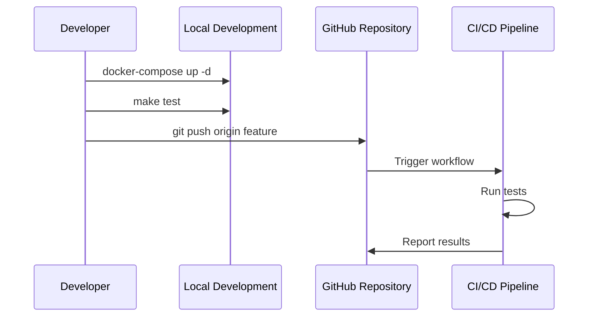
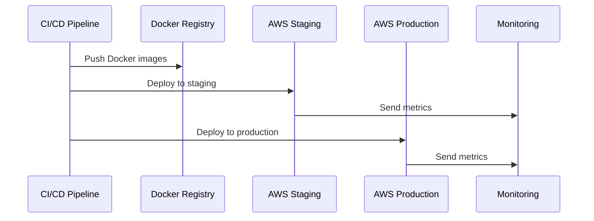

# Task 12: Context Level Architecture Explanation
## Настройка среды разработки и деплоя - Контекстная диаграмма

### Обзор контекста

Контекстная диаграмма Task 12 показывает высокоуровневое взаимодействие между различными участниками процесса разработки и внешними системами в рамках настройки среды разработки и деплоя для Auto.ru GraphQL Federation.

### Участники системы (Actors)

#### 1. Developer (Разработчик)
**Роль:** Основной пользователь системы разработки
**Ответственности:**
- Разработка и тестирование кода локально
- Использование Docker Compose для локальной среды
- Чтение и обновление документации
- Создание Pull Request'ов

**Взаимодействие с системой:**
```bash
# Локальная разработка
docker-compose up -d
make dev
make test

# Работа с документацией
vim README.md
vim docs/API.md
```

#### 2. DevOps Engineer (DevOps инженер)
**Роль:** Специалист по инфраструктуре и автоматизации
**Ответственности:**
- Настройка и поддержка CI/CD pipeline
- Конфигурирование GitHub Actions
- Мониторинг деплойментов
- Управление инфраструктурой AWS

**Взаимодействие с системой:**
```yaml
# Настройка CI/CD
name: CI
on:
  push:
    branches: [main, develop]
jobs:
  test:
    runs-on: ubuntu-latest
    steps:
      - uses: actions/checkout@v3
      - run: cargo test --all-features
```

#### 3. QA Engineer (Инженер по качеству)
**Роль:** Специалист по обеспечению качества
**Ответственности:**
- Анализ результатов автоматизированного тестирования
- Валидация деплойментов в staging
- Проверка соответствия требованиям качества

**Взаимодействие с системой:**
- Просмотр результатов CI/CD в GitHub Actions
- Тестирование в staging окружении
- Валидация GraphQL схем

### Системы в контексте

#### 1. Development Environment (Среда разработки)
**Назначение:** Локальная среда для разработки и тестирования

**Компоненты:**
- **Local Development:** Docker Compose окружение
- **CI/CD Pipeline:** GitHub Actions автоматизация
- **Documentation System:** Система документации проекта

**Характеристики:**
```yaml
# docker-compose.yml
version: '3.8'
services:
  ugc-subgraph:
    build: ./ugc-subgraph
    ports: ["4001:4001"]
    environment:
      - RUST_LOG=debug
  
  apollo-router:
    build: ./apollo-router
    ports: ["4000:4000"]
    depends_on: [ugc-subgraph]
```

#### 2. External Systems (Внешние системы)

##### GitHub Repository
**Роль:** Центральное хранилище кода и конфигураций
**Функции:**
- Version control для всего кода
- Trigger для CI/CD pipeline
- Хранение конфигураций GitHub Actions
- Pull Request workflow

**Интеграция:**
```bash
# Developer workflow
git add .
git commit -m "feat: add new feature"
git push origin feature-branch
# Автоматически запускается CI pipeline
```

##### Docker Registry (ECR/Docker Hub)
**Роль:** Хранилище контейнерных образов
**Функции:**
- Хранение built Docker images
- Версионирование образов
- Distribution для deployment

**Интеграция:**
```yaml
# GitHub Actions
- name: Build and push Docker images
  run: |
    docker build -t $ECR_REGISTRY/ugc-subgraph:$GITHUB_SHA .
    docker push $ECR_REGISTRY/ugc-subgraph:$GITHUB_SHA
```

##### AWS Staging Environment
**Роль:** Промежуточная среда для тестирования
**Функции:**
- Автоматический деплой из develop ветки
- Integration testing
- Performance validation
- Pre-production validation

**Конфигурация:**
```yaml
# EKS Deployment
apiVersion: apps/v1
kind: Deployment
metadata:
  name: ugc-subgraph
  namespace: staging
spec:
  replicas: 2
  template:
    spec:
      containers:
      - name: ugc-subgraph
        image: auto-ru/ugc-subgraph:latest
        resources:
          requests:
            memory: "256Mi"
            cpu: "250m"
```

##### AWS Production Environment
**Роль:** Производственная среда
**Функции:**
- Manual deployment после валидации
- High availability configuration
- Production monitoring
- Real user traffic

**Характеристики:**
- Multi-AZ deployment
- Auto-scaling groups
- Production-grade monitoring
- Backup и disaster recovery

##### Monitoring Stack
**Роль:** Система наблюдаемости
**Функции:**
- Сбор метрик из всех окружений
- Distributed tracing
- Alerting и notifications
- Performance monitoring

**Компоненты:**
```yaml
# Monitoring integration
telemetry:
  metrics:
    prometheus:
      enabled: true
      endpoint: http://prometheus:9090
  tracing:
    jaeger:
      enabled: true
      endpoint: http://jaeger:14268/api/traces
```

### Потоки взаимодействия

#### 1. Development Flow


#### 2. Deployment Flow


### Архитектурные решения

#### 1. Containerization Strategy
**Решение:** Docker-first подход для всех компонентов
**Обоснование:**
- Консистентность между окружениями
- Изоляция зависимостей
- Простота деплоя
- Масштабируемость

#### 2. CI/CD Automation
**Решение:** GitHub Actions для полной автоматизации
**Обоснование:**
- Интеграция с GitHub repository
- Богатая экосистема actions
- Matrix builds для параллелизации
- Встроенная безопасность

#### 3. Multi-Environment Strategy
**Решение:** Separate staging и production окружения
**Обоснование:**
- Risk mitigation
- Performance validation
- Integration testing
- Gradual rollout capability

### Качественные атрибуты

#### 1. Reliability (Надежность)
- **Health checks:** Автоматическая проверка состояния сервисов
- **Rollback capability:** Возможность быстрого отката
- **Multi-AZ deployment:** Высокая доступность в production

#### 2. Scalability (Масштабируемость)
- **Horizontal scaling:** Kubernetes auto-scaling
- **Resource optimization:** Эффективное использование ресурсов
- **Load balancing:** Распределение нагрузки

#### 3. Security (Безопасность)
- **Container security:** Non-root пользователи, minimal images
- **Secret management:** Безопасное хранение credentials
- **Network isolation:** Kubernetes network policies

#### 4. Maintainability (Поддерживаемость)
- **Documentation:** Comprehensive guides и runbooks
- **Automation:** Минимизация ручных операций
- **Monitoring:** Observability для troubleshooting

### Ограничения и компромиссы

#### 1. Complexity vs Flexibility
**Компромисс:** Более сложная настройка в обмен на гибкость
**Решение:** Comprehensive documentation и automation

#### 2. Cost vs Performance
**Компромисс:** Дополнительные ресурсы для staging окружения
**Решение:** Right-sizing ресурсов для каждого окружения

#### 3. Security vs Convenience
**Компромисс:** Дополнительные security checks замедляют deployment
**Решение:** Parallel execution и caching для оптимизации

### Заключение

Контекстная архитектура Task 12 обеспечивает надежную, автоматизированную и масштабируемую систему разработки и деплоя. Ключевые преимущества:

- **Developer Experience:** Простой локальный запуск и разработка
- **Automation:** Полностью автоматизированный CI/CD pipeline
- **Quality Assurance:** Multi-stage validation процесс
- **Operational Excellence:** Production-ready monitoring и alerting
- **Security:** Встроенные security best practices