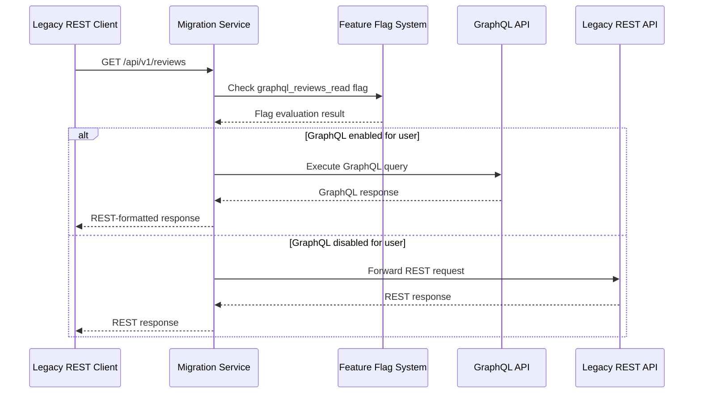
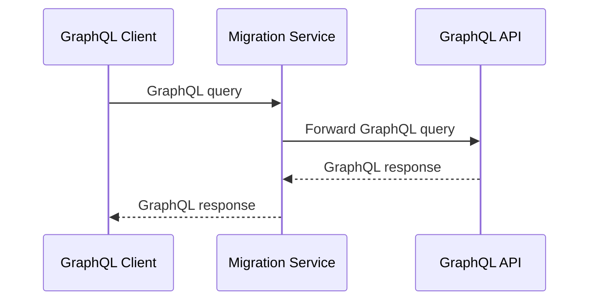
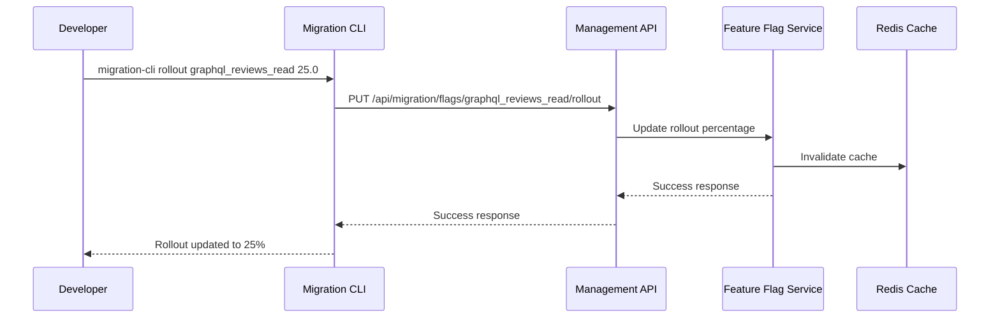

# Task 13: Context Level Architecture Explanation
## Реализация стратегии миграции - Контекстная диаграмма

### Обзор контекстной архитектуры

Контекстная диаграмма Task 13 показывает высокоуровневое взаимодействие между участниками процесса миграции от REST к GraphQL и внешними системами. Диаграмма демонстрирует, как различные типы пользователей взаимодействуют с системой миграции.

### Участники системы (Actors)

#### 1. Legacy REST Client (Устаревший REST клиент)
**Роль:** Существующие приложения, использующие REST API
**Характеристики:**
- Мобильные приложения Auto.ru
- Веб-интерфейсы третьих сторон
- Внутренние сервисы компании
- Legacy интеграции партнеров

**Взаимодействие с системой:**
```http
GET /api/v1/reviews HTTP/1.1
Host: api.auto.ru
Authorization: Bearer jwt-token
```

**Ожидания:**
- Сохранение существующих API endpoints
- Идентичные форматы ответов
- Стабильная производительность
- Отсутствие breaking changes

#### 2. GraphQL Client (GraphQL клиент)
**Роль:** Новые приложения, использующие GraphQL API
**Характеристики:**
- Современные веб-приложения
- Mobile apps нового поколения
- Микросервисы с GraphQL интеграцией
- Developer tools и админ панели

**Взаимодействие с системой:**
```graphql
query GetReviews($first: Int, $offerId: ID) {
  reviews(first: $first, offerId: $offerId) {
    edges {
      node {
        id
        rating
        text
        author { name }
        offer { title }
      }
    }
  }
}
```

**Преимущества:**
- Flexible data fetching
- Type safety
- Real-time subscriptions
- Better developer experience

#### 3. Developer (Разработчик)
**Роль:** Управляет процессом миграции и feature flags
**Ответственности:**
- Настройка feature flags
- Мониторинг процесса миграции
- A/B тестирование
- Rollback при проблемах

**Инструменты взаимодействия:**
```bash
# CLI управление
cargo run --bin migration-cli list
cargo run --bin migration-cli enable graphql_reviews_read
cargo run --bin migration-cli rollout graphql_reviews_read 25.0

# API управление
curl -X POST http://localhost:4001/api/migration/flags/graphql_reviews_read/enable
curl -X PUT http://localhost:4001/api/migration/flags/graphql_reviews_read/rollout \
  -d '{"percentage": 25.0}'
```

#### 4. Operations Engineer (Инженер эксплуатации)
**Роль:** Мониторинг прогресса миграции и обработка инцидентов
**Ответственности:**
- Мониторинг метрик производительности
- Реагирование на алерты
- Управление инцидентами
- Capacity planning

**Dashboards и алерты:**
```yaml
# Grafana Dashboard queries
- Migration Progress: migration_progress_percentage
- Error Rate: rate(migration_errors_total[5m])
- Response Time: histogram_quantile(0.95, rate(request_duration_seconds_bucket[5m]))
- Traffic Distribution: migration_traffic_distribution_by_backend
```

### Системы в контексте

#### 1. Migration System (Система миграции)
**Назначение:** Центральная система управления переходом от REST к GraphQL

**Ключевые компоненты:**
- **Migration Service:** Основной сервис маршрутизации
- **Feature Flag System:** Управление rollout и targeting
- **Migration Monitoring:** Сбор метрик и мониторинг

**Архитектурные характеристики:**
```yaml
Scalability: Horizontal scaling с load balancing
Availability: 99.9% uptime с automated failover
Performance: <100ms response time для flag evaluation
Security: JWT authentication, RBAC, audit logging
```

#### 2. External Systems (Внешние системы)

##### UGC GraphQL API
**Роль:** Целевая GraphQL federation система
**Характеристики:**
- Современная GraphQL federation архитектура
- Type-safe schema
- Real-time capabilities
- Optimized performance

**Integration Pattern:**
```rust
async fn route_to_graphql(&self, request: Request) -> Response {
    let graphql_query = self.convert_rest_to_graphql(request).await?;
    let response = self.graphql_client.execute(graphql_query).await?;
    self.convert_graphql_to_rest_response(response).await
}
```

##### Legacy REST API
**Роль:** Существующая REST API система (deprecated)
**Характеристики:**
- Monolithic architecture
- Well-established endpoints
- Stable but limited functionality
- Performance bottlenecks

**Fallback Strategy:**
```rust
async fn fallback_to_rest(&self, request: Request) -> Response {
    warn!("Falling back to legacy REST API for request: {:?}", request);
    self.legacy_client.execute(request).await
}
```

##### Redis Cache
**Роль:** Кеширование feature flags и сессий
**Назначение:**
- Feature flag evaluation caching
- User session storage
- A/B test variant assignments
- Performance optimization

**Caching Strategy:**
```rust
async fn get_cached_flag_result(&self, flag_name: &str, user_id: &str) -> Option<bool> {
    let cache_key = format!("feature_flag:{}:{}", flag_name, user_id);
    let mut conn = self.redis_client.get_async_connection().await.ok()?;
    
    redis::cmd("GET")
        .arg(&cache_key)
        .query_async::<_, Option<String>>(&mut conn)
        .await
        .ok()?
        .and_then(|v| v.parse().ok())
}
```

##### Metrics & Alerting System
**Роль:** Сбор метрик и система алертов
**Компоненты:**
- Prometheus для сбора метрик
- Grafana для визуализации
- AlertManager для уведомлений

**Key Metrics:**
```prometheus
# Migration progress
migration_progress_percentage{phase="read_operations"} 25.0

# Request distribution
migration_requests_total{backend="graphql"} 1500
migration_requests_total{backend="rest"} 4500

# Performance metrics
migration_request_duration_seconds{quantile="0.95"} 0.150
migration_error_rate{backend="graphql"} 0.02
```

### Потоки взаимодействия

#### 1. Legacy Client Flow


#### 2. GraphQL Client Flow


#### 3. Migration Management Flow


### Архитектурные решения

#### 1. Gradual Migration Strategy
**Решение:** Feature flag-based gradual rollout
**Обоснование:**
- Минимизация рисков при переходе
- Возможность быстрого rollback
- A/B тестирование производительности
- Контролируемый user experience

**Implementation:**
```rust
pub async fn should_use_graphql(&self, user_id: &str) -> bool {
    // Check feature flag with caching
    if let Some(cached_result) = self.check_cache(user_id).await {
        return cached_result;
    }
    
    let flag_enabled = self.feature_flags
        .is_enabled("graphql_reviews_read", user_id)
        .await;
    
    // Cache result for performance
    self.cache_result(user_id, flag_enabled).await;
    flag_enabled
}
```

#### 2. Backward Compatibility
**Решение:** REST-to-GraphQL adapter pattern
**Обоснование:**
- Сохранение работоспособности legacy clients
- Плавный переход без breaking changes
- Возможность постепенного обновления клиентов
- Reduced migration complexity

#### 3. Observability-First Approach
**Решение:** Comprehensive monitoring и metrics
**Обоснование:**
- Data-driven migration decisions
- Early detection проблем
- Performance comparison между backends
- Audit trail для compliance

### Качественные атрибуты

#### 1. Reliability (Надежность)
- **Fallback mechanisms:** Automatic fallback к REST при GraphQL сбоях
- **Circuit breaker:** Protection от cascading failures
- **Health checks:** Continuous monitoring сервисов
- **Graceful degradation:** Partial functionality при partial failures

#### 2. Performance (Производительность)
- **Caching strategy:** Redis caching для flag evaluations
- **Connection pooling:** Efficient resource utilization
- **Async processing:** Non-blocking request handling
- **Load balancing:** Traffic distribution across instances

#### 3. Security (Безопасность)
- **Authentication:** JWT-based authentication для всех requests
- **Authorization:** RBAC для migration management
- **Audit logging:** Complete audit trail всех migration actions
- **Data encryption:** TLS для all communications

#### 4. Scalability (Масштабируемость)
- **Horizontal scaling:** Auto-scaling на основе load
- **Stateless design:** No server-side state для easy scaling
- **Database sharding:** Distributed data storage
- **CDN integration:** Global content distribution

### Ограничения и компромиссы

#### 1. Complexity vs Control
**Компромисс:** Increased system complexity для fine-grained control
**Mitigation:** Comprehensive documentation и automation tools

#### 2. Performance vs Safety
**Компромисс:** Additional latency от feature flag evaluation
**Mitigation:** Aggressive caching и optimization

#### 3. Flexibility vs Consistency
**Компромисс:** Different backends могут иметь slight behavioral differences
**Mitigation:** Extensive testing и monitoring

### Заключение

Контекстная архитектура Task 13 обеспечивает:

- **Safe Migration:** Controlled, gradual transition от REST к GraphQL
- **Backward Compatibility:** Seamless experience для existing clients
- **Operational Excellence:** Comprehensive monitoring и management tools
- **Risk Mitigation:** Multiple fallback mechanisms и emergency procedures
- **Data-Driven Decisions:** Extensive metrics для informed decision making

Архитектура спроектирована для минимизации рисков при максимизации контроля над процессом миграции, обеспечивая smooth transition для всех stakeholders.