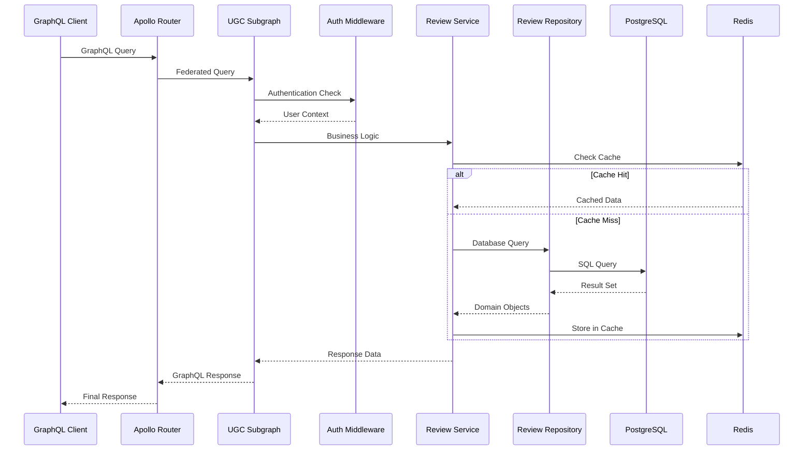
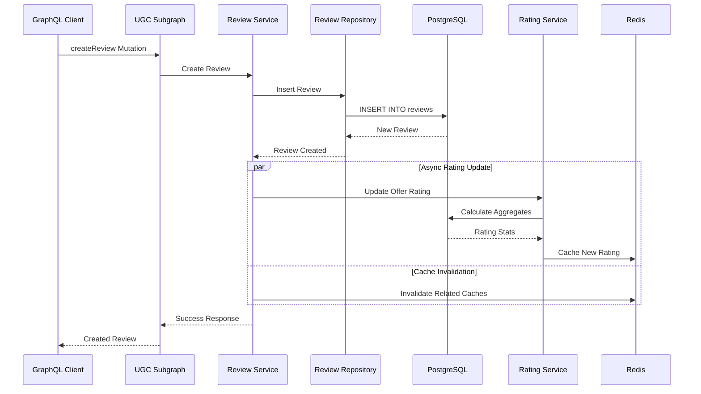

# C4 Container Diagram - Подробное объяснение Task 2

## Обзор диаграммы

**Файл**: `C4_ARCHITECTURE_CONTAINER.puml`

Контейнерная диаграмма показывает высокоуровневую архитектуру UGC системы, включая основные контейнеры, их технологии и взаимодействия.

## Архитектурные контейнеры и их реализация

### 1. UGC Subgraph System

#### GraphQL Server
```plantuml
Container(graphql_server, "GraphQL Server", "Rust, Axum, async-graphql", "HTTP сервер с GraphQL API...")
```

**Архитектурная роль**: Основной HTTP сервер с GraphQL API

**Реализация сервера**:
```rust
// crates/ugc-subgraph/src/main.rs
use axum::{
    extract::State,
    http::StatusCode,
    response::Json,
    routing::{get, post},
    Router,
};
use async_graphql::{Schema, EmptySubscription};
use async_graphql_axum::{GraphQLRequest, GraphQLResponse};
use tower::ServiceBuilder;
use tower_http::{
    cors::CorsLayer,
    trace::TraceLayer,
    compression::CompressionLayer,
};

mod resolvers;
mod services;
mod repository;
mod models;

use resolvers::{Query, Mutation};

type UgcSchema = Schema<Query, Mutation, EmptySubscription>;

#[tokio::main]
async fn main() -> Result<(), Box<dyn std::error::Error>> {
    // Инициализация трассировки
    shared::tracing::init_tracing("ugc-subgraph", &std::env::var("JAEGER_ENDPOINT")?)?;
    
    // Конфигурация из переменных окружения
    let config = UgcConfig::from_env()?;
    
    // Подключение к базе данных
    let pool = database::create_pool(&config.database_url).await?;
    database::run_migrations(&pool).await?;
    
    // Подключение к Redis
    let cache_service = shared::cache::CacheService::new(&config.redis_url).await?;
    
    // Создание сервисов
    let review_repository = repository::ReviewRepository::new(pool.clone());
    let rating_repository = repository::RatingRepository::new(pool.clone());
    
    let validation_service = services::ValidationService::new();
    let review_service = services::ReviewService::new(
        Arc::new(review_repository),
        cache_service.clone(),
        Arc::new(validation_service),
    );
    let rating_service = services::RatingService::new(
        Arc::new(rating_repository),
        cache_service.clone(),
    );
    let moderation_service = services::ModerationService::new(
        Arc::new(review_repository.clone()),
        Arc::new(rating_service.clone()),
    );
    
    // JWT сервис для аутентификации
    let jwt_service = shared::auth::JwtService::new(&config.jwt_secret);
    
    // Создание GraphQL схемы
    let schema = Schema::build(Query, Mutation, EmptySubscription)
        .data(pool.clone())
        .data(review_service)
        .data(rating_service)
        .data(moderation_service)
        .data(jwt_service)
        .data(cache_service)
        .enable_federation()
        .finish();
    
    // Middleware stack
    let middleware_stack = ServiceBuilder::new()
        .layer(TraceLayer::new_for_http())
        .layer(CompressionLayer::new())
        .layer(CorsLayer::permissive())
        .layer(shared::middleware::auth_middleware)
        .layer(shared::middleware::rate_limit_middleware)
        .layer(shared::middleware::metrics_middleware);
    
    // Создание HTTP роутера
    let app = Router::new()
        .route("/graphql", post(graphql_handler))
        .route("/", get(graphql_playground))
        .route("/health", get(health_check))
        .route("/metrics", get(metrics_handler))
        .route("/ready", get(readiness_check))
        .layer(middleware_stack)
        .with_state(schema);
    
    // Запуск сервера
    let addr = std::net::SocketAddr::from(([0, 0, 0, 0], config.port));
    tracing::info!("UGC Subgraph server starting on {}", addr);
    
    axum::Server::bind(&addr)
        .serve(app.into_make_service())
        .with_graceful_shutdown(shutdown_signal())
        .await?;
    
    Ok(())
}

/// GraphQL endpoint handler
async fn graphql_handler(
    State(schema): State<UgcSchema>,
    req: GraphQLRequest,
) -> Result<GraphQLResponse, StatusCode> {
    let response = schema.execute(req.into_inner()).await;
    Ok(response.into())
}

/// GraphQL Playground для разработки
async fn graphql_playground() -> impl axum::response::IntoResponse {
    axum::response::Html(async_graphql::http::playground_source(
        async_graphql::http::GraphQLPlaygroundConfig::new("/graphql")
    ))
}

/// Health check endpoint
async fn health_check(
    State(schema): State<UgcSchema>,
) -> Result<Json<serde_json::Value>, StatusCode> {
    let pool = schema.data::<sqlx::PgPool>()
        .map_err(|_| StatusCode::INTERNAL_SERVER_ERROR)?;
    
    // Проверка подключения к базе данных
    match database::health_check(pool).await {
        Ok(_) => Ok(Json(serde_json::json!({
            "status": "healthy",
            "service": "ugc-subgraph",
            "version": env!("CARGO_PKG_VERSION"),
            "timestamp": chrono::Utc::now()
        }))),
        Err(_) => Err(StatusCode::SERVICE_UNAVAILABLE),
    }
}

/// Readiness check для Kubernetes
async fn readiness_check(
    State(schema): State<UgcSchema>,
) -> Result<Json<serde_json::Value>, StatusCode> {
    let cache_service = schema.data::<shared::cache::CacheService>()
        .map_err(|_| StatusCode::INTERNAL_SERVER_ERROR)?;
    
    // Проверка всех зависимостей
    let db_ready = database::health_check(
        schema.data::<sqlx::PgPool>().unwrap()
    ).await.is_ok();
    
    let cache_ready = cache_service.ping().await.is_ok();
    
    if db_ready && cache_ready {
        Ok(Json(serde_json::json!({
            "status": "ready",
            "checks": {
                "database": "ok",
                "cache": "ok"
            }
        })))
    } else {
        Err(StatusCode::SERVICE_UNAVAILABLE)
    }
}

/// Graceful shutdown signal
async fn shutdown_signal() {
    let ctrl_c = async {
        tokio::signal::ctrl_c()
            .await
            .expect("failed to install Ctrl+C handler");
    };

    #[cfg(unix)]
    let terminate = async {
        tokio::signal::unix::signal(tokio::signal::unix::SignalKind::terminate())
            .expect("failed to install signal handler")
            .recv()
            .await;
    };

    #[cfg(not(unix))]
    let terminate = std::future::pending::<()>();

    tokio::select! {
        _ = ctrl_c => {},
        _ = terminate => {},
    }

    tracing::info!("Shutdown signal received, starting graceful shutdown");
}
```

#### Review Service
```plantuml
Container(review_service, "Review Service", "Rust", "Бизнес-логика отзывов...")
```

**Архитектурная роль**: Центральная бизнес-логика для работы с отзывами

**Реализация конфигурации сервиса**:
```rust
// crates/ugc-subgraph/src/services/mod.rs
use std::sync::Arc;
use shared::cache::CacheService;

pub mod review_service;
pub mod rating_service;
pub mod moderation_service;
pub mod validation_service;

pub use review_service::ReviewService;
pub use rating_service::RatingService;
pub use moderation_service::ModerationService;
pub use validation_service::ValidationService;

/// Конфигурация сервисов
#[derive(Debug, Clone)]
pub struct ServiceConfig {
    pub max_review_length: usize,
    pub min_review_length: usize,
    pub cache_ttl_seconds: u64,
    pub rate_limit_per_minute: u32,
    pub enable_auto_moderation: bool,
}

impl Default for ServiceConfig {
    fn default() -> Self {
        Self {
            max_review_length: 5000,
            min_review_length: 10,
            cache_ttl_seconds: 300, // 5 минут
            rate_limit_per_minute: 10,
            enable_auto_moderation: true,
        }
    }
}

/// Фабрика для создания сервисов
pub struct ServiceFactory;

impl ServiceFactory {
    pub fn create_review_service(
        repository: Arc<dyn crate::repository::ReviewRepositoryTrait>,
        cache_service: Arc<CacheService>,
        config: ServiceConfig,
    ) -> ReviewService {
        let validation_service = Arc::new(ValidationService::new(config.clone()));
        
        ReviewService::new(
            repository,
            cache_service,
            validation_service,
            config,
        )
    }
    
    pub fn create_rating_service(
        repository: Arc<dyn crate::repository::RatingRepositoryTrait>,
        cache_service: Arc<CacheService>,
        config: ServiceConfig,
    ) -> RatingService {
        RatingService::new(
            repository,
            cache_service,
            config,
        )
    }
    
    pub fn create_moderation_service(
        review_repository: Arc<dyn crate::repository::ReviewRepositoryTrait>,
        rating_service: Arc<RatingService>,
        config: ServiceConfig,
    ) -> ModerationService {
        ModerationService::new(
            review_repository,
            rating_service,
            config,
        )
    }
}
```

#### Review Repository
```plantuml
Container(review_repository, "Review Repository", "Rust, SQLx", "Слой доступа к данным...")
```

**Архитектурная роль**: Абстракция доступа к данным с оптимизированными запросами

**Реализация оптимизированных запросов**:
```rust
// crates/ugc-subgraph/src/repository/review_repository.rs
use sqlx::{PgPool, QueryBuilder, Postgres};
use shared::types::{UserId, OfferId, ReviewId};

impl ReviewRepository {
    /// Оптимизированный запрос для получения отзывов с фильтрацией
    pub async fn get_reviews_optimized(
        &self,
        offer_id: OfferId,
        filter: &ReviewFilter,
        limit: i32,
        offset: i32,
    ) -> UgcResult<Vec<Review>> {
        let mut query_builder = QueryBuilder::<Postgres>::new(
            "SELECT r.id, r.offer_id, r.user_id, r.rating, r.text, 
                    r.is_moderated, r.created_at, r.updated_at"
        );
        
        query_builder.push(" FROM reviews r WHERE r.offer_id = ");
        query_builder.push_bind(offer_id.0);
        query_builder.push(" AND r.deleted_at IS NULL");
        
        // Динамическое добавление фильтров
        if filter.only_moderated.unwrap_or(true) {
            query_builder.push(" AND r.is_moderated = TRUE");
        }
        
        if let Some(min_rating) = filter.min_rating {
            query_builder.push(" AND r.rating >= ");
            query_builder.push_bind(min_rating);
        }
        
        if let Some(max_rating) = filter.max_rating {
            query_builder.push(" AND r.rating <= ");
            query_builder.push_bind(max_rating);
        }
        
        if let Some(user_id) = filter.user_id {
            query_builder.push(" AND r.user_id = ");
            query_builder.push_bind(user_id.0);
        }
        
        // Сортировка
        match filter.sort_by.as_deref().unwrap_or("created_at") {
            "rating" => query_builder.push(" ORDER BY r.rating DESC, r.created_at DESC"),
            "created_at" => query_builder.push(" ORDER BY r.created_at DESC"),
            "helpful" => query_builder.push(" ORDER BY r.helpful_count DESC, r.created_at DESC"),
            _ => query_builder.push(" ORDER BY r.created_at DESC"),
        };
        
        query_builder.push(" LIMIT ");
        query_builder.push_bind(limit);
        query_builder.push(" OFFSET ");
        query_builder.push_bind(offset);
        
        let reviews = query_builder
            .build_query_as::<Review>()
            .fetch_all(&self.pool)
            .await
            .map_err(UgcError::from)?;
        
        tracing::debug!(
            offer_id = %offer_id,
            filter = ?filter,
            count = reviews.len(),
            "Optimized reviews query executed"
        );
        
        Ok(reviews)
    }
    
    /// Batch операция для получения статистики по нескольким объявлениям
    pub async fn get_offers_stats_batch(
        &self,
        offer_ids: &[OfferId],
    ) -> UgcResult<std::collections::HashMap<OfferId, OfferStats>> {
        if offer_ids.is_empty() {
            return Ok(std::collections::HashMap::new());
        }
        
        let offer_uuids: Vec<uuid::Uuid> = offer_ids.iter().map(|id| id.0).collect();
        
        let stats = sqlx::query!(
            r#"
            SELECT 
                offer_id,
                COUNT(*) as total_reviews,
                AVG(rating) as average_rating,
                COUNT(*) FILTER (WHERE rating = 1) as rating_1,
                COUNT(*) FILTER (WHERE rating = 2) as rating_2,
                COUNT(*) FILTER (WHERE rating = 3) as rating_3,
                COUNT(*) FILTER (WHERE rating = 4) as rating_4,
                COUNT(*) FILTER (WHERE rating = 5) as rating_5,
                MAX(created_at) as latest_review_at
            FROM reviews 
            WHERE offer_id = ANY($1) 
              AND deleted_at IS NULL 
              AND is_moderated = TRUE
            GROUP BY offer_id
            "#,
            &offer_uuids
        )
        .fetch_all(&self.pool)
        .await
        .map_err(UgcError::from)?;
        
        let mut result = std::collections::HashMap::new();
        
        for stat in stats {
            let offer_id = OfferId(stat.offer_id);
            let mut distribution = std::collections::HashMap::new();
            distribution.insert("1".to_string(), stat.rating_1.unwrap_or(0) as i32);
            distribution.insert("2".to_string(), stat.rating_2.unwrap_or(0) as i32);
            distribution.insert("3".to_string(), stat.rating_3.unwrap_or(0) as i32);
            distribution.insert("4".to_string(), stat.rating_4.unwrap_or(0) as i32);
            distribution.insert("5".to_string(), stat.rating_5.unwrap_or(0) as i32);
            
            result.insert(offer_id, OfferStats {
                total_reviews: stat.total_reviews.unwrap_or(0) as i32,
                average_rating: stat.average_rating.unwrap_or(0.0),
                rating_distribution: distribution,
                latest_review_at: stat.latest_review_at,
            });
        }
        
        tracing::debug!(
            offers_count = offer_ids.len(),
            stats_count = result.len(),
            "Batch offer stats retrieved"
        );
        
        Ok(result)
    }
}
```

#### Auth Middleware
```plantuml
Container(auth_middleware, "Auth Middleware", "Rust", "Аутентификация и авторизация...")
```

**Архитектурная роль**: Централизованная аутентификация и авторизация

**Реализация middleware**:
```rust
// crates/shared/src/middleware/auth.rs
use axum::{
    extract::{Request, State},
    http::{StatusCode, HeaderMap},
    middleware::Next,
    response::Response,
};
use jsonwebtoken::{decode, DecodingKey, Validation, Algorithm};

#[derive(Debug, Clone)]
pub struct AuthConfig {
    pub jwt_secret: String,
    pub jwt_algorithm: Algorithm,
    pub token_expiry_hours: i64,
    pub refresh_token_expiry_days: i64,
}

impl Default for AuthConfig {
    fn default() -> Self {
        Self {
            jwt_secret: std::env::var("JWT_SECRET").unwrap_or_default(),
            jwt_algorithm: Algorithm::HS256,
            token_expiry_hours: 24,
            refresh_token_expiry_days: 30,
        }
    }
}

/// Middleware для аутентификации
pub async fn auth_middleware(
    State(auth_config): State<AuthConfig>,
    mut request: Request,
    next: Next,
) -> Result<Response, StatusCode> {
    let headers = request.headers();
    
    // Извлечение токена из заголовка Authorization
    let token = extract_bearer_token(headers);
    
    // Для публичных эндпоинтов токен не обязателен
    if is_public_endpoint(request.uri().path()) {
        if let Some(token) = token {
            // Попытка валидации токена для публичных эндпоинтов
            if let Ok(user_context) = validate_and_create_context(&token, &auth_config).await {
                request.extensions_mut().insert(user_context);
            }
        }
        return Ok(next.run(request).await);
    }
    
    // Для защищенных эндпоинтов токен обязателен
    let token = token.ok_or(StatusCode::UNAUTHORIZED)?;
    
    // Валидация токена и создание контекста пользователя
    let user_context = validate_and_create_context(&token, &auth_config)
        .await
        .map_err(|_| StatusCode::UNAUTHORIZED)?;
    
    // Добавление контекста в request extensions
    request.extensions_mut().insert(user_context);
    
    // Метрики аутентификации
    shared::metrics::AUTH_REQUESTS_TOTAL
        .with_label_values(&["success"])
        .inc();
    
    tracing::debug!(
        user_id = %user_context.user_id,
        "User authenticated successfully"
    );
    
    Ok(next.run(request).await)
}

/// Валидация JWT токена и создание контекста пользователя
async fn validate_and_create_context(
    token: &str,
    config: &AuthConfig,
) -> Result<UserContext, AuthError> {
    let decoding_key = DecodingKey::from_secret(config.jwt_secret.as_ref());
    let validation = Validation::new(config.jwt_algorithm);
    
    let token_data = decode::<Claims>(token, &decoding_key, &validation)
        .map_err(|e| {
            tracing::warn!(error = %e, "JWT validation failed");
            shared::metrics::AUTH_REQUESTS_TOTAL
                .with_label_values(&["invalid_token"])
                .inc();
            AuthError::InvalidToken
        })?;
    
    let claims = token_data.claims;
    
    // Проверка срока действия токена
    let now = chrono::Utc::now().timestamp();
    if claims.exp < now {
        tracing::warn!(
            user_id = %claims.user_id,
            exp = claims.exp,
            now = now,
            "Token expired"
        );
        shared::metrics::AUTH_REQUESTS_TOTAL
            .with_label_values(&["expired_token"])
            .inc();
        return Err(AuthError::TokenExpired);
    }
    
    // Создание контекста пользователя
    let user_context = UserContext {
        user_id: claims.user_id,
        roles: claims.roles,
        permissions: claims.permissions,
        session_id: claims.session_id,
        authenticated_at: chrono::Utc::now(),
    };
    
    Ok(user_context)
}

/// Извлечение Bearer токена из заголовков
fn extract_bearer_token(headers: &HeaderMap) -> Option<String> {
    headers
        .get("authorization")
        .and_then(|header| header.to_str().ok())
        .and_then(|auth_header| {
            if auth_header.starts_with("Bearer ") {
                Some(auth_header[7..].to_string())
            } else {
                None
            }
        })
}

/// Проверка, является ли эндпоинт публичным
fn is_public_endpoint(path: &str) -> bool {
    matches!(path, "/health" | "/ready" | "/metrics" | "/" | "/graphql")
}

#[derive(Debug, thiserror::Error)]
pub enum AuthError {
    #[error("Invalid token")]
    InvalidToken,
    #[error("Token expired")]
    TokenExpired,
    #[error("Missing token")]
    MissingToken,
    #[error("Insufficient permissions")]
    InsufficientPermissions,
}
```

#### Cache Service
```plantuml
Container(cache_service, "Cache Service", "Rust, Redis", "Кеширование данных...")
```

**Архитектурная роль**: Высокопроизводительное кеширование с Redis

**Реализация кеш-сервиса**:
```rust
// crates/shared/src/cache/mod.rs
use redis::{Client, AsyncCommands, RedisResult};
use serde::{Serialize, Deserialize};
use std::time::Duration;

#[derive(Debug, Clone)]
pub struct CacheConfig {
    pub redis_url: String,
    pub default_ttl: Duration,
    pub max_connections: u32,
    pub connection_timeout: Duration,
    pub key_prefix: String,
}

impl Default for CacheConfig {
    fn default() -> Self {
        Self {
            redis_url: std::env::var("REDIS_URL").unwrap_or_else(|_| "redis://localhost:6379".to_string()),
            default_ttl: Duration::from_secs(300), // 5 минут
            max_connections: 20,
            connection_timeout: Duration::from_secs(5),
            key_prefix: "ugc:".to_string(),
        }
    }
}

pub struct CacheService {
    client: Client,
    config: CacheConfig,
}

impl CacheService {
    pub async fn new(config: CacheConfig) -> Result<Self, redis::RedisError> {
        let client = Client::open(config.redis_url.as_str())?;
        
        // Проверка подключения
        let mut conn = client.get_async_connection().await?;
        let _: String = conn.ping().await?;
        
        tracing::info!("Cache service initialized successfully");
        
        Ok(Self { client, config })
    }
    
    /// Получение значения из кеша
    pub async fn get<T>(&self, key: &str) -> Result<Option<T>, CacheError>
    where
        T: for<'de> Deserialize<'de>,
    {
        let full_key = format!("{}{}", self.config.key_prefix, key);
        let mut conn = self.client.get_async_connection().await?;
        
        let value: Option<String> = conn.get(&full_key).await?;
        
        match value {
            Some(json_str) => {
                let deserialized = serde_json::from_str(&json_str)
                    .map_err(CacheError::SerializationError)?;
                
                // Метрики
                shared::metrics::CACHE_OPERATIONS_TOTAL
                    .with_label_values(&["get", "hit"])
                    .inc();
                
                tracing::debug!(key = %key, "Cache hit");
                Ok(Some(deserialized))
            }
            None => {
                shared::metrics::CACHE_OPERATIONS_TOTAL
                    .with_label_values(&["get", "miss"])
                    .inc();
                
                tracing::debug!(key = %key, "Cache miss");
                Ok(None)
            }
        }
    }
    
    /// Сохранение значения в кеш с TTL
    pub async fn set_with_ttl<T>(
        &self,
        key: &str,
        value: &T,
        ttl_seconds: u64,
    ) -> Result<(), CacheError>
    where
        T: Serialize,
    {
        let full_key = format!("{}{}", self.config.key_prefix, key);
        let json_str = serde_json::to_string(value)
            .map_err(CacheError::SerializationError)?;
        
        let mut conn = self.client.get_async_connection().await?;
        
        let _: () = conn.set_ex(&full_key, json_str, ttl_seconds).await?;
        
        shared::metrics::CACHE_OPERATIONS_TOTAL
            .with_label_values(&["set", "success"])
            .inc();
        
        tracing::debug!(
            key = %key,
            ttl = ttl_seconds,
            "Value cached successfully"
        );
        
        Ok(())
    }
    
    /// Сохранение с дефолтным TTL
    pub async fn set<T>(&self, key: &str, value: &T) -> Result<(), CacheError>
    where
        T: Serialize,
    {
        self.set_with_ttl(key, value, self.config.default_ttl.as_secs()).await
    }
    
    /// Удаление ключа из кеша
    pub async fn delete(&self, key: &str) -> Result<(), CacheError> {
        let full_key = format!("{}{}", self.config.key_prefix, key);
        let mut conn = self.client.get_async_connection().await?;
        
        let _: () = conn.del(&full_key).await?;
        
        shared::metrics::CACHE_OPERATIONS_TOTAL
            .with_label_values(&["delete", "success"])
            .inc();
        
        tracing::debug!(key = %key, "Key deleted from cache");
        Ok(())
    }
    
    /// Удаление ключей по паттерну
    pub async fn delete_pattern(&self, pattern: &str) -> Result<u32, CacheError> {
        let full_pattern = format!("{}{}", self.config.key_prefix, pattern);
        let mut conn = self.client.get_async_connection().await?;
        
        // Получение ключей по паттерну
        let keys: Vec<String> = conn.keys(&full_pattern).await?;
        
        if keys.is_empty() {
            return Ok(0);
        }
        
        // Удаление найденных ключей
        let deleted_count: u32 = conn.del(&keys).await?;
        
        shared::metrics::CACHE_OPERATIONS_TOTAL
            .with_label_values(&["delete_pattern", "success"])
            .inc();
        
        tracing::debug!(
            pattern = %pattern,
            deleted_count = deleted_count,
            "Keys deleted by pattern"
        );
        
        Ok(deleted_count)
    }
    
    /// Проверка подключения к Redis
    pub async fn ping(&self) -> Result<(), CacheError> {
        let mut conn = self.client.get_async_connection().await?;
        let _: String = conn.ping().await?;
        Ok(())
    }
    
    /// Получение статистики кеша
    pub async fn get_stats(&self) -> Result<CacheStats, CacheError> {
        let mut conn = self.client.get_async_connection().await?;
        
        let info: String = conn.info("memory").await?;
        let keyspace: String = conn.info("keyspace").await?;
        
        // Парсинг статистики Redis (упрощенная версия)
        let used_memory = parse_redis_info(&info, "used_memory:")
            .unwrap_or(0);
        let total_keys = parse_redis_keyspace(&keyspace)
            .unwrap_or(0);
        
        Ok(CacheStats {
            used_memory_bytes: used_memory,
            total_keys,
            hit_rate: 0.0, // Можно вычислить из метрик
        })
    }
}

#[derive(Debug, Clone)]
pub struct CacheStats {
    pub used_memory_bytes: u64,
    pub total_keys: u64,
    pub hit_rate: f64,
}

#[derive(Debug, thiserror::Error)]
pub enum CacheError {
    #[error("Redis error: {0}")]
    RedisError(#[from] redis::RedisError),
    #[error("Serialization error: {0}")]
    SerializationError(#[from] serde_json::Error),
}

/// Парсинг информации из Redis INFO команды
fn parse_redis_info(info: &str, key: &str) -> Option<u64> {
    info.lines()
        .find(|line| line.starts_with(key))
        .and_then(|line| line.split(':').nth(1))
        .and_then(|value| value.parse().ok())
}

/// Парсинг keyspace информации
fn parse_redis_keyspace(keyspace: &str) -> Option<u64> {
    keyspace.lines()
        .find(|line| line.starts_with("db0:"))
        .and_then(|line| {
            line.split(',')
                .find(|part| part.starts_with("keys="))
                .and_then(|part| part.strip_prefix("keys="))
                .and_then(|value| value.parse().ok())
        })
}
```

### 2. Federation System

#### Apollo Router
```plantuml
Container(apollo_router, "Apollo Router", "GraphQL Router", "Федеративный роутер...")
```

**Архитектурная роль**: Композиция федеративных схем и маршрутизация запросов

**Конфигурация федерации**:
```yaml
# router.yaml - конфигурация Apollo Router
supergraph:
  # Путь к федеративной схеме
  path: ./supergraph.graphql
  
# Конфигурация подграфов
subgraphs:
  ugc:
    routing_url: http://ugc-subgraph:4001/graphql
    schema:
      subgraph_url: http://ugc-subgraph:4001/graphql
  
  users:
    routing_url: http://users-subgraph:4002/graphql
    schema:
      subgraph_url: http://users-subgraph:4002/graphql
  
  offers:
    routing_url: http://offers-subgraph:4003/graphql
    schema:
      subgraph_url: http://offers-subgraph:4003/graphql

# Настройки производительности
traffic_shaping:
  router:
    # Глобальные лимиты
    global_rate_limit:
      capacity: 1000
      interval: 60s
    
    # Таймауты
    timeout: 30s
    
  subgraphs:
    ugc:
      # Лимиты для UGC подграфа
      rate_limit:
        capacity: 500
        interval: 60s
      timeout: 10s
      
    users:
      rate_limit:
        capacity: 1000
        interval: 60s
      timeout: 5s
      
    offers:
      rate_limit:
        capacity: 800
        interval: 60s
      timeout: 8s

# Настройки кеширования
caching:
  redis:
    urls: ["redis://redis:6379"]
    timeout: 2s
    ttl: 300s
  
  # Правила кеширования для запросов
  query_plan_cache:
    enabled: true
    ttl: 300s
  
  # Кеширование на уровне полей
  subgraph_cache:
    enabled: true
    ttl: 60s

# Мониторинг и трассировка
telemetry:
  apollo:
    # Apollo Studio интеграция
    schema_reporting:
      enabled: true
    
    field_level_instrumentation: 1.0
  
  tracing:
    jaeger:
      endpoint: http://jaeger:14268/api/traces
      batch_size: 512
    
    # Sampling configuration
    trace_config:
      service_name: "apollo-router"
      sampler: 0.1 # 10% sampling
  
  metrics:
    prometheus:
      enabled: true
      path: /metrics
      listen: 0.0.0.0:9090

# Настройки CORS
cors:
  allow_any_origin: false
  allow_origins:
    - "https://auto.ru"
    - "https://dev.auto.ru"
  allow_headers:
    - "content-type"
    - "authorization"
  allow_methods:
    - GET
    - POST
    - OPTIONS

# Настройки безопасности
security:
  # Защита от сложных запросов
  query_depth_limit: 15
  query_complexity_limit: 1000
  
  # Лимиты на размер запроса
  request_size_limit: 2MB
  
  # Introspection (отключить в продакшене)
  introspection: false
```

### 3. Базы данных

#### PostgreSQL
```plantuml
ContainerDb(postgres, "PostgreSQL", "PostgreSQL 15", "Основная база данных...")
```

**Архитектурная роль**: Надежное хранение данных с ACID гарантиями

**Оптимизированная схема базы данных**:
```sql
-- migrations/001_create_reviews_schema.sql

-- Создание расширений
CREATE EXTENSION IF NOT EXISTS "uuid-ossp";
CREATE EXTENSION IF NOT EXISTS "pg_trgm"; -- Для полнотекстового поиска

-- Основная таблица отзывов
CREATE TABLE IF NOT EXISTS reviews (
    id UUID PRIMARY KEY DEFAULT uuid_generate_v4(),
    offer_id UUID NOT NULL,
    user_id UUID NOT NULL,
    rating INTEGER NOT NULL,
    title VARCHAR(200),
    text TEXT NOT NULL,
    
    -- Модерация
    is_moderated BOOLEAN DEFAULT FALSE,
    moderated_by UUID,
    moderated_at TIMESTAMP WITH TIME ZONE,
    moderation_reason TEXT,
    
    -- Флаги
    is_flagged BOOLEAN DEFAULT FALSE,
    flag_reason TEXT,
    is_featured BOOLEAN DEFAULT FALSE,
    
    -- Полезность отзыва
    helpful_count INTEGER DEFAULT 0,
    not_helpful_count INTEGER DEFAULT 0,
    
    -- Временные метки
    created_at TIMESTAMP WITH TIME ZONE DEFAULT NOW(),
    updated_at TIMESTAMP WITH TIME ZONE DEFAULT NOW(),
    deleted_at TIMESTAMP WITH TIME ZONE,
    
    -- Бизнес-ограничения
    CONSTRAINT reviews_rating_check CHECK (rating >= 1 AND rating <= 5),
    CONSTRAINT reviews_text_length_check CHECK (length(text) >= 10 AND length(text) <= 5000),
    CONSTRAINT reviews_title_length_check CHECK (title IS NULL OR length(title) <= 200),
    
    -- Уникальность: один отзыв от пользователя на объявление
    CONSTRAINT unique_user_offer_review UNIQUE (user_id, offer_id) 
        WHERE deleted_at IS NULL,
    
    -- Проверка модерации
    CONSTRAINT valid_moderation CHECK (
        (is_moderated = FALSE AND moderated_by IS NULL AND moderated_at IS NULL) OR
        (is_moderated = TRUE AND moderated_by IS NOT NULL AND moderated_at IS NOT NULL)
    )
);

-- Таблица агрегированных рейтингов объявлений
CREATE TABLE IF NOT EXISTS offer_ratings (
    offer_id UUID PRIMARY KEY,
    total_reviews INTEGER DEFAULT 0,
    average_rating DECIMAL(3,2) DEFAULT 0.00,
    
    -- Распределение по рейтингам
    rating_distribution JSONB DEFAULT '{"1": 0, "2": 0, "3": 0, "4": 0, "5": 0}',
    
    -- Статистика
    latest_review_at TIMESTAMP WITH TIME ZONE,
    first_review_at TIMESTAMP WITH TIME ZONE,
    
    -- Временные метки
    created_at TIMESTAMP WITH TIME ZONE DEFAULT NOW(),
    updated_at TIMESTAMP WITH TIME ZONE DEFAULT NOW(),
    
    -- Ограничения
    CONSTRAINT offer_ratings_average_check CHECK (average_rating >= 0 AND average_rating <= 5),
    CONSTRAINT offer_ratings_total_check CHECK (total_reviews >= 0)
);

-- Таблица для отслеживания полезности отзывов
CREATE TABLE IF NOT EXISTS review_helpfulness (
    id UUID PRIMARY KEY DEFAULT uuid_generate_v4(),
    review_id UUID NOT NULL REFERENCES reviews(id) ON DELETE CASCADE,
    user_id UUID NOT NULL,
    is_helpful BOOLEAN NOT NULL,
    created_at TIMESTAMP WITH TIME ZONE DEFAULT NOW(),
    
    -- Один пользователь может оценить отзыв только один раз
    CONSTRAINT unique_user_review_helpfulness UNIQUE (review_id, user_id)
);

-- Индексы для производительности

-- Основные индексы для reviews
CREATE INDEX CONCURRENTLY IF NOT EXISTS idx_reviews_offer_id 
    ON reviews(offer_id) WHERE deleted_at IS NULL;

CREATE INDEX CONCURRENTLY IF NOT EXISTS idx_reviews_user_id 
    ON reviews(user_id) WHERE deleted_at IS NULL;

CREATE INDEX CONCURRENTLY IF NOT EXISTS idx_reviews_created_at 
    ON reviews(created_at DESC) WHERE deleted_at IS NULL;

CREATE INDEX CONCURRENTLY IF NOT EXISTS idx_reviews_rating 
    ON reviews(rating) WHERE deleted_at IS NULL AND is_moderated = TRUE;

CREATE INDEX CONCURRENTLY IF NOT EXISTS idx_reviews_moderation 
    ON reviews(is_moderated, created_at DESC) WHERE deleted_at IS NULL;

-- Составные индексы для частых запросов
CREATE INDEX CONCURRENTLY IF NOT EXISTS idx_reviews_offer_moderated_created 
    ON reviews(offer_id, is_moderated, created_at DESC) 
    WHERE deleted_at IS NULL;

CREATE INDEX CONCURRENTLY IF NOT EXISTS idx_reviews_offer_rating_created 
    ON reviews(offer_id, rating, created_at DESC) 
    WHERE deleted_at IS NULL AND is_moderated = TRUE;

-- Индекс для полнотекстового поиска
CREATE INDEX CONCURRENTLY IF NOT EXISTS idx_reviews_text_search 
    ON reviews USING gin(to_tsvector('russian', text)) 
    WHERE deleted_at IS NULL AND is_moderated = TRUE;

-- Индексы для offer_ratings
CREATE INDEX CONCURRENTLY IF NOT EXISTS idx_offer_ratings_average 
    ON offer_ratings(average_rating DESC);

CREATE INDEX CONCURRENTLY IF NOT EXISTS idx_offer_ratings_total 
    ON offer_ratings(total_reviews DESC);

-- Индексы для review_helpfulness
CREATE INDEX CONCURRENTLY IF NOT EXISTS idx_review_helpfulness_review_id 
    ON review_helpfulness(review_id);

-- Функции и триггеры

-- Функция для обновления updated_at
CREATE OR REPLACE FUNCTION update_updated_at_column()
RETURNS TRIGGER AS $$
BEGIN
    NEW.updated_at = NOW();
    RETURN NEW;
END;
$$ language 'plpgsql';

-- Триггеры для автоматического обновления updated_at
CREATE TRIGGER update_reviews_updated_at 
    BEFORE UPDATE ON reviews 
    FOR EACH ROW EXECUTE FUNCTION update_updated_at_column();

CREATE TRIGGER update_offer_ratings_updated_at 
    BEFORE UPDATE ON offer_ratings 
    FOR EACH ROW EXECUTE FUNCTION update_updated_at_column();

-- Функция для обновления агрегированного рейтинга
CREATE OR REPLACE FUNCTION update_offer_rating(p_offer_id UUID)
RETURNS VOID AS $$
DECLARE
    v_stats RECORD;
BEGIN
    -- Вычисление статистики
    SELECT 
        COUNT(*) as total_reviews,
        AVG(rating) as average_rating,
        MIN(created_at) as first_review_at,
        MAX(created_at) as latest_review_at,
        jsonb_build_object(
            '1', COUNT(*) FILTER (WHERE rating = 1),
            '2', COUNT(*) FILTER (WHERE rating = 2),
            '3', COUNT(*) FILTER (WHERE rating = 3),
            '4', COUNT(*) FILTER (WHERE rating = 4),
            '5', COUNT(*) FILTER (WHERE rating = 5)
        ) as rating_distribution
    INTO v_stats
    FROM reviews 
    WHERE offer_id = p_offer_id 
      AND deleted_at IS NULL 
      AND is_moderated = TRUE;
    
    -- Обновление или вставка агрегированных данных
    INSERT INTO offer_ratings (
        offer_id, 
        total_reviews, 
        average_rating, 
        rating_distribution,
        first_review_at,
        latest_review_at
    ) VALUES (
        p_offer_id,
        v_stats.total_reviews,
        COALESCE(v_stats.average_rating, 0),
        v_stats.rating_distribution,
        v_stats.first_review_at,
        v_stats.latest_review_at
    )
    ON CONFLICT (offer_id) DO UPDATE SET
        total_reviews = v_stats.total_reviews,
        average_rating = COALESCE(v_stats.average_rating, 0),
        rating_distribution = v_stats.rating_distribution,
        first_review_at = COALESCE(v_stats.first_review_at, offer_ratings.first_review_at),
        latest_review_at = v_stats.latest_review_at,
        updated_at = NOW();
END;
$$ LANGUAGE plpgsql;

-- Триггер для автоматического обновления рейтинга при изменении отзыва
CREATE OR REPLACE FUNCTION trigger_update_offer_rating()
RETURNS TRIGGER AS $$
BEGIN
    -- Обновляем рейтинг для старого объявления (при UPDATE)
    IF TG_OP = 'UPDATE' AND OLD.offer_id != NEW.offer_id THEN
        PERFORM update_offer_rating(OLD.offer_id);
    END IF;
    
    -- Обновляем рейтинг для текущего объявления
    IF TG_OP = 'DELETE' THEN
        PERFORM update_offer_rating(OLD.offer_id);
        RETURN OLD;
    ELSE
        PERFORM update_offer_rating(NEW.offer_id);
        RETURN NEW;
    END IF;
END;
$$ LANGUAGE plpgsql;

-- Применение триггера
CREATE TRIGGER trigger_reviews_update_rating
    AFTER INSERT OR UPDATE OR DELETE ON reviews
    FOR EACH ROW EXECUTE FUNCTION trigger_update_offer_rating();

-- Функция для обновления счетчиков полезности
CREATE OR REPLACE FUNCTION update_review_helpfulness_counts()
RETURNS TRIGGER AS $$
BEGIN
    IF TG_OP = 'INSERT' THEN
        UPDATE reviews SET
            helpful_count = helpful_count + CASE WHEN NEW.is_helpful THEN 1 ELSE 0 END,
            not_helpful_count = not_helpful_count + CASE WHEN NOT NEW.is_helpful THEN 1 ELSE 0 END
        WHERE id = NEW.review_id;
        RETURN NEW;
    ELSIF TG_OP = 'UPDATE' THEN
        UPDATE reviews SET
            helpful_count = helpful_count + 
                CASE WHEN NEW.is_helpful AND NOT OLD.is_helpful THEN 1
                     WHEN NOT NEW.is_helpful AND OLD.is_helpful THEN -1
                     ELSE 0 END,
            not_helpful_count = not_helpful_count + 
                CASE WHEN NOT NEW.is_helpful AND OLD.is_helpful THEN 1
                     WHEN NEW.is_helpful AND NOT OLD.is_helpful THEN -1
                     ELSE 0 END
        WHERE id = NEW.review_id;
        RETURN NEW;
    ELSIF TG_OP = 'DELETE' THEN
        UPDATE reviews SET
            helpful_count = helpful_count - CASE WHEN OLD.is_helpful THEN 1 ELSE 0 END,
            not_helpful_count = not_helpful_count - CASE WHEN NOT OLD.is_helpful THEN 1 ELSE 0 END
        WHERE id = OLD.review_id;
        RETURN OLD;
    END IF;
    RETURN NULL;
END;
$$ LANGUAGE plpgsql;

-- Триггер для обновления счетчиков полезности
CREATE TRIGGER trigger_update_helpfulness_counts
    AFTER INSERT OR UPDATE OR DELETE ON review_helpfulness
    FOR EACH ROW EXECUTE FUNCTION update_review_helpfulness_counts();
```

#### Redis Cache
```plantuml
ContainerDb(redis, "Redis", "Redis 7", "Кеш и сессии...")
```

**Архитектурная роль**: Высокопроизводительное кеширование и временное хранение

**Конфигурация Redis**:
```conf
# redis.conf - оптимизированная конфигурация для UGC

# Основные настройки
port 6379
bind 0.0.0.0
protected-mode yes
requirepass ${REDIS_PASSWORD}

# Настройки памяти
maxmemory 512mb
maxmemory-policy allkeys-lru

# Настройки персистентности
save 900 1
save 300 10
save 60 10000

# RDB настройки
rdbcompression yes
rdbchecksum yes
dbfilename dump.rdb
dir /data

# AOF настройки (для критичных данных)
appendonly yes
appendfilename "appendonly.aof"
appendfsync everysec
no-appendfsync-on-rewrite no
auto-aof-rewrite-percentage 100
auto-aof-rewrite-min-size 64mb

# Настройки сети
tcp-keepalive 300
timeout 0
tcp-backlog 511

# Настройки клиентов
maxclients 10000

# Логирование
loglevel notice
logfile /var/log/redis/redis-server.log

# Медленные запросы
slowlog-log-slower-than 10000
slowlog-max-len 128

# Настройки для кластера (если используется)
# cluster-enabled yes
# cluster-config-file nodes-6379.conf
# cluster-node-timeout 15000

# Модули (если нужны)
# loadmodule /usr/lib/redis/modules/redisearch.so
# loadmodule /usr/lib/redis/modules/redisjson.so
```

### 4. Monitoring & Observability

#### Prometheus
```plantuml
Container(prometheus, "Prometheus", "Metrics DB", "Сбор метрик...")
```

**Архитектурная роль**: Сбор и хранение метрик для мониторинга

**Конфигурация метрик**:
```yaml
# prometheus.yml
global:
  scrape_interval: 15s
  evaluation_interval: 15s

rule_files:
  - "ugc_rules.yml"

scrape_configs:
  # UGC Subgraph метрики
  - job_name: 'ugc-subgraph'
    static_configs:
      - targets: ['ugc-subgraph:4001']
    metrics_path: /metrics
    scrape_interval: 10s
    scrape_timeout: 5s
    
  # Apollo Router метрики
  - job_name: 'apollo-router'
    static_configs:
      - targets: ['apollo-router:9090']
    metrics_path: /metrics
    scrape_interval: 15s
    
  # PostgreSQL метрики
  - job_name: 'postgres'
    static_configs:
      - targets: ['postgres-exporter:9187']
    scrape_interval: 30s
    
  # Redis метрики
  - job_name: 'redis'
    static_configs:
      - targets: ['redis-exporter:9121']
    scrape_interval: 30s

alerting:
  alertmanagers:
    - static_configs:
        - targets:
          - alertmanager:9093
```

**Правила алертов**:
```yaml
# ugc_rules.yml
groups:
  - name: ugc_alerts
    rules:
      # Высокий уровень ошибок
      - alert: HighErrorRate
        expr: rate(graphql_errors_total[5m]) > 0.1
        for: 2m
        labels:
          severity: warning
        annotations:
          summary: "High error rate in UGC subgraph"
          description: "Error rate is {{ $value }} errors per second"
      
      # Медленные запросы
      - alert: SlowQueries
        expr: histogram_quantile(0.95, rate(graphql_request_duration_seconds_bucket[5m])) > 2
        for: 5m
        labels:
          severity: warning
        annotations:
          summary: "Slow GraphQL queries detected"
          description: "95th percentile latency is {{ $value }} seconds"
      
      # Проблемы с базой данных
      - alert: DatabaseConnectionIssues
        expr: up{job="postgres"} == 0
        for: 1m
        labels:
          severity: critical
        annotations:
          summary: "PostgreSQL is down"
          description: "PostgreSQL database is not responding"
      
      # Проблемы с кешем
      - alert: RedisConnectionIssues
        expr: up{job="redis"} == 0
        for: 1m
        labels:
          severity: warning
        annotations:
          summary: "Redis is down"
          description: "Redis cache is not responding"
      
      # Высокое использование памяти
      - alert: HighMemoryUsage
        expr: process_resident_memory_bytes / 1024 / 1024 > 500
        for: 5m
        labels:
          severity: warning
        annotations:
          summary: "High memory usage"
          description: "Memory usage is {{ $value }}MB"
```

## Взаимодействия между контейнерами

### Поток обработки GraphQL запроса


### Поток создания отзыва с обновлением рейтинга


## Выводы

Контейнерная диаграмма UGC системы демонстрирует:

1. **Модульную архитектуру** с четким разделением ответственности между контейнерами
2. **Масштабируемость** через независимое развертывание и масштабирование компонентов
3. **Надежность** через репликацию данных и кеширование
4. **Производительность** через оптимизированные запросы и многоуровневое кеширование
5. **Наблюдаемость** через комплексный мониторинг и трассировку
6. **Безопасность** через централизованную аутентификацию и авторизацию

Каждый контейнер имеет конкретную технологическую реализацию и может быть развернут независимо, что обеспечивает гибкость в разработке и эксплуатации системы.