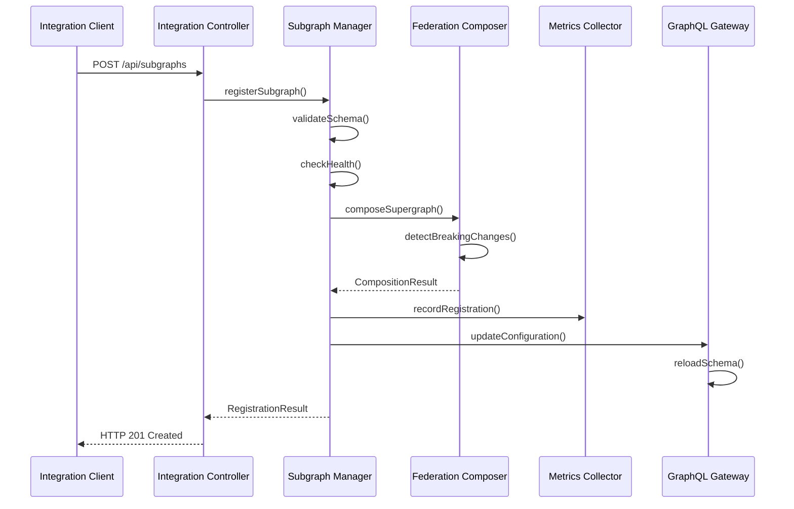
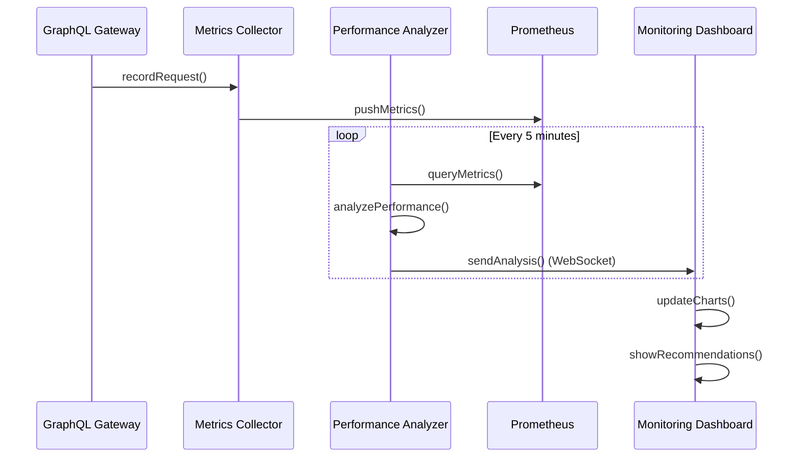

# C4 Component Diagram - Подробное объяснение Task 3

## Обзор диаграммы

**Файл**: `C4_ARCHITECTURE_COMPONENT.puml`

Компонентная диаграмма Task 3 детализирует внутреннюю структуру Integration Hub, показывая взаимодействие между компонентами системы интеграции и мониторинга.

## Архитектурные слои и их реализация

### 1. API Layer

#### Integration Controller
```plantuml
Component(integration_controller, "Integration Controller", "Express.js", "REST API контроллеры...")
```

**Архитектурная роль**: HTTP API для управления интеграциями

**Реализация контроллеров**:
```typescript
// backend/src/controllers/integration.controller.ts
import { Request, Response, NextFunction } from 'express';
import { IntegrationService } from '../services/integration.service';
import { SubgraphManager } from '../services/subgraph-manager.service';
import { TestOrchestrator } from '../services/test-orchestrator.service';

export class IntegrationController {
  constructor(
    private integrationService: IntegrationService,
    private subgraphManager: SubgraphManager,
    private testOrchestrator: TestOrchestrator,
  ) {}
  
  // GET /api/integrations/subgraphs
  async getSubgraphs(req: Request, res: Response, next: NextFunction) {
    try {
      const subgraphs = await this.subgraphManager.getAllSubgraphs();
      
      // Обогащение данными о здоровье
      const enrichedSubgraphs = await Promise.all(
        subgraphs.map(async (subgraph) => ({
          ...subgraph,
          health: await this.subgraphManager.getHealthStatus(subgraph.id),
          metrics: await this.integrationService.getSubgraphMetrics(subgraph.id),
        }))
      );
      
      res.json({
        success: true,
        data: enrichedSubgraphs,
        meta: {
          total: enrichedSubgraphs.length,
          healthy: enrichedSubgraphs.filter(sg => sg.health.status === 'healthy').length,
        },
      });
    } catch (error) {
      next(error);
    }
  }
  
  // POST /api/integrations/subgraphs
  async registerSubgraph(req: Request, res: Response, next: NextFunction) {
    try {
      const { name, url, schema, description } = req.body;
      
      // Валидация входных данных
      const validationResult = await this.integrationService.validateSubgraphData({
        name, url, schema, description
      });
      
      if (!validationResult.isValid) {
        return res.status(400).json({
          success: false,
          error: 'Validation failed',
          details: validationResult.errors,
        });
      }
      
      // Регистрация подграфа
      const registrationResult = await this.subgraphManager.registerSubgraph({
        name,
        url,
        schema,
        description,
        registeredBy: req.user.id,
      });
      
      // Запуск интеграционных тестов
      const testResults = await this.testOrchestrator.runRegistrationTests(
        registrationResult.subgraph.id
      );
      
      res.status(201).json({
        success: true,
        data: {
          subgraph: registrationResult.subgraph,
          composition: registrationResult.compositionResult,
          tests: testResults,
        },
      });
    } catch (error) {
      next(error);
    }
  }
  
  // PUT /api/integrations/subgraphs/:id/schema
  async updateSubgraphSchema(req: Request, res: Response, next: NextFunction) {
    try {
      const { id } = req.params;
      const { schema, forceUpdate = false } = req.body;
      
      // Анализ breaking changes
      const breakingChanges = await this.integrationService.analyzeBreakingChanges(
        id, schema
      );
      
      if (breakingChanges.length > 0 && !forceUpdate) {
        return res.status(409).json({
          success: false,
          error: 'Breaking changes detected',
          data: {
            breakingChanges,
            canForceUpdate: true,
          },
        });
      }
      
      // Обновление схемы
      const updateResult = await this.subgraphManager.updateSchema(id, schema, {
        updatedBy: req.user.id,
        breakingChanges,
        forceUpdate,
      });
      
      res.json({
        success: true,
        data: updateResult,
      });
    } catch (error) {
      next(error);
    }
  }
  
  // POST /api/integrations/compose
  async composeSupergraph(req: Request, res: Response, next: NextFunction) {
    try {
      const { subgraphs, validateOnly = false } = req.body;
      
      const compositionResult = await this.integrationService.composeSupergraph({
        subgraphs,
        validateOnly,
      });
      
      if (!compositionResult.success) {
        return res.status(400).json({
          success: false,
          error: 'Composition failed',
          details: compositionResult.errors,
        });
      }
      
      res.json({
        success: true,
        data: compositionResult,
      });
    } catch (error) {
      next(error);
    }
  }
}
```

#### GraphQL Gateway
```plantuml
Component(graphql_gateway, "GraphQL Gateway", "Apollo Gateway", "Федеративный GraphQL роутер...")
```

**Архитектурная роль**: Обработка федеративных GraphQL запросов

**Реализация с интеграционными возможностями**:
```typescript
// backend/src/services/enhanced-gateway.service.ts
import { ApolloGateway, RemoteGraphQLDataSource } from '@apollo/gateway';
import { buildSubgraphSchema } from '@apollo/subgraph';
import { EventEmitter } from 'events';

export class EnhancedGatewayService extends EventEmitter {
  private gateway: ApolloGateway;
  private subgraphConfigs: Map<string, SubgraphConfig> = new Map();
  private schemaUpdateQueue: SchemaUpdate[] = [];
  
  constructor(private integrationService: IntegrationService) {
    super();
    this.initializeGateway();
  }
  
  private initializeGateway() {
    this.gateway = new ApolloGateway({
      serviceList: [], // Будет заполнено динамически
      
      buildService: ({ name, url }) => {
        return new IntegrationAwareDataSource({ url, name, integrationService: this.integrationService });
      },
      
      onSchemaChange: (schema) => {
        this.emit('schema-changed', {
          schema,
          timestamp: new Date(),
          subgraphs: Array.from(this.subgraphConfigs.keys()),
        });
        
        // Запуск валидационных тестов
        this.runSchemaValidationTests(schema);
      },
      
      onSchemaLoadOrUpdateError: (error) => {
        this.emit('schema-error', {
          error,
          timestamp: new Date(),
          subgraphs: Array.from(this.subgraphConfigs.keys()),
        });
        
        // Попытка отката к предыдущей рабочей схеме
        this.rollbackToPreviousSchema();
      },
    });
  }
  
  async updateSubgraphConfiguration(subgraphName: string, config: SubgraphConfig) {
    this.subgraphConfigs.set(subgraphName, config);
    
    // Обновление конфигурации gateway
    const serviceList = Array.from(this.subgraphConfigs.entries()).map(([name, cfg]) => ({
      name,
      url: cfg.url,
    }));
    
    // Горячее обновление конфигурации
    await this.gateway.load({ serviceList });
    
    this.emit('subgraph-updated', {
      subgraphName,
      config,
      timestamp: new Date(),
    });
  }
  
  async removeSubgraph(subgraphName: string) {
    this.subgraphConfigs.delete(subgraphName);
    
    const serviceList = Array.from(this.subgraphConfigs.entries()).map(([name, cfg]) => ({
      name,
      url: cfg.url,
    }));
    
    await this.gateway.load({ serviceList });
    
    this.emit('subgraph-removed', {
      subgraphName,
      timestamp: new Date(),
    });
  }
  
  private async runSchemaValidationTests(schema: any) {
    try {
      const validationResults = await this.integrationService.validateComposedSchema(schema);
      
      if (!validationResults.isValid) {
        this.emit('validation-failed', {
          errors: validationResults.errors,
          schema,
          timestamp: new Date(),
        });
      }
    } catch (error) {
      this.emit('validation-error', { error, timestamp: new Date() });
    }
  }
  
  private async rollbackToPreviousSchema() {
    // Логика отката к предыдущей рабочей конфигурации
    const lastWorkingConfig = await this.integrationService.getLastWorkingConfiguration();
    
    if (lastWorkingConfig) {
      await this.gateway.load({ serviceList: lastWorkingConfig.serviceList });
      
      this.emit('schema-rollback', {
        config: lastWorkingConfig,
        timestamp: new Date(),
      });
    }
  }
}

// Кастомный DataSource с интеграционными возможностями
class IntegrationAwareDataSource extends RemoteGraphQLDataSource {
  constructor(config: { url: string; name: string; integrationService: IntegrationService }) {
    super(config);
    this.subgraphName = config.name;
    this.integrationService = config.integrationService;
  }
  
  async willSendRequest({ request, context }) {
    // Добавление заголовков интеграции
    request.http.headers.set('x-integration-source', 'gateway');
    request.http.headers.set('x-request-id', context.requestId);
    
    // Трассировка
    if (context.traceId) {
      request.http.headers.set('x-trace-id', context.traceId);
    }
    
    // Метрики начала запроса
    this.integrationService.recordSubgraphRequestStart(this.subgraphName, {
      operation: request.operationName,
      query: request.query,
      variables: request.variables,
    });
  }
  
  async didReceiveResponse({ response, request, context }) {
    // Метрики завершения запроса
    this.integrationService.recordSubgraphRequestEnd(this.subgraphName, {
      success: !response.errors || response.errors.length === 0,
      responseTime: context.responseTime,
      errors: response.errors,
    });
    
    return response;
  }
}
```### 2. In
tegration Management Layer

#### Subgraph Manager
```plantuml
Component(subgraph_manager, "Subgraph Manager", "Node.js", "Управление подграфами...")
```

**Архитектурная роль**: Централизованное управление подграфами

**Реализация Subgraph Manager**:
```typescript
// backend/src/services/subgraph-manager.service.ts
import { Injectable } from '@nestjs/common';
import { SubgraphRepository } from '../repositories/subgraph.repository';
import { HealthCheckService } from './health-check.service';
import { SchemaValidationService } from './schema-validation.service';

@Injectable()
export class SubgraphManager {
  constructor(
    private subgraphRepository: SubgraphRepository,
    private healthCheckService: HealthCheckService,
    private schemaValidationService: SchemaValidationService,
  ) {}
  
  async registerSubgraph(data: RegisterSubgraphDto): Promise<SubgraphRegistrationResult> {
    // 1. Валидация схемы
    const schemaValidation = await this.schemaValidationService.validateSchema(data.schema);
    if (!schemaValidation.isValid) {
      throw new ValidationError('Invalid GraphQL schema', schemaValidation.errors);
    }
    
    // 2. Проверка доступности
    const healthCheck = await this.healthCheckService.checkSubgraphHealth(data.url);
    if (!healthCheck.isHealthy) {
      throw new ServiceUnavailableError(`Subgraph at ${data.url} is not accessible`);
    }
    
    // 3. Проверка уникальности имени
    const existingSubgraph = await this.subgraphRepository.findByName(data.name);
    if (existingSubgraph) {
      throw new ConflictError(`Subgraph with name '${data.name}' already exists`);
    }
    
    // 4. Создание записи в БД
    const subgraph = await this.subgraphRepository.create({
      name: data.name,
      url: data.url,
      schema: data.schema,
      description: data.description,
      version: '1.0.0',
      status: 'active',
      registeredBy: data.registeredBy,
      registeredAt: new Date(),
    });
    
    // 5. Запуск мониторинга здоровья
    this.startHealthMonitoring(subgraph.id);
    
    return {
      subgraph,
      healthCheck,
      schemaValidation,
    };
  }
  
  async updateSchema(subgraphId: string, newSchema: string, options: UpdateSchemaOptions): Promise<SchemaUpdateResult> {
    const subgraph = await this.subgraphRepository.findById(subgraphId);
    if (!subgraph) {
      throw new NotFoundError(`Subgraph with id '${subgraphId}' not found`);
    }
    
    // Анализ breaking changes
    const breakingChanges = await this.schemaValidationService.detectBreakingChanges(
      subgraph.schema,
      newSchema
    );
    
    if (breakingChanges.length > 0 && !options.forceUpdate) {
      return {
        success: false,
        breakingChanges,
        requiresForceUpdate: true,
      };
    }
    
    // Создание бэкапа текущей схемы
    await this.createSchemaBackup(subgraphId, subgraph.schema);
    
    // Обновление схемы
    const updatedSubgraph = await this.subgraphRepository.update(subgraphId, {
      schema: newSchema,
      version: this.incrementVersion(subgraph.version),
      updatedBy: options.updatedBy,
      updatedAt: new Date(),
    });
    
    return {
      success: true,
      subgraph: updatedSubgraph,
      breakingChanges,
      previousVersion: subgraph.version,
    };
  }
  
  private startHealthMonitoring(subgraphId: string): void {
    // Запуск периодической проверки здоровья
    setInterval(async () => {
      try {
        const subgraph = await this.subgraphRepository.findById(subgraphId);
        if (!subgraph) return;
        
        const healthStatus = await this.healthCheckService.checkSubgraphHealth(subgraph.url);
        
        await this.subgraphRepository.updateHealthStatus(subgraphId, {
          status: healthStatus.isHealthy ? 'healthy' : 'unhealthy',
          lastHealthCheck: new Date(),
          responseTime: healthStatus.responseTime,
          error: healthStatus.error,
        });
        
        // Уведомление об изменении статуса
        if (subgraph.healthStatus?.status !== healthStatus.status) {
          this.notifyHealthStatusChange(subgraph, healthStatus);
        }
      } catch (error) {
        console.error(`Health check failed for subgraph ${subgraphId}:`, error);
      }
    }, 30000); // Каждые 30 секунд
  }
}
```

#### Federation Composer
```plantuml
Component(federation_composer, "Federation Composer", "Apollo Federation", "Композиция федеративной схемы...")
```

**Реализация композитора схем**:
```typescript
// backend/src/services/federation-composer.service.ts
import { composeServices } from '@apollo/composition';
import { buildSubgraphSchema } from '@apollo/subgraph';
import { parse, validate, GraphQLError } from 'graphql';

@Injectable()
export class FederationComposer {
  private compositionCache = new Map<string, CompositionResult>();
  
  async composeSupergraph(subgraphs: SubgraphDefinition[]): Promise<CompositionResult> {
    const cacheKey = this.generateCacheKey(subgraphs);
    
    // Проверка кеша
    if (this.compositionCache.has(cacheKey)) {
      return this.compositionCache.get(cacheKey)!;
    }
    
    try {
      // Подготовка сервисов для композиции
      const services = subgraphs.map(subgraph => ({
        name: subgraph.name,
        typeDefs: parse(subgraph.schema),
        url: subgraph.url,
      }));
      
      // Композиция схемы
      const compositionResult = composeServices(services);
      
      if (compositionResult.errors && compositionResult.errors.length > 0) {
        return {
          success: false,
          errors: compositionResult.errors.map(error => ({
            message: error.message,
            locations: error.locations,
            path: error.path,
          })),
        };
      }
      
      // Валидация скомпозированной схемы
      const validationErrors = validate(compositionResult.schema, parse(`
        query IntrospectionQuery {
          __schema {
            types {
              name
            }
          }
        }
      `));
      
      if (validationErrors.length > 0) {
        return {
          success: false,
          errors: validationErrors.map(error => ({
            message: error.message,
            locations: error.locations,
          })),
        };
      }
      
      const result: CompositionResult = {
        success: true,
        schema: compositionResult.schema,
        supergraphSdl: compositionResult.supergraphSdl,
        composedAt: new Date(),
        subgraphs: subgraphs.map(sg => sg.name),
      };
      
      // Кеширование результата
      this.compositionCache.set(cacheKey, result);
      
      return result;
    } catch (error) {
      return {
        success: false,
        errors: [{
          message: error.message,
          type: 'COMPOSITION_ERROR',
        }],
      };
    }
  }
  
  async detectBreakingChanges(
    oldSchema: string,
    newSchema: string
  ): Promise<BreakingChange[]> {
    try {
      const oldAST = parse(oldSchema);
      const newAST = parse(newSchema);
      
      const breakingChanges: BreakingChange[] = [];
      
      // Анализ типов
      const oldTypes = this.extractTypes(oldAST);
      const newTypes = this.extractTypes(newAST);
      
      // Проверка удаленных типов
      for (const [typeName, oldType] of oldTypes) {
        if (!newTypes.has(typeName)) {
          breakingChanges.push({
            type: 'TYPE_REMOVED',
            description: `Type '${typeName}' was removed`,
            severity: 'BREAKING',
          });
        }
      }
      
      // Проверка изменений в полях
      for (const [typeName, oldType] of oldTypes) {
        const newType = newTypes.get(typeName);
        if (newType) {
          const fieldChanges = this.compareFields(oldType, newType);
          breakingChanges.push(...fieldChanges);
        }
      }
      
      return breakingChanges;
    } catch (error) {
      throw new Error(`Failed to detect breaking changes: ${error.message}`);
    }
  }
}
```

### 3. Monitoring & Analytics Layer

#### Metrics Collector
```plantuml
Component(metrics_collector, "Metrics Collector", "Prometheus Client", "Сбор метрик производительности...")
```

**Реализация сборщика метрик**:
```typescript
// backend/src/services/metrics-collector.service.ts
import { register, Counter, Histogram, Gauge } from 'prom-client';

@Injectable()
export class MetricsCollector {
  // GraphQL метрики
  private readonly graphqlRequestsTotal = new Counter({
    name: 'graphql_requests_total',
    help: 'Total number of GraphQL requests',
    labelNames: ['operation_name', 'operation_type', 'status'],
  });
  
  private readonly graphqlRequestDuration = new Histogram({
    name: 'graphql_request_duration_seconds',
    help: 'GraphQL request duration in seconds',
    labelNames: ['operation_name', 'operation_type'],
    buckets: [0.01, 0.05, 0.1, 0.2, 0.5, 1, 2, 5],
  });
  
  // Федеративные метрики
  private readonly federationCompositionTime = new Histogram({
    name: 'federation_composition_duration_seconds',
    help: 'Time spent composing federated schema',
    buckets: [0.1, 0.5, 1, 2, 5, 10],
  });
  
  private readonly subgraphHealth = new Gauge({
    name: 'subgraph_health_status',
    help: 'Health status of subgraphs (1 = healthy, 0 = unhealthy)',
    labelNames: ['subgraph_name'],
  });
  
  // Бизнес-метрики
  private readonly activeSubgraphs = new Gauge({
    name: 'active_subgraphs_total',
    help: 'Total number of active subgraphs',
  });
  
  recordGraphQLRequest(metrics: GraphQLRequestMetrics): void {
    this.graphqlRequestsTotal
      .labels(
        metrics.operationName || 'unknown',
        metrics.operationType || 'query',
        metrics.status
      )
      .inc();
    
    if (metrics.duration) {
      this.graphqlRequestDuration
        .labels(
          metrics.operationName || 'unknown',
          metrics.operationType || 'query'
        )
        .observe(metrics.duration / 1000);
    }
  }
  
  recordFederationComposition(duration: number): void {
    this.federationCompositionTime.observe(duration / 1000);
  }
  
  updateSubgraphHealth(subgraphName: string, isHealthy: boolean): void {
    this.subgraphHealth.labels(subgraphName).set(isHealthy ? 1 : 0);
  }
  
  updateActiveSubgraphsCount(count: number): void {
    this.activeSubgraphs.set(count);
  }
  
  async collectCustomMetrics(): Promise<CustomMetrics> {
    // Сбор кастомных метрик интеграции
    const subgraphStats = await this.getSubgraphStatistics();
    const federationStats = await this.getFederationStatistics();
    
    return {
      subgraphs: subgraphStats,
      federation: federationStats,
      timestamp: new Date(),
    };
  }
  
  getMetricsRegistry() {
    return register;
  }
}
```

#### Performance Analyzer
```plantuml
Component(performance_analyzer, "Performance Analyzer", "Python/Pandas", "Анализ производительности...")
```

**Реализация анализатора производительности**:
```typescript
// backend/src/services/performance-analyzer.service.ts
@Injectable()
export class PerformanceAnalyzer {
  constructor(
    private metricsCollector: MetricsCollector,
    private prometheusService: PrometheusService,
  ) {}
  
  async analyzeQueryPerformance(timeRange: string = '1h'): Promise<QueryPerformanceReport> {
    // Получение данных из Prometheus
    const queries = [
      'histogram_quantile(0.50, rate(graphql_request_duration_seconds_bucket[5m]))',
      'histogram_quantile(0.95, rate(graphql_request_duration_seconds_bucket[5m]))',
      'histogram_quantile(0.99, rate(graphql_request_duration_seconds_bucket[5m]))',
      'rate(graphql_requests_total[5m])',
      'rate(graphql_errors_total[5m])',
    ];
    
    const [p50, p95, p99, requestRate, errorRate] = await Promise.all(
      queries.map(query => this.prometheusService.query(query))
    );
    
    // Анализ медленных запросов
    const slowQueries = await this.identifySlowQueries(timeRange);
    
    // Анализ ошибок
    const errorAnalysis = await this.analyzeErrors(timeRange);
    
    // Рекомендации по оптимизации
    const recommendations = this.generateOptimizationRecommendations({
      p50: p50.value,
      p95: p95.value,
      p99: p99.value,
      requestRate: requestRate.value,
      errorRate: errorRate.value,
      slowQueries,
      errorAnalysis,
    });
    
    return {
      summary: {
        p50ResponseTime: p50.value,
        p95ResponseTime: p95.value,
        p99ResponseTime: p99.value,
        requestsPerSecond: requestRate.value,
        errorRate: errorRate.value,
      },
      slowQueries,
      errorAnalysis,
      recommendations,
      generatedAt: new Date(),
    };
  }
  
  private async identifySlowQueries(timeRange: string): Promise<SlowQuery[]> {
    const query = `
      topk(10, 
        avg_over_time(
          graphql_request_duration_seconds{quantile="0.95"}[${timeRange}]
        ) by (operation_name)
      ) > 1
    `;
    
    const result = await this.prometheusService.query(query);
    
    return result.data.map(item => ({
      operationName: item.metric.operation_name,
      averageResponseTime: item.value,
      impact: this.calculateQueryImpact(item),
      suggestions: this.generateQueryOptimizationSuggestions(item),
    }));
  }
  
  private generateOptimizationRecommendations(data: PerformanceData): Recommendation[] {
    const recommendations: Recommendation[] = [];
    
    // Рекомендации по времени ответа
    if (data.p95 > 1.0) {
      recommendations.push({
        type: 'PERFORMANCE',
        priority: 'HIGH',
        title: 'High Response Time Detected',
        description: `95th percentile response time is ${data.p95}s, which exceeds the 1s threshold`,
        actions: [
          'Implement DataLoader for N+1 query optimization',
          'Add caching for frequently accessed data',
          'Optimize database queries and add indexes',
          'Consider query complexity limits',
        ],
      });
    }
    
    // Рекомендации по частоте ошибок
    if (data.errorRate > 0.01) {
      recommendations.push({
        type: 'RELIABILITY',
        priority: 'CRITICAL',
        title: 'High Error Rate Detected',
        description: `Error rate is ${(data.errorRate * 100).toFixed(2)}%, which exceeds the 1% threshold`,
        actions: [
          'Review error logs for common failure patterns',
          'Implement circuit breakers for external services',
          'Add retry logic with exponential backoff',
          'Improve error handling and validation',
        ],
      });
    }
    
    return recommendations;
  }
}
```

## Взаимодействия между компонентами

### Поток регистрации подграфа


### Поток мониторинга производительности


## Выводы

Компонентная диаграмма Task 3 демонстрирует:

1. **Четкое разделение ответственности** между слоями архитектуры
2. **Комплексную систему мониторинга** с real-time аналитикой
3. **Автоматизацию процессов** интеграции и управления
4. **Масштабируемую архитектуру** с возможностью горизонтального расширения
5. **Интеллектуальную аналитику** с рекомендациями по оптимизации

Каждый компонент имеет конкретную реализацию, обеспечивающую полный жизненный цикл управления федеративной GraphQL системой.