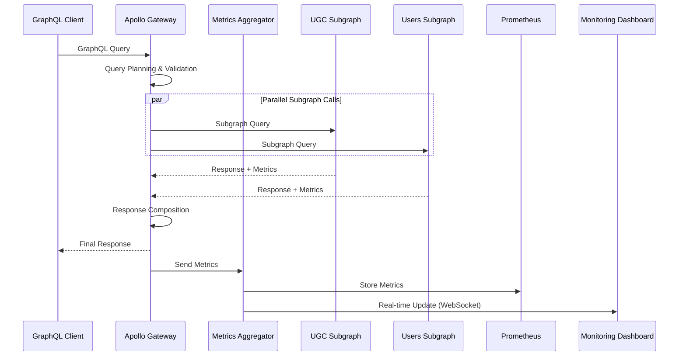
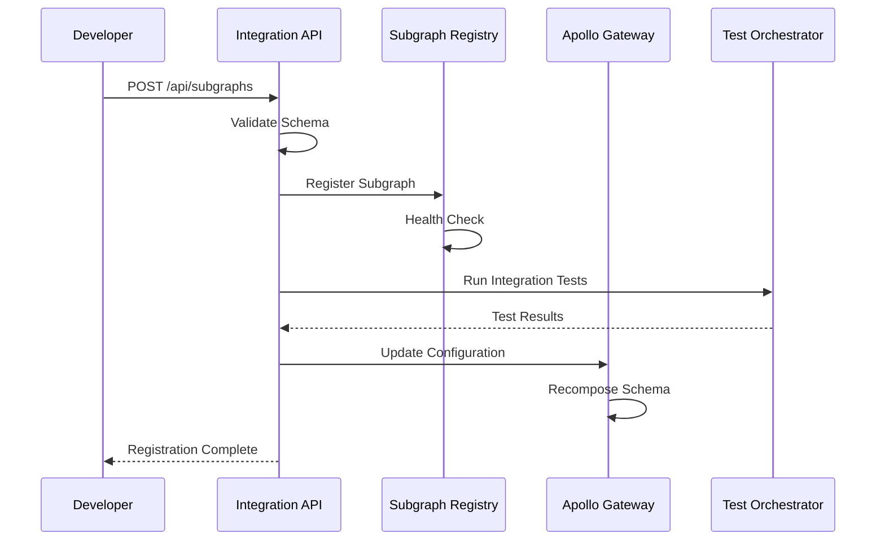

# C4 Container Diagram - Подробное объяснение Task 3

## Обзор диаграммы

**Файл**: `C4_ARCHITECTURE_CONTAINER.puml`

Контейнерная диаграмма Task 3 показывает высокоуровневую архитектуру системы интеграции и мониторинга федеративной GraphQL системы Auto.ru.

## Архитектурные контейнеры и их реализация

### 1. Integration & Monitoring System

#### Integration API
```plantuml
Container(integration_api, "Integration API", "Node.js, Express", "REST API для управления интеграциями и конфигурацией")
```

**Архитектурная роль**: Центральный API для управления федеративной системой

**Реализация REST API**:
```typescript
// backend/src/app.ts
import express from 'express';
import cors from 'cors';
import helmet from 'helmet';
import rateLimit from 'express-rate-limit';
import { createPrometheusMetrics } from './middleware/metrics';
import { authMiddleware } from './middleware/auth';
import { errorHandler } from './middleware/error-handler';

// Роутеры
import { subgraphRouter } from './routes/subgraphs';
import { federationRouter } from './routes/federation';
import { monitoringRouter } from './routes/monitoring';
import { testsRouter } from './routes/tests';

const app = express();

// Middleware
app.use(helmet());
app.use(cors({
  origin: process.env.ALLOWED_ORIGINS?.split(',') || ['http://localhost:3000'],
  credentials: true,
}));

app.use(rateLimit({
  windowMs: 15 * 60 * 1000, // 15 минут
  max: 1000, // максимум 1000 запросов на IP
  message: 'Too many requests from this IP',
}));

app.use(express.json({ limit: '10mb' }));
app.use(createPrometheusMetrics());
app.use(authMiddleware);

// API роуты
app.use('/api/subgraphs', subgraphRouter);
app.use('/api/federation', federationRouter);
app.use('/api/monitoring', monitoringRouter);
app.use('/api/tests', testsRouter);

// Health check
app.get('/health', (req, res) => {
  res.json({
    status: 'healthy',
    timestamp: new Date().toISOString(),
    version: process.env.npm_package_version,
  });
});

// Metrics endpoint
app.get('/metrics', async (req, res) => {
  const metrics = await prometheusRegister.metrics();
  res.set('Content-Type', prometheusRegister.contentType);
  res.end(metrics);
});

app.use(errorHandler);

export default app;
```

**Subgraph Management API**:
```typescript
// backend/src/routes/subgraphs.ts
import { Router } from 'express';
import { SubgraphService } from '../services/subgraph.service';
import { validateSchema } from '../middleware/validation';
import { requireRole } from '../middleware/auth';

const router = Router();
const subgraphService = new SubgraphService();

// Получение всех подграфов
router.get('/', async (req, res) => {
  try {
    const subgraphs = await subgraphService.getAllSubgraphs();
    res.json(subgraphs);
  } catch (error) {
    res.status(500).json({ error: error.message });
  }
});

// Регистрация нового подграфа
router.post('/', 
  requireRole('developer'),
  validateSchema('registerSubgraph'),
  async (req, res) => {
    try {
      const { name, url, schema } = req.body;
      
      // Валидация схемы
      const validationResult = await subgraphService.validateSchema(schema);
      if (!validationResult.isValid) {
        return res.status(400).json({
          error: 'Invalid schema',
          details: validationResult.errors,
        });
      }
      
      // Проверка доступности подграфа
      const healthCheck = await subgraphService.checkHealth(url);
      if (!healthCheck.isHealthy) {
        return res.status(400).json({
          error: 'Subgraph is not accessible',
          details: healthCheck.error,
        });
      }
      
      // Регистрация подграфа
      const subgraph = await subgraphService.registerSubgraph({
        name,
        url,
        schema,
        registeredBy: req.user.id,
      });
      
      // Запуск интеграционных тестов
      const testResults = await subgraphService.runIntegrationTests(subgraph.id);
      
      res.status(201).json({
        subgraph,
        testResults,
      });
    } catch (error) {
      res.status(500).json({ error: error.message });
    }
  }
);

// Обновление схемы подграфа
router.put('/:id/schema',
  requireRole('developer'),
  validateSchema('updateSchema'),
  async (req, res) => {
    try {
      const { id } = req.params;
      const { schema } = req.body;
      
      // Проверка breaking changes
      const breakingChanges = await subgraphService.detectBreakingChanges(id, schema);
      
      if (breakingChanges.length > 0 && !req.body.forceUpdate) {
        return res.status(409).json({
          error: 'Breaking changes detected',
          breakingChanges,
          message: 'Use forceUpdate=true to proceed',
        });
      }
      
      // Обновление схемы
      const result = await subgraphService.updateSchema(id, schema, {
        updatedBy: req.user.id,
        breakingChanges,
      });
      
      res.json(result);
    } catch (error) {
      res.status(500).json({ error: error.message });
    }
  }
);

export { router as subgraphRouter };
```#### Mo
nitoring Dashboard
```plantuml
Container(monitoring_dashboard, "Monitoring Dashboard", "React, TypeScript", "Web интерфейс для мониторинга и управления федерацией")
```

**Архитектурная роль**: Пользовательский интерфейс для мониторинга

**Реализация React Dashboard**:
```typescript
// frontend/src/components/MonitoringDashboard.tsx
import React, { useState, useEffect } from 'react';
import { Grid, Card, CardContent, Typography, Alert } from '@mui/material';
import { LineChart, Line, XAxis, YAxis, CartesianGrid, Tooltip, ResponsiveContainer } from 'recharts';
import { useWebSocket } from '../hooks/useWebSocket';
import { useQuery } from '@apollo/client';

interface MetricsData {
  timestamp: string;
  requestsPerSecond: number;
  averageResponseTime: number;
  errorRate: number;
  subgraphHealth: Record<string, boolean>;
}

export const MonitoringDashboard: React.FC = () => {
  const [metricsData, setMetricsData] = useState<MetricsData[]>([]);
  const [alerts, setAlerts] = useState<Alert[]>([]);
  
  // WebSocket для real-time обновлений
  const { lastMessage, sendMessage } = useWebSocket('ws://localhost:3001/monitoring');
  
  // GraphQL запрос для исторических данных
  const { data: historicalData } = useQuery(GET_HISTORICAL_METRICS, {
    variables: { timeRange: '1h' },
    pollInterval: 60000, // Обновление каждую минуту
  });
  
  useEffect(() => {
    if (lastMessage) {
      const message = JSON.parse(lastMessage.data);
      
      switch (message.type) {
        case 'metrics-update':
          setMetricsData(prev => [...prev.slice(-59), message.data]); // Последние 60 точек
          break;
        case 'alert':
          setAlerts(prev => [message.data, ...prev.slice(0, 9)]); // Последние 10 алертов
          break;
      }
    }
  }, [lastMessage]);
  
  // Подписка на метрики при монтировании
  useEffect(() => {
    sendMessage(JSON.stringify({
      type: 'subscribe-metrics',
      subgraphs: ['ugc', 'users', 'offers'],
    }));
    
    sendMessage(JSON.stringify({
      type: 'subscribe-alerts',
    }));
  }, [sendMessage]);
  
  return (
    <div className="monitoring-dashboard">
      <Grid container spacing={3}>
        {/* Алерты */}
        <Grid item xs={12}>
          <AlertsPanel alerts={alerts} />
        </Grid>
        
        {/* Метрики производительности */}
        <Grid item xs={12} md={6}>
          <Card>
            <CardContent>
              <Typography variant="h6">Requests per Second</Typography>
              <ResponsiveContainer width="100%" height={300}>
                <LineChart data={metricsData}>
                  <CartesianGrid strokeDasharray="3 3" />
                  <XAxis dataKey="timestamp" />
                  <YAxis />
                  <Tooltip />
                  <Line 
                    type="monotone" 
                    dataKey="requestsPerSecond" 
                    stroke="#8884d8" 
                    strokeWidth={2}
                  />
                </LineChart>
              </ResponsiveContainer>
            </CardContent>
          </Card>
        </Grid>
        
        <Grid item xs={12} md={6}>
          <Card>
            <CardContent>
              <Typography variant="h6">Average Response Time</Typography>
              <ResponsiveContainer width="100%" height={300}>
                <LineChart data={metricsData}>
                  <CartesianGrid strokeDasharray="3 3" />
                  <XAxis dataKey="timestamp" />
                  <YAxis />
                  <Tooltip />
                  <Line 
                    type="monotone" 
                    dataKey="averageResponseTime" 
                    stroke="#82ca9d" 
                    strokeWidth={2}
                  />
                </LineChart>
              </ResponsiveContainer>
            </CardContent>
          </Card>
        </Grid>
        
        {/* Здоровье подграфов */}
        <Grid item xs={12}>
          <SubgraphHealthPanel metricsData={metricsData} />
        </Grid>
        
        {/* Федеративные метрики */}
        <Grid item xs={12}>
          <FederationMetricsPanel />
        </Grid>
      </Grid>
    </div>
  );
};

// Компонент панели алертов
const AlertsPanel: React.FC<{ alerts: Alert[] }> = ({ alerts }) => {
  return (
    <Card>
      <CardContent>
        <Typography variant="h6">Active Alerts</Typography>
        {alerts.length === 0 ? (
          <Typography color="textSecondary">No active alerts</Typography>
        ) : (
          alerts.map((alert, index) => (
            <Alert 
              key={index} 
              severity={alert.severity} 
              sx={{ mb: 1 }}
            >
              <strong>{alert.title}</strong>: {alert.message}
            </Alert>
          ))
        )}
      </CardContent>
    </Card>
  );
};
```

**Real-time WebSocket Hook**:
```typescript
// frontend/src/hooks/useWebSocket.ts
import { useEffect, useRef, useState } from 'react';

interface UseWebSocketReturn {
  lastMessage: MessageEvent | null;
  sendMessage: (message: string) => void;
  readyState: number;
}

export const useWebSocket = (url: string): UseWebSocketReturn => {
  const [lastMessage, setLastMessage] = useState<MessageEvent | null>(null);
  const [readyState, setReadyState] = useState<number>(WebSocket.CONNECTING);
  const ws = useRef<WebSocket | null>(null);
  
  useEffect(() => {
    ws.current = new WebSocket(url);
    
    ws.current.onopen = () => {
      setReadyState(WebSocket.OPEN);
      console.log('WebSocket connected');
    };
    
    ws.current.onmessage = (event: MessageEvent) => {
      setLastMessage(event);
    };
    
    ws.current.onclose = () => {
      setReadyState(WebSocket.CLOSED);
      console.log('WebSocket disconnected');
      
      // Автоматическое переподключение через 5 секунд
      setTimeout(() => {
        if (ws.current?.readyState === WebSocket.CLOSED) {
          ws.current = new WebSocket(url);
        }
      }, 5000);
    };
    
    ws.current.onerror = (error) => {
      console.error('WebSocket error:', error);
    };
    
    return () => {
      ws.current?.close();
    };
  }, [url]);
  
  const sendMessage = (message: string) => {
    if (ws.current?.readyState === WebSocket.OPEN) {
      ws.current.send(message);
    }
  };
  
  return { lastMessage, sendMessage, readyState };
};
```

#### Metrics Aggregator
```plantuml
Container(metrics_aggregator, "Metrics Aggregator", "Go, Prometheus Client", "Сбор и агрегация метрик от всех подграфов")
```

**Архитектурная роль**: Централизованный сбор метрик

**Реализация на Go**:
```go
// metrics-aggregator/main.go
package main

import (
    "context"
    "encoding/json"
    "fmt"
    "log"
    "net/http"
    "time"
    
    "github.com/prometheus/client_golang/api"
    v1 "github.com/prometheus/client_golang/api/prometheus/v1"
    "github.com/prometheus/client_golang/prometheus"
    "github.com/prometheus/client_golang/prometheus/promhttp"
    "github.com/gorilla/websocket"
)

type MetricsAggregator struct {
    prometheusClient v1.API
    subgraphs       []SubgraphConfig
    wsClients       map[string]*websocket.Conn
    metricsCache    map[string]interface{}
}

type SubgraphConfig struct {
    Name string `json:"name"`
    URL  string `json:"url"`
}

type AggregatedMetrics struct {
    Timestamp           time.Time            `json:"timestamp"`
    RequestsPerSecond   float64             `json:"requestsPerSecond"`
    AverageResponseTime float64             `json:"averageResponseTime"`
    ErrorRate          float64             `json:"errorRate"`
    SubgraphMetrics    map[string]SubgraphMetrics `json:"subgraphMetrics"`
}

type SubgraphMetrics struct {
    RequestsPerSecond   float64 `json:"requestsPerSecond"`
    AverageResponseTime float64 `json:"averageResponseTime"`
    ErrorRate          float64 `json:"errorRate"`
    HealthStatus       bool    `json:"healthStatus"`
}

func NewMetricsAggregator(prometheusURL string, subgraphs []SubgraphConfig) *MetricsAggregator {
    client, err := api.NewClient(api.Config{
        Address: prometheusURL,
    })
    if err != nil {
        log.Fatalf("Error creating Prometheus client: %v", err)
    }
    
    return &MetricsAggregator{
        prometheusClient: v1.NewAPI(client),
        subgraphs:       subgraphs,
        wsClients:       make(map[string]*websocket.Conn),
        metricsCache:    make(map[string]interface{}),
    }
}

func (ma *MetricsAggregator) Start() {
    // Запуск HTTP сервера для метрик
    http.Handle("/metrics", promhttp.Handler())
    http.HandleFunc("/ws", ma.handleWebSocket)
    http.HandleFunc("/health", ma.healthCheck)
    
    // Запуск периодического сбора метрик
    go ma.startMetricsCollection()
    
    log.Println("Metrics Aggregator started on :8080")
    log.Fatal(http.ListenAndServe(":8080", nil))
}

func (ma *MetricsAggregator) startMetricsCollection() {
    ticker := time.NewTicker(15 * time.Second)
    defer ticker.Stop()
    
    for {
        select {
        case <-ticker.C:
            metrics, err := ma.collectMetrics()
            if err != nil {
                log.Printf("Error collecting metrics: %v", err)
                continue
            }
            
            // Отправка метрик через WebSocket
            ma.broadcastMetrics(metrics)
            
            // Кеширование метрик
            ma.metricsCache["latest"] = metrics
        }
    }
}

func (ma *MetricsAggregator) collectMetrics() (*AggregatedMetrics, error) {
    ctx, cancel := context.WithTimeout(context.Background(), 10*time.Second)
    defer cancel()
    
    now := time.Now()
    metrics := &AggregatedMetrics{
        Timestamp:       now,
        SubgraphMetrics: make(map[string]SubgraphMetrics),
    }
    
    // Сбор общих метрик федерации
    totalRPS, err := ma.queryPrometheus(ctx, `sum(rate(graphql_requests_total[1m]))`)
    if err != nil {
        return nil, fmt.Errorf("failed to get total RPS: %w", err)
    }
    metrics.RequestsPerSecond = totalRPS
    
    avgResponseTime, err := ma.queryPrometheus(ctx, 
        `histogram_quantile(0.5, sum(rate(graphql_request_duration_seconds_bucket[1m])) by (le))`)
    if err != nil {
        return nil, fmt.Errorf("failed to get average response time: %w", err)
    }
    metrics.AverageResponseTime = avgResponseTime
    
    errorRate, err := ma.queryPrometheus(ctx,
        `sum(rate(graphql_errors_total[1m])) / sum(rate(graphql_requests_total[1m]))`)
    if err != nil {
        return nil, fmt.Errorf("failed to get error rate: %w", err)
    }
    metrics.ErrorRate = errorRate
    
    // Сбор метрик по каждому подграфу
    for _, subgraph := range ma.subgraphs {
        subgraphMetrics, err := ma.collectSubgraphMetrics(ctx, subgraph.Name)
        if err != nil {
            log.Printf("Error collecting metrics for subgraph %s: %v", subgraph.Name, err)
            continue
        }
        metrics.SubgraphMetrics[subgraph.Name] = subgraphMetrics
    }
    
    return metrics, nil
}

func (ma *MetricsAggregator) collectSubgraphMetrics(ctx context.Context, subgraphName string) (SubgraphMetrics, error) {
    var metrics SubgraphMetrics
    
    // RPS для подграфа
    rps, err := ma.queryPrometheus(ctx, 
        fmt.Sprintf(`sum(rate(graphql_requests_total{subgraph="%s"}[1m]))`, subgraphName))
    if err != nil {
        return metrics, err
    }
    metrics.RequestsPerSecond = rps
    
    // Время ответа для подграфа
    responseTime, err := ma.queryPrometheus(ctx,
        fmt.Sprintf(`histogram_quantile(0.5, sum(rate(graphql_request_duration_seconds_bucket{subgraph="%s"}[1m])) by (le))`, subgraphName))
    if err != nil {
        return metrics, err
    }
    metrics.AverageResponseTime = responseTime
    
    // Частота ошибок для подграфа
    errorRate, err := ma.queryPrometheus(ctx,
        fmt.Sprintf(`sum(rate(graphql_errors_total{subgraph="%s"}[1m])) / sum(rate(graphql_requests_total{subgraph="%s"}[1m]))`, subgraphName, subgraphName))
    if err != nil {
        return metrics, err
    }
    metrics.ErrorRate = errorRate
    
    // Статус здоровья подграфа
    healthStatus, err := ma.queryPrometheus(ctx,
        fmt.Sprintf(`up{job="subgraph", instance=~".*%s.*"}`, subgraphName))
    if err != nil {
        return metrics, err
    }
    metrics.HealthStatus = healthStatus == 1
    
    return metrics, nil
}

func (ma *MetricsAggregator) queryPrometheus(ctx context.Context, query string) (float64, error) {
    result, warnings, err := ma.prometheusClient.Query(ctx, query, time.Now())
    if err != nil {
        return 0, err
    }
    
    if len(warnings) > 0 {
        log.Printf("Prometheus query warnings: %v", warnings)
    }
    
    // Извлечение значения из результата
    switch result.Type() {
    case model.ValVector:
        vector := result.(model.Vector)
        if len(vector) > 0 {
            return float64(vector[0].Value), nil
        }
    case model.ValScalar:
        scalar := result.(*model.Scalar)
        return float64(scalar.Value), nil
    }
    
    return 0, nil
}

func (ma *MetricsAggregator) handleWebSocket(w http.ResponseWriter, r *http.Request) {
    upgrader := websocket.Upgrader{
        CheckOrigin: func(r *http.Request) bool {
            return true // В продакшене нужна более строгая проверка
        },
    }
    
    conn, err := upgrader.Upgrade(w, r, nil)
    if err != nil {
        log.Printf("WebSocket upgrade error: %v", err)
        return
    }
    defer conn.Close()
    
    clientID := fmt.Sprintf("client_%d", time.Now().UnixNano())
    ma.wsClients[clientID] = conn
    
    // Отправка текущих метрик новому клиенту
    if latestMetrics, exists := ma.metricsCache["latest"]; exists {
        ma.sendToClient(conn, map[string]interface{}{
            "type": "metrics-update",
            "data": latestMetrics,
        })
    }
    
    // Обработка сообщений от клиента
    for {
        var message map[string]interface{}
        err := conn.ReadJSON(&message)
        if err != nil {
            log.Printf("WebSocket read error: %v", err)
            delete(ma.wsClients, clientID)
            break
        }
        
        // Обработка подписок клиента
        ma.handleClientMessage(clientID, message)
    }
}

func (ma *MetricsAggregator) broadcastMetrics(metrics *AggregatedMetrics) {
    message := map[string]interface{}{
        "type": "metrics-update",
        "data": metrics,
    }
    
    for clientID, conn := range ma.wsClients {
        err := ma.sendToClient(conn, message)
        if err != nil {
            log.Printf("Error sending to client %s: %v", clientID, err)
            delete(ma.wsClients, clientID)
        }
    }
}

func (ma *MetricsAggregator) sendToClient(conn *websocket.Conn, message interface{}) error {
    return conn.WriteJSON(message)
}

func (ma *MetricsAggregator) healthCheck(w http.ResponseWriter, r *http.Request) {
    w.Header().Set("Content-Type", "application/json")
    json.NewEncoder(w).Encode(map[string]interface{}{
        "status":    "healthy",
        "timestamp": time.Now(),
        "subgraphs": len(ma.subgraphs),
        "clients":   len(ma.wsClients),
    })
}

func main() {
    subgraphs := []SubgraphConfig{
        {Name: "ugc", URL: "http://ugc-subgraph:4001"},
        {Name: "users", URL: "http://users-subgraph:4002"},
        {Name: "offers", URL: "http://offers-subgraph:4003"},
    }
    
    aggregator := NewMetricsAggregator("http://prometheus:9090", subgraphs)
    aggregator.Start()
}
```

### 2. Federation Layer

#### Apollo Gateway
```plantuml
Container(apollo_gateway, "Apollo Gateway", "Node.js, Apollo Federation", "Федеративный роутер с расширенной телеметрией")
```

**Архитектурная роль**: Федеративный GraphQL роутер

**Реализация с мониторингом**:
```typescript
// gateway/src/monitored-apollo-gateway.ts
import { ApolloGateway, RemoteGraphQLDataSource } from '@apollo/gateway';
import { ApolloServer } from 'apollo-server-express';
import { createHash } from 'crypto';
import { performance } from 'perf_hooks';

// Кастомный DataSource с мониторингом
class MonitoredRemoteGraphQLDataSource extends RemoteGraphQLDataSource {
  constructor(config: { url: string; name: string }) {
    super(config);
    this.subgraphName = config.name;
  }
  
  async process({ request, context }) {
    const startTime = performance.now();
    const requestId = this.generateRequestId(request);
    
    // Логирование начала запроса
    console.log(`[${this.subgraphName}] Request started: ${requestId}`);
    
    try {
      const response = await super.process({ request, context });
      const duration = performance.now() - startTime;
      
      // Метрики успешного запроса
      this.recordMetrics({
        subgraph: this.subgraphName,
        requestId,
        duration,
        success: true,
        errorCount: response.errors?.length || 0,
      });
      
      return response;
    } catch (error) {
      const duration = performance.now() - startTime;
      
      // Метрики ошибки
      this.recordMetrics({
        subgraph: this.subgraphName,
        requestId,
        duration,
        success: false,
        error: error.message,
      });
      
      throw error;
    }
  }
  
  private generateRequestId(request: any): string {
    const hash = createHash('md5');
    hash.update(request.query + JSON.stringify(request.variables || {}));
    return hash.digest('hex').substring(0, 8);
  }
  
  private recordMetrics(metrics: SubgraphRequestMetrics): void {
    // Отправка метрик в Prometheus
    if (metrics.success) {
      subgraphRequestDuration
        .labels(metrics.subgraph)
        .observe(metrics.duration / 1000);
      
      subgraphRequestsTotal
        .labels(metrics.subgraph, 'success')
        .inc();
    } else {
      subgraphRequestsTotal
        .labels(metrics.subgraph, 'error')
        .inc();
      
      subgraphErrorsTotal
        .labels(metrics.subgraph, metrics.error || 'unknown')
        .inc();
    }
    
    // Отправка в систему трассировки
    this.sendTraceData(metrics);
  }
}

// Главный класс Gateway с мониторингом
export class MonitoredApolloGateway {
  private gateway: ApolloGateway;
  private server: ApolloServer;
  private metricsCollector: MetricsCollector;
  
  constructor(config: GatewayConfig) {
    this.metricsCollector = new MetricsCollector();
    
    this.gateway = new ApolloGateway({
      serviceList: config.subgraphs,
      buildService: ({ name, url }) => {
        return new MonitoredRemoteGraphQLDataSource({ url, name });
      },
      
      // Обработчик обновления схемы
      onSchemaChange: (schema) => {
        console.log('Schema updated:', schema.getTypeMap());
        this.metricsCollector.recordSchemaUpdate();
      },
      
      // Обработчик ошибок композиции
      onSchemaLoadOrUpdateError: (error) => {
        console.error('Schema composition error:', error);
        this.metricsCollector.recordCompositionError(error);
      },
    });
    
    this.server = new ApolloServer({
      gateway: this.gateway,
      subscriptions: false,
      
      plugins: [
        // Плагин для мониторинга запросов
        {
          requestDidStart() {
            return {
              didResolveOperation(requestContext) {
                const complexity = calculateQueryComplexity(
                  requestContext.document,
                  requestContext.schema
                );
                
                requestContext.request.http.complexity = complexity;
                
                // Ограничение сложности запросов
                if (complexity > 1000) {
                  throw new Error(`Query complexity ${complexity} exceeds limit of 1000`);
                }
              },
              
              willSendResponse(requestContext) {
                const executionTime = requestContext.metrics?.executionTime || 0;
                const complexity = requestContext.request.http?.complexity || 0;
                
                // Запись метрик
                this.metricsCollector.recordRequest({
                  operationName: requestContext.request.operationName,
                  executionTime,
                  complexity,
                  errorCount: requestContext.errors?.length || 0,
                });
                
                // Логирование медленных запросов
                if (executionTime > 1000) {
                  console.warn('Slow query detected:', {
                    operationName: requestContext.request.operationName,
                    executionTime,
                    complexity,
                    query: requestContext.request.query,
                  });
                }
              },
            };
          },
        },
      ],
    });
  }
  
  async start(port: number = 4000): Promise<void> {
    const { url } = await this.server.listen({ port });
    console.log(`🚀 Gateway ready at ${url}`);
    
    // Запуск периодического сбора метрик
    this.startMetricsCollection();
  }
  
  private startMetricsCollection(): void {
    setInterval(() => {
      this.metricsCollector.collectSystemMetrics();
    }, 30000); // Каждые 30 секунд
  }
}
```

## Взаимодействия между контейнерами

### Поток обработки GraphQL запроса с мониторингом


### Поток регистрации нового подграфа


## Выводы

Контейнерная диаграмма Task 3 демонстрирует:

1. **Модульную архитектуру** с четким разделением ответственности
2. **Комплексный мониторинг** на всех уровнях системы
3. **Real-time коммуникацию** через WebSocket
4. **Масштабируемость** через независимые контейнеры
5. **��нтеграцию с инфраструктурой** мониторинга и оркестрации

Каждый контейнер имеет конкретную технологическую реализацию и может быть развернут независимо, обеспечивая гибкость в разработке и эксплуатации системы интеграции и мониторинга.