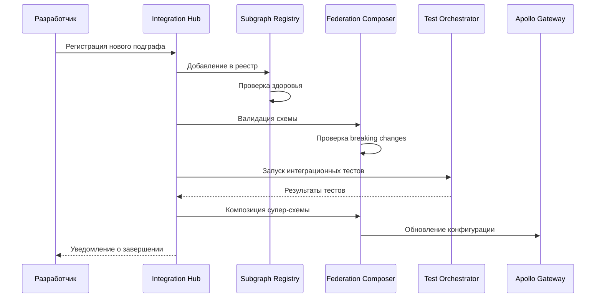
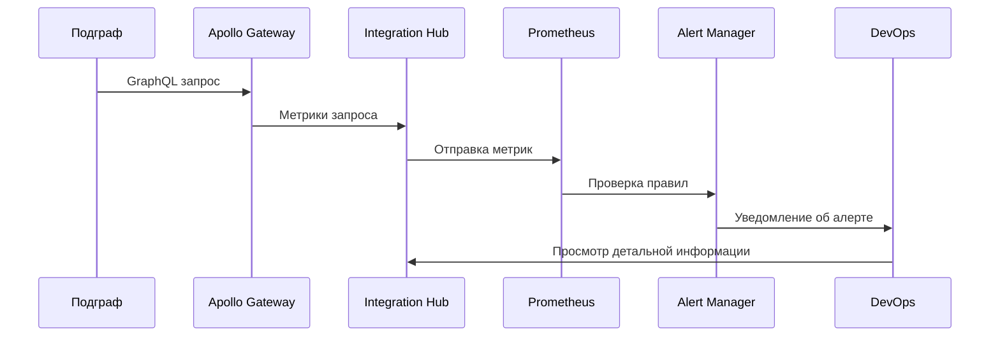

# C4 Context Diagram - Подробное объяснение Task 3

## Обзор диаграммы

**Файл**: `C4_ARCHITECTURE_CONTEXT.puml`

Контекстная диаграмма Task 3 показывает систему интеграции и мониторинга федеративной архитектуры Auto.ru в контексте всей экосистемы разработки и эксплуатации.

## Архитектурные элементы и их реализация

### 1. Пользователи системы

#### Разработчик
```plantuml
Person(developer, "Разработчик", "Интегрирует и мониторит федеративную систему")
```

**Архитектурная роль**: Основной пользователь системы интеграции

**Реализация взаимодействия**:
```typescript
// Интерфейс для разработчика - Integration Dashboard
// frontend/src/components/DeveloperDashboard.tsx
import React, { useState, useEffect } from 'react';
import { useQuery, useMutation } from '@apollo/client';

const SUBGRAPHS_QUERY = gql`
  query GetSubgraphs {
    subgraphs {
      id
      name
      url
      status
      lastHealthCheck
      schema {
        version
        isValid
      }
      metrics {
        requestsPerSecond
        averageResponseTime
        errorRate
      }
    }
  }
`;

const REGISTER_SUBGRAPH_MUTATION = gql`
  mutation RegisterSubgraph($input: RegisterSubgraphInput!) {
    registerSubgraph(input: $input) {
      id
      name
      status
    }
  }
`;

export const DeveloperDashboard: React.FC = () => {
  const { data, loading, error } = useQuery(SUBGRAPHS_QUERY, {
    pollInterval: 30000, // Обновление каждые 30 секунд
  });
  
  const [registerSubgraph] = useMutation(REGISTER_SUBGRAPH_MUTATION);
  
  const handleRegisterSubgraph = async (subgraphData: SubgraphInput) => {
    try {
      await registerSubgraph({
        variables: { input: subgraphData },
      });
      
      // Уведомление об успешной регистрации
      toast.success('Subgraph registered successfully');
    } catch (error) {
      toast.error(`Failed to register subgraph: ${error.message}`);
    }
  };
  
  return (
    <div className="developer-dashboard">
      <SubgraphRegistry 
        subgraphs={data?.subgraphs}
        onRegister={handleRegisterSubgraph}
      />
      <MetricsDashboard subgraphs={data?.subgraphs} />
      <SchemaComposer subgraphs={data?.subgraphs} />
    </div>
  );
};
```

**API для разработчика**:
```typescript
// backend/src/api/developer.controller.ts
import { Controller, Get, Post, Put, Delete, Body, Param } from '@nestjs/common';
import { IntegrationService } from '../services/integration.service';

@Controller('api/developer')
export class DeveloperController {
  constructor(private integrationService: IntegrationService) {}
  
  @Get('subgraphs')
  async getSubgraphs() {
    return this.integrationService.getAllSubgraphs();
  }
  
  @Post('subgraphs')
  async registerSubgraph(@Body() subgraphData: RegisterSubgraphDto) {
    return this.integrationService.registerSubgraph(subgraphData);
  }
  
  @Put('subgraphs/:id/schema')
  async updateSchema(@Param('id') id: string, @Body() schema: string) {
    return this.integrationService.updateSubgraphSchema(id, schema);
  }
  
  @Get('federation/compose')
  async composeSchema() {
    return this.integrationService.composeSupergraphSchema();
  }
  
  @Post('tests/integration')
  async runIntegrationTests(@Body() testConfig: TestConfig) {
    return this.integrationService.runIntegrationTests(testConfig);
  }
}
```#### 
DevOps инженер
```plantuml
Person(devops, "DevOps инженер", "Настраивает мониторинг и деплой")
```

**Архитектурная роль**: Управление инфраструктурой и мониторингом

**Реализация DevOps интерфейса**:
```typescript
// DevOps Dashboard для управления инфраструктурой
// frontend/src/components/DevOpsDashboard.tsx
export const DevOpsDashboard: React.FC = () => {
  const [deploymentStatus, setDeploymentStatus] = useState<DeploymentStatus>();
  const [alerts, setAlerts] = useState<Alert[]>([]);
  
  return (
    <div className="devops-dashboard">
      <InfrastructureOverview />
      <DeploymentPipeline status={deploymentStatus} />
      <AlertsPanel alerts={alerts} />
      <ResourceMonitoring />
    </div>
  );
};

// Kubernetes операторы для автоматизации
// k8s/operators/federation-operator.go
package main

import (
    "context"
    "fmt"
    
    appsv1 "k8s.io/api/apps/v1"
    corev1 "k8s.io/api/core/v1"
    metav1 "k8s.io/apimachinery/pkg/apis/meta/v1"
    "k8s.io/client-go/kubernetes"
    "sigs.k8s.io/controller-runtime/pkg/controller"
    "sigs.k8s.io/controller-runtime/pkg/handler"
    "sigs.k8s.io/controller-runtime/pkg/reconcile"
    "sigs.k8s.io/controller-runtime/pkg/source"
)

type FederationReconciler struct {
    client.Client
    Scheme *runtime.Scheme
}

func (r *FederationReconciler) Reconcile(ctx context.Context, req reconcile.Request) (reconcile.Result, error) {
    // Получение Federation CRD
    federation := &v1alpha1.Federation{}
    err := r.Get(ctx, req.NamespacedName, federation)
    if err != nil {
        return reconcile.Result{}, client.IgnoreNotFound(err)
    }
    
    // Создание Apollo Gateway deployment
    gatewayDeployment := &appsv1.Deployment{
        ObjectMeta: metav1.ObjectMeta{
            Name:      fmt.Sprintf("%s-gateway", federation.Name),
            Namespace: federation.Namespace,
        },
        Spec: appsv1.DeploymentSpec{
            Replicas: &federation.Spec.Gateway.Replicas,
            Selector: &metav1.LabelSelector{
                MatchLabels: map[string]string{
                    "app": fmt.Sprintf("%s-gateway", federation.Name),
                },
            },
            Template: corev1.PodTemplateSpec{
                ObjectMeta: metav1.ObjectMeta{
                    Labels: map[string]string{
                        "app": fmt.Sprintf("%s-gateway", federation.Name),
                    },
                },
                Spec: corev1.PodSpec{
                    Containers: []corev1.Container{
                        {
                            Name:  "apollo-gateway",
                            Image: federation.Spec.Gateway.Image,
                            Env: []corev1.EnvVar{
                                {
                                    Name:  "SUBGRAPHS_CONFIG",
                                    Value: r.generateSubgraphsConfig(federation.Spec.Subgraphs),
                                },
                            },
                            Ports: []corev1.ContainerPort{
                                {
                                    ContainerPort: 4000,
                                    Protocol:      corev1.ProtocolTCP,
                                },
                            },
                        },
                    },
                },
            },
        },
    }
    
    // Применение deployment
    err = r.Create(ctx, gatewayDeployment)
    if err != nil {
        return reconcile.Result{}, err
    }
    
    return reconcile.Result{}, nil
}
```

**Мониторинг и алерты**:
```yaml
# monitoring/prometheus-rules.yaml
apiVersion: monitoring.coreos.com/v1
kind: PrometheusRule
metadata:
  name: federation-alerts
spec:
  groups:
  - name: federation.rules
    rules:
    - alert: SubgraphDown
      expr: up{job="subgraph"} == 0
      for: 1m
      labels:
        severity: critical
      annotations:
        summary: "Subgraph {{ $labels.instance }} is down"
        description: "Subgraph {{ $labels.instance }} has been down for more than 1 minute"
    
    - alert: HighFederationLatency
      expr: histogram_quantile(0.95, rate(federation_request_duration_seconds_bucket[5m])) > 1
      for: 5m
      labels:
        severity: warning
      annotations:
        summary: "High federation latency detected"
        description: "95th percentile latency is {{ $value }} seconds"
    
    - alert: FederationErrorRate
      expr: rate(federation_errors_total[5m]) / rate(federation_requests_total[5m]) > 0.05
      for: 2m
      labels:
        severity: critical
      annotations:
        summary: "High error rate in federation"
        description: "Error rate is {{ $value | humanizePercentage }}"
```

#### QA инженер
```plantuml
Person(qa_engineer, "QA инженер", "Проводит интеграционное тестирование")
```

**Архитектурная роль**: Обеспечение качества федеративной системы

**Реализация тестовой инфраструктуры**:
```typescript
// QA Dashboard для управления тестами
// frontend/src/components/QADashboard.tsx
export const QADashboard: React.FC = () => {
  const [testSuites, setTestSuites] = useState<TestSuite[]>([]);
  const [testResults, setTestResults] = useState<TestResult[]>([]);
  
  const runTestSuite = async (suiteId: string) => {
    const result = await testOrchestrator.runTestSuite(suiteId);
    setTestResults(prev => [...prev, result]);
  };
  
  return (
    <div className="qa-dashboard">
      <TestSuiteManager 
        suites={testSuites}
        onRunSuite={runTestSuite}
      />
      <TestResultsViewer results={testResults} />
      <CoverageReport />
      <PerformanceMetrics />
    </div>
  );
};

// Автоматизированное тестирование федерации
// tests/integration/federation-test-orchestrator.ts
export class FederationTestOrchestrator {
  private subgraphs: SubgraphClient[];
  private gateway: GatewayClient;
  
  async runComprehensiveTests(): Promise<TestReport> {
    const report = new TestReport();
    
    // 1. Тестирование отдельных подграфов
    for (const subgraph of this.subgraphs) {
      const subgraphTests = await this.runSubgraphTests(subgraph);
      report.addSubgraphResults(subgraph.name, subgraphTests);
    }
    
    // 2. Тестирование композиции схемы
    const compositionTests = await this.runCompositionTests();
    report.addCompositionResults(compositionTests);
    
    // 3. Тестирование федеративных запросов
    const federationTests = await this.runFederationTests();
    report.addFederationResults(federationTests);
    
    // 4. Тестирование производительности
    const performanceTests = await this.runPerformanceTests();
    report.addPerformanceResults(performanceTests);
    
    // 5. Тестирование отказоустойчивости
    const resilienceTests = await this.runResilienceTests();
    report.addResilienceResults(resilienceTests);
    
    return report;
  }
  
  private async runFederationTests(): Promise<FederationTestResults> {
    const tests = [
      // Тест сложного федеративного запроса
      {
        name: 'Complex federated query',
        query: `
          query ComplexFederatedQuery($offerId: ID!) {
            offer(id: $offerId) {
              title
              price
              seller {
                name
                rating
                reviews(first: 5) {
                  edges {
                    node {
                      rating
                      text
                    }
                  }
                }
              }
              reviews(first: 10) {
                edges {
                  node {
                    rating
                    text
                    user {
                      name
                      avatar
                    }
                  }
                }
                pageInfo {
                  hasNextPage
                }
              }
              averageRating
              similarOffers(first: 3) {
                title
                price
              }
            }
          }
        `,
        variables: { offerId: 'test-offer-123' },
        expectedFields: ['offer.title', 'offer.reviews', 'offer.seller.reviews'],
      },
      
      // Тест обработки ошибок
      {
        name: 'Error handling test',
        query: `
          query ErrorHandlingTest {
            offer(id: "non-existent") {
              title
              reviews {
                edges {
                  node {
                    rating
                  }
                }
              }
            }
          }
        `,
        expectError: true,
        expectedErrorCode: 'NOT_FOUND',
      },
    ];
    
    const results = [];
    for (const test of tests) {
      const result = await this.executeTest(test);
      results.push(result);
    }
    
    return new FederationTestResults(results);
  }
}
```

### 2. Integration Hub System

#### Integration Hub
```plantuml
System(integration_hub, "Integration Hub", "Центральная система интеграции и мониторинга федеративных подграфов")
```

**Архитектурная роль**: Центральная система управления федерацией

**Реализация Integration Hub**:
```typescript
// backend/src/services/integration-hub.service.ts
import { Injectable } from '@nestjs/common';
import { SubgraphRegistry } from './subgraph-registry.service';
import { FederationComposer } from './federation-composer.service';
import { MonitoringService } from './monitoring.service';
import { TestOrchestrator } from './test-orchestrator.service';

@Injectable()
export class IntegrationHubService {
  constructor(
    private subgraphRegistry: SubgraphRegistry,
    private federationComposer: FederationComposer,
    private monitoringService: MonitoringService,
    private testOrchestrator: TestOrchestrator,
  ) {}
  
  async initializeHub(): Promise<void> {
    // Инициализация всех компонентов
    await this.subgraphRegistry.initialize();
    await this.federationComposer.initialize();
    await this.monitoringService.startMonitoring();
    
    // Запуск периодических задач
    this.startPeriodicTasks();
  }
  
  private startPeriodicTasks(): void {
    // Проверка здоровья подграфов каждые 30 секунд
    setInterval(async () => {
      await this.subgraphRegistry.checkAllSubgraphsHealth();
    }, 30000);
    
    // Композиция схемы каждые 5 минут
    setInterval(async () => {
      await this.federationComposer.recomposeSchema();
    }, 300000);
    
    // Сбор метрик каждые 15 секунд
    setInterval(async () => {
      await this.monitoringService.collectMetrics();
    }, 15000);
    
    // Запуск smoke тестов каждый час
    setInterval(async () => {
      await this.testOrchestrator.runSmokeTests();
    }, 3600000);
  }
  
  async handleSubgraphUpdate(subgraphName: string, newSchema: string): Promise<CompositionResult> {
    try {
      // 1. Валидация новой схемы
      const validationResult = await this.federationComposer.validateSchema(newSchema);
      if (!validationResult.isValid) {
        throw new Error(`Schema validation failed: ${validationResult.errors.join(', ')}`);
      }
      
      // 2. Проверка breaking changes
      const breakingChanges = await this.federationComposer.detectBreakingChanges(
        subgraphName,
        newSchema
      );
      
      if (breakingChanges.length > 0) {
        // Уведомление о breaking changes
        await this.notifyBreakingChanges(subgraphName, breakingChanges);
      }
      
      // 3. Обновление схемы подграфа
      await this.subgraphRegistry.updateSubgraphSchema(subgraphName, newSchema);
      
      // 4. Перекомпозиция супер-схемы
      const compositionResult = await this.federationComposer.composeSupergraph();
      
      // 5. Запуск интеграционных тестов
      const testResults = await this.testOrchestrator.runIntegrationTests({
        subgraphs: [subgraphName],
        testTypes: ['schema', 'federation', 'contract'],
      });
      
      if (!testResults.allPassed) {
        // Откат изменений при неудачных тестах
        await this.rollbackSchemaUpdate(subgraphName);
        throw new Error(`Integration tests failed: ${testResults.failures.join(', ')}`);
      }
      
      // 6. Обновление метрик
      await this.monitoringService.recordSchemaUpdate(subgraphName, {
        success: true,
        breakingChanges: breakingChanges.length,
        testResults,
      });
      
      return compositionResult;
      
    } catch (error) {
      await this.monitoringService.recordSchemaUpdate(subgraphName, {
        success: false,
        error: error.message,
      });
      
      throw error;
    }
  }
}
```

**WebSocket для real-time обновлений**:
```typescript
// backend/src/gateways/integration.gateway.ts
import {
  WebSocketGateway,
  WebSocketServer,
  SubscribeMessage,
  OnGatewayConnection,
  OnGatewayDisconnect,
} from '@nestjs/websockets';
import { Server, Socket } from 'socket.io';

@WebSocketGateway({
  cors: {
    origin: '*',
  },
})
export class IntegrationGateway implements OnGatewayConnection, OnGatewayDisconnect {
  @WebSocketServer()
  server: Server;
  
  private connectedClients = new Map<string, Socket>();
  
  handleConnection(client: Socket) {
    console.log(`Client connected: ${client.id}`);
    this.connectedClients.set(client.id, client);
    
    // Отправка текущего состояния системы
    this.sendSystemStatus(client);
  }
  
  handleDisconnect(client: Socket) {
    console.log(`Client disconnected: ${client.id}`);
    this.connectedClients.delete(client.id);
  }
  
  @SubscribeMessage('subscribe-metrics')
  handleSubscribeMetrics(client: Socket, data: { subgraphs: string[] }) {
    client.join(`metrics-${data.subgraphs.join('-')}`);
  }
  
  @SubscribeMessage('subscribe-alerts')
  handleSubscribeAlerts(client: Socket) {
    client.join('alerts');
  }
  
  // Методы для отправки обновлений
  broadcastMetricsUpdate(metrics: MetricsUpdate) {
    this.server.emit('metrics-update', metrics);
  }
  
  broadcastAlert(alert: Alert) {
    this.server.to('alerts').emit('alert', alert);
  }
  
  broadcastSchemaUpdate(update: SchemaUpdate) {
    this.server.emit('schema-update', update);
  }
  
  private async sendSystemStatus(client: Socket) {
    const status = await this.getSystemStatus();
    client.emit('system-status', status);
  }
}
```

### 3. Внешние системы

#### Apollo Router
```plantuml
System_Ext(apollo_router, "Apollo Router", "Федеративный GraphQL роутер с расширенной телеметрией")
```

**Архитектурная роль**: Федеративный роутер с мониторингом

**Реализация расширенного Apollo Router**:
```typescript
// gateway/src/enhanced-apollo-gateway.ts
import { ApolloGateway, RemoteGraphQLDataSource } from '@apollo/gateway';
import { ApolloServer } from 'apollo-server-express';
import { createPrometheusMetricsPlugin } from './plugins/prometheus-metrics';
import { createTracingPlugin } from './plugins/tracing';
import { createCachingPlugin } from './plugins/caching';

class EnhancedRemoteGraphQLDataSource extends RemoteGraphQLDataSource {
  constructor(config: { url: string; name: string }) {
    super(config);
    this.subgraphName = config.name;
  }
  
  willSendRequest({ request, context }) {
    // Добавление заголовков трассировки
    if (context.traceId) {
      request.http.headers.set('x-trace-id', context.traceId);
      request.http.headers.set('x-span-id', context.spanId);
    }
    
    // Добавление контекста пользователя
    if (context.user) {
      request.http.headers.set('x-user-id', context.user.id);
      request.http.headers.set('x-user-roles', JSON.stringify(context.user.roles));
    }
    
    // Метрики запросов к подграфам
    this.recordSubgraphRequest(this.subgraphName, request);
  }
  
  didReceiveResponse({ response, request, context }) {
    // Метрики ответов от подграфов
    this.recordSubgraphResponse(this.subgraphName, response, request);
    
    // Обработка ошибок подграфов
    if (response.body?.errors) {
      this.handleSubgraphErrors(this.subgraphName, response.body.errors, context);
    }
    
    return response;
  }
  
  didEncounterError(error, request, context) {
    // Логирование и метрики ошибок
    this.recordSubgraphError(this.subgraphName, error, context);
    
    // Уведомление системы мониторинга
    this.notifyMonitoringSystem({
      type: 'subgraph_error',
      subgraph: this.subgraphName,
      error: error.message,
      traceId: context.traceId,
    });
    
    return error;
  }
}

export class EnhancedApolloGateway {
  private gateway: ApolloGateway;
  private server: ApolloServer;
  
  constructor(config: GatewayConfig) {
    this.gateway = new ApolloGateway({
      serviceList: config.subgraphs.map(sg => ({
        name: sg.name,
        url: sg.url,
      })),
      
      buildService: ({ name, url }) => {
        return new EnhancedRemoteGraphQLDataSource({ url, name });
      },
      
      // Экспериментальные функции
      experimental_pollInterval: 30000,
      experimental_approximateQueryPlanStoreSizeInBytes: 50 * 1024 * 1024, // 50MB
    });
    
    this.server = new ApolloServer({
      gateway: this.gateway,
      subscriptions: false,
      
      plugins: [
        createPrometheusMetricsPlugin(),
        createTracingPlugin(),
        createCachingPlugin(),
        {
          requestDidStart() {
            return {
              didResolveOperation(requestContext) {
                // Анализ сложности запроса
                const complexity = calculateQueryComplexity(
                  requestContext.document,
                  requestContext.schema
                );
                
                if (complexity > 1000) {
                  throw new Error(`Query too complex: ${complexity}`);
                }
              },
              
              willSendResponse(requestContext) {
                // Метрики производительности
                const executionTime = requestContext.metrics?.executionTime || 0;
                recordExecutionTime(executionTime);
                
                // Логирование медленных запросов
                if (executionTime > 1000) {
                  console.warn('Slow query detected:', {
                    query: requestContext.request.query,
                    variables: requestContext.request.variables,
                    executionTime,
                  });
                }
              },
            };
          },
        },
      ],
    });
  }
}
```

## Взаимодействия и потоки данных

### Поток интеграции нового подграфа


### Поток мониторинга и алертинга


## Выводы

Контекстная диаграмма Task 3 демонстрирует:

1. **Комплексную экосистему** интеграции и мониторинга федеративной архитектуры
2. **Четкое разделение ролей** между различными типами пользователей
3. **Централизованное управление** через Integration Hub
4. **Полную интеграцию** с инфраструктурой разработки и эксплуатации
5. **Автоматизацию процессов** тестирования, мониторинга и деплоя

Каждый элемент диаграммы имеет конкретную реализацию в коде, обеспечивающую полный жизненный цикл федеративной GraphQL системы.