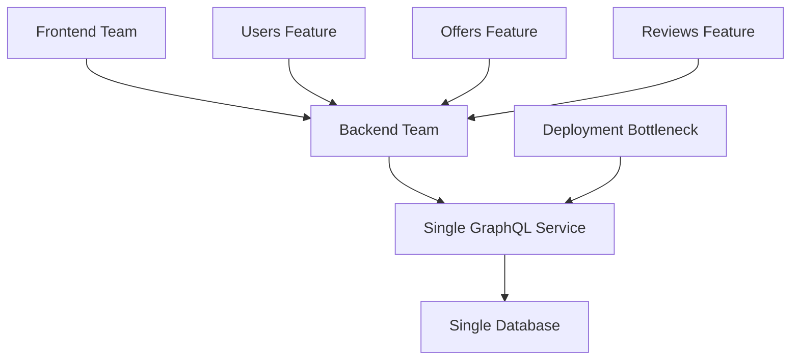
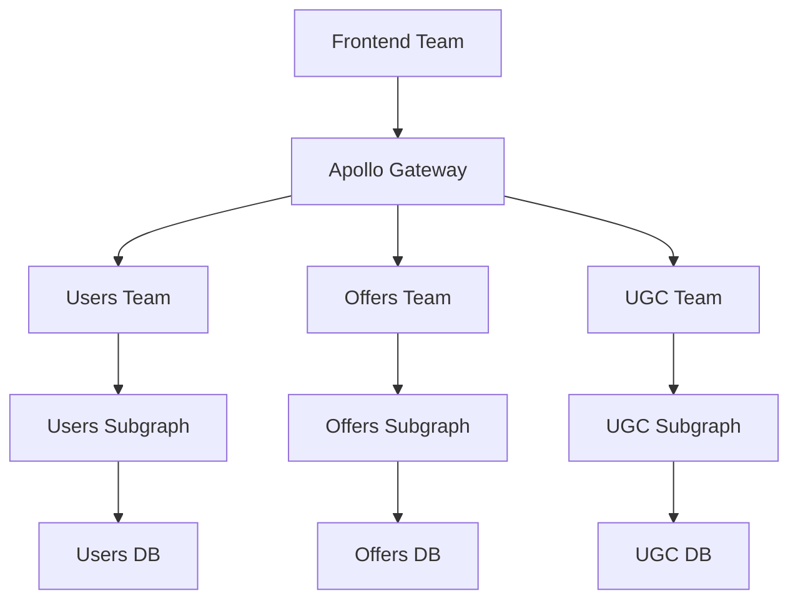
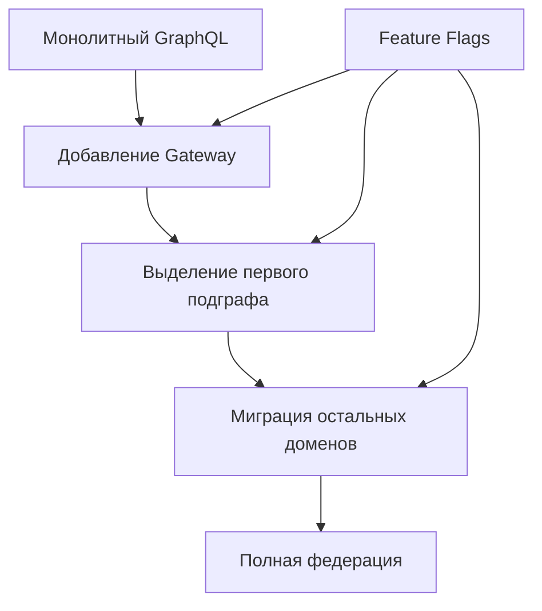

# Сравнительный анализ Task 1 vs Task 2

## Обзор

Данный документ содержит детальное сравнение архитектурных подходов Task 1 (монолитный GraphQL сервер) и Task 2 (федеративная архитектура) для системы Auto.ru.

## Архитектурные различия

| Аспект | Task 1 (Монолитный подход) | Task 2 (Федеративный подход) |
|--------|---------------------------|------------------------------|
| **Структура** | Единый GraphQL сервер | Федерация подграфов |
| **Масштабируемость** | Вертикальная | Горизонтальная |
| **Сложность развертывания** | Низкая | Средняя/Высокая |
| **Независимость команд** | Низкая | Высокая |
| **Время разработки** | Быстрое начало | Медленное начало, быстрое развитие |
| **Производительность** | Высокая (один hop) | Средняя (network overhead) |
| **Отказоустойчивость** | Единая точка отказа | Распределенная устойчивость |
| **Мониторинг** | Простой | Сложный, но детальный |
| **Тестирование** | Простое | Сложное (интеграционное) |
| **Безопасность** | Централизованная | Распределенная |

## Детальное сравнение

### 1. Архитектурная сложность

#### Task 1: Монолитный подход
```rust
// Простая структура - все в одном сервисе
src/
├── main.rs              // Единая точка входа
├── schema.rs            // Вся GraphQL схема
├── resolvers/
│   ├── users.rs         // Резолверы пользователей
│   ├── offers.rs        // Резолверы объявлений
│   └── reviews.rs       // Резолверы отзывов
├── services/            // Бизнес-логика
└── database/            // Единая БД
```

**Преимущества:**
- Простота понимания и разработки
- Легкость отладки и тестирования
- Быстрое прототипирование
- Единая транзакционность

**Недостатки:**
- Сложность масштабирования команд
- Единая точка отказа
- Сложность независимого деплоя
- Технологическая привязка

#### Task 2: Федеративный подход
```yaml
# Сложная распределенная архитектура
federation:
  gateway: apollo-router
  subgraphs:
    - ugc-subgraph:     # Rust
        entities: [Review, Rating]
    - users-subgraph:   # Node.js
        entities: [User, Profile]
    - offers-subgraph:  # Java
        entities: [Offer, Car]
```

**Преимущества:**
- Независимость команд и технологий
- Горизонтальное масштабирование
- Изоляция отказов
- Гибкость развертывания

**Недостатки:**
- Сложность интеграции
- Network latency
- Сложность отладки
- Eventual consistency

### 2. Производительность

#### Сравнение времени ответа

```typescript
// Task 1: Монолитный запрос
query GetOfferWithReviews {
  offer(id: "123") {        // 1 DB query
    title
    price
    reviews {               // JOIN в той же БД
      rating
      text
      user {                // JOIN в той же БД
        name
      }
    }
  }
}
// Общее время: ~50ms (1 network hop, 1 DB query)
```

```typescript
// Task 2: Федеративный запрос
query GetOfferWithReviews {
  offer(id: "123") {        // 1. Запрос к Offers подграфу
    title                   // 2. DB query в Offers сервисе
    price
    reviews {               // 3. Запрос к UGC подграфу
      rating                // 4. DB query в UGC сервисе
      text
      user {                // 5. Запрос к Users подграфу
        name                // 6. DB query в Users сервисе
      }
    }
  }
}
// Общее время: ~150ms (3 network hops, 3 DB queries)
```

#### Оптимизация федеративных запросов

```typescript
// Оптимизированный федеративный запрос с DataLoader
class ReviewDataLoader {
  async batchLoadReviews(offerIds: string[]): Promise<Review[][]> {
    // Batch запрос для всех offer_id одновременно
    const reviews = await this.reviewService.getReviewsByOfferIds(offerIds);
    return this.groupByOfferId(reviews);
  }
}

// Результат: ~80ms (параллельные запросы + батчинг)
```

### 3. Масштабируемость команд

#### Task 1: Ограничения монолита


**Проблемы:**
- Все изменения проходят через одну команду
- Конфликты при одновременной разработке
- Сложность координации релизов
- Технологические ограничения

#### Task 2: Независимость команд


**Преимущества:**
- Независимые циклы разработки
- Выбор технологий по команде
- Параллельная разработка
- Изолированные релизы

### 4. Отказоустойчивость

#### Task 1: Единая точка отказа
```typescript
// Если монолитный сервис падает - вся система недоступна
const healthCheck = async () => {
  try {
    await graphqlServer.ping();
    return { status: 'healthy' };
  } catch (error) {
    // Вся система недоступна
    return { status: 'unhealthy', error };
  }
};
```

#### Task 2: Graceful degradation
```typescript
// Федеративная система может работать частично
const federatedHealthCheck = async () => {
  const subgraphsHealth = await Promise.allSettled([
    ugcSubgraph.healthCheck(),
    usersSubgraph.healthCheck(),
    offersSubgraph.healthCheck(),
  ]);
  
  return {
    status: 'partial',
    subgraphs: {
      ugc: subgraphsHealth[0].status === 'fulfilled' ? 'healthy' : 'unhealthy',
      users: subgraphsHealth[1].status === 'fulfilled' ? 'healthy' : 'unhealthy',
      offers: subgraphsHealth[2].status === 'fulfilled' ? 'healthy' : 'unhealthy',
    }
  };
};

// Пример graceful degradation
query GetOfferWithReviews {
  offer(id: "123") {
    title
    price
    reviews @skip(if: $ugcServiceDown) {  // Пропускаем если UGC недоступен
      rating
      text
    }
  }
}
```

### 5. Мониторинг и наблюдаемость

#### Task 1: Простой мониторинг
```typescript
// Простые метрики для монолита
const metrics = {
  requestsPerSecond: prometheus.counter('graphql_requests_total'),
  responseTime: prometheus.histogram('graphql_response_time'),
  errorRate: prometheus.counter('graphql_errors_total'),
  databaseConnections: prometheus.gauge('db_connections_active'),
};
```

#### Task 2: Комплексный мониторинг
```typescript
// Сложные метрики для федерации
const federationMetrics = {
  // Gateway метрики
  gatewayRequestsPerSecond: prometheus.counter('gateway_requests_total'),
  gatewayResponseTime: prometheus.histogram('gateway_response_time'),
  
  // Подграф метрики
  subgraphRequestsPerSecond: prometheus.counter('subgraph_requests_total', ['subgraph']),
  subgraphResponseTime: prometheus.histogram('subgraph_response_time', ['subgraph']),
  
  // Федеративные метрики
  federationPlanningTime: prometheus.histogram('federation_planning_time'),
  subgraphCallsPerQuery: prometheus.histogram('subgraph_calls_per_query'),
  
  // Бизнес метрики
  reviewsCreatedPerMinute: prometheus.counter('reviews_created_total'),
  averageRatingByCategory: prometheus.gauge('average_rating', ['category']),
};
```

## Рекомендации по выбору подхода

### Когда использовать Task 1 (Монолитный подход):

#### Сценарии применения:
1. **Стартапы и MVP** - быстрое время выхода на рынок
2. **Небольшие команды** (до 10 разработчиков)
3. **Простые доменные модели** без сложных взаимосвязей
4. **Ограниченные ресурсы** на DevOps и инфраструктуру
5. **Высокие требования к производительности** (low latency)

#### Пример реализации:
```rust
// Простой монолитный GraphQL сервер
#[tokio::main]
async fn main() -> Result<(), Box<dyn std::error::Error>> {
    let schema = Schema::build(Query, Mutation, EmptySubscription)
        .data(database_pool)
        .data(redis_cache)
        .finish();
    
    let app = Router::new()
        .route("/graphql", post(graphql_handler))
        .layer(cors_layer())
        .with_state(schema);
    
    axum::Server::bind(&"0.0.0.0:4000".parse()?)
        .serve(app.into_make_service())
        .await?;
    
    Ok(())
}
```

### Когда использовать Task 2 (Федеративный подход):

#### Сценарии применения:
1. **Крупные организации** с множественными командами
2. **Сложные доменные модели** с четкими границами
3. **Высокие требования к масштабируемости**
4. **Разнородные технологические стеки**
5. **Необходимость независимых релизов**

#### Пример реализации:
```typescript
// Федеративный gateway
const gateway = new ApolloGateway({
  serviceList: [
    { name: 'ugc', url: 'http://ugc-subgraph:4001/graphql' },
    { name: 'users', url: 'http://users-subgraph:4002/graphql' },
    { name: 'offers', url: 'http://offers-subgraph:4003/graphql' },
  ],
  buildService: ({ url }) => new RemoteGraphQLDataSource({ url }),
});

const server = new ApolloServer({
  gateway,
  subscriptions: false,
  plugins: [
    ApolloServerPluginLandingPageGraphQLPlayground(),
    ApolloServerPluginInlineTrace(),
  ],
});
```

## Гибридный подход

### Постепенная миграция


#### Этапы миграции:
1. **Этап 1**: Добавление Apollo Gateway перед монолитом
2. **Этап 2**: Выделение наименее связанного домена (например, UGC)
3. **Этап 3**: Постепенная миграция остальных доменов
4. **Этап 4**: Удаление монолитного сервиса

#### Пример конфигурации гибридного подхода:
```yaml
# Гибридная конфигурация
gateway:
  subgraphs:
    - name: ugc
      url: http://ugc-subgraph:4001/graphql  # Новый подграф
    - name: legacy
      url: http://monolith:4000/graphql      # Старый монолит
  
  routing:
    # Новые запросы идут в подграфы
    reviews: ugc
    ratings: ugc
    
    # Старые запросы остаются в монолите
    users: legacy
    offers: legacy
```

## Выводы

### Task 1 подходит для:
- ✅ Быстрого прототипирования
- ✅ Небольших команд
- ✅ Простых доменов
- ✅ Высокой производительности
- ✅ Ограниченных ресурсов

### Task 2 подходит для:
- ✅ Крупных организаций
- ✅ Независимых команд
- ✅ Сложных доменов
- ✅ Высокой масштабируемости
- ✅ Технологического разнообразия

### Рекомендуемая стратегия:
1. **Начинать с монолита** (Task 1) для быстрого MVP
2. **Мигрировать к федерации** (Task 2) при росте команды и сложности
3. **Использовать гибридный подход** для плавного перехода
4. **Применять Task 3** для мониторинга и оптимизации любого подхода

Выбор архитектуры должен основываться на текущих потребностях организации, размере команды, сложности домена и долгосрочных целях проекта.