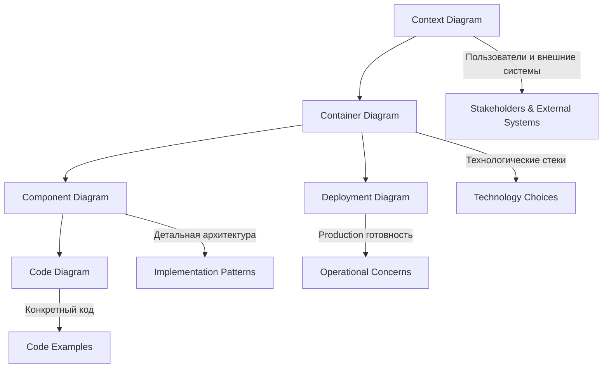

# Task 8: PlantUML Диаграммы - Полный индекс и навигация

## 🎯 Обзор системы телеметрии и мониторинга

Этот документ служит **центральным индексом** для всех PlantUML диаграмм Task 8, демонстрирующих comprehensive систему телеметрии и мониторинга для GraphQL федерации Auto.ru. Каждая диаграмма представляет различный уровень архитектурной детализации - от высокоуровневого контекста до конкретной реализации кода.

## 📊 Архитектурные уровни C4 Model

### 🌐 Level 1: Context Diagram - Системный контекст
**Файл диаграммы:** [`C4_ARCHITECTURE_CONTEXT.puml`](./C4_ARCHITECTURE_CONTEXT.puml)  
**Подробное объяснение:** [`C4_CONTEXT_DETAILED_EXPLANATION.md`](./C4_CONTEXT_DETAILED_EXPLANATION.md)

**Что показывает:**
- Взаимодействие пользователей (разработчики, SRE, бизнес-аналитики) с системой телеметрии
- Интеграция с внешними системами мониторинга (Jaeger, Prometheus, Grafana)
- Потоки данных между системой федерации и инфраструктурой наблюдаемости
- Каналы уведомлений и алертинга

**Ключевые компоненты:**
- Auto.ru Telemetry & Monitoring Federation
- Monitoring & Observability Infrastructure  
- Logging & Analysis Infrastructure
- Alerting & Notification Infrastructure
- Monitored External Services

---

### 🏗️ Level 2: Container Diagram - Контейнерная архитектура
**Файл диаграммы:** [`C4_ARCHITECTURE_CONTAINER.puml`](./C4_ARCHITECTURE_CONTAINER.puml)  
**Подробное объяснение:** [`C4_CONTAINER_DETAILED_EXPLANATION.md`](./C4_CONTAINER_DETAILED_EXPLANATION.md)

**Что показывает:**
- Детальную архитектуру слоев телеметрии (Telemetry Layer, Application Layer, Data Layer)
- Технологические стеки каждого контейнера
- Паттерны взаимодействия между контейнерами
- Инфраструктуру сбора, обработки и визуализации данных

**Ключевые слои:**
- **Telemetry Layer:** Tracing Service, Metrics Collector, Logging Service
- **Instrumented Application Layer:** UGC GraphQL Server, Telemetry Middleware, Business Metrics Service
- **Apollo Router Telemetry:** Router Metrics, Router Tracing, Router Logging
- **Telemetry Infrastructure:** OTEL Collector, Jaeger Backend, Prometheus Server

---

### ⚙️ Level 3: Component Diagram - Компонентная архитектура
**Файл диаграммы:** [`C4_ARCHITECTURE_COMPONENT.puml`](./C4_ARCHITECTURE_COMPONENT.puml)  
**Подробное объяснение:** [`C4_COMPONENT_DETAILED_EXPLANATION.md`](./C4_COMPONENT_DETAILED_EXPLANATION.md)

**Что показывает:**
- Внутреннюю структуру каждого контейнера на уровне компонентов
- Специализированные функции компонентов телеметрии
- Детальные взаимодействия между компонентами
- Паттерны обработки данных и middleware

**Основные группы компонентов:**
- **Distributed Tracing Components:** OpenTelemetry Integration, Tracing Instrumentation, Correlation Management
- **Prometheus Metrics Components:** Metrics Collection, Business Metrics, Infrastructure Metrics  
- **Structured Logging Components:** Log Formatting, Business Event Logging, Log Processing
- **Telemetry Middleware Components:** HTTP Middleware, GraphQL Middleware
- **Configuration Components:** Telemetry Configuration, Environment Management

---

### 💻 Level 4: Code Diagram - Реализация кода
**Файл диаграммы:** [`C4_ARCHITECTURE_CODE.puml`](./C4_ARCHITECTURE_CODE.puml)  
**Подробное объяснение:** [`C4_CODE_DETAILED_EXPLANATION.md`](./C4_CODE_DETAILED_EXPLANATION.md)

**Что показывает:**
- Конкретную реализацию компонентов в виде Rust структур, функций и макросов
- Детальные примеры кода для каждого аспекта телеметрии
- Паттерны интеграции и использования
- Практические примеры инструментации

**Реализованные модули:**
- **Tracing Implementation:** TracingConfig, init_tracing, CorrelationId
- **Metrics Implementation:** Metrics struct, http_metrics_middleware, metrics_handler
- **Logging Implementation:** JsonFormatter, BusinessEventLogger, correlation_middleware
- **Business Metrics Implementation:** BusinessMetricsService, MetricsTimer
- **GraphQL Instrumentation:** Instrumented resolvers, Query complexity analyzer
- **Application Integration:** main.rs integration, Telemetry macros

---

### 🚀 Level 5: Deployment Diagram - Production инфраструктура
**Файл диаграммы:** [`C4_ARCHITECTURE_DEPLOYMENT.puml`](./C4_ARCHITECTURE_DEPLOYMENT.puml)  
**Подробное объяснение:** [`C4_DEPLOYMENT_DETAILED_EXPLANATION.md`](./C4_DEPLOYMENT_DETAILED_EXPLANATION.md)

**Что показывает:**
- Production-ready развертывание в AWS облаке
- Kubernetes кластеры и их конфигурацию
- Управляемые сервисы AWS для телеметрии
- Сетевую архитектуру и безопасность
- Масштабирование и высокую доступность

**Инфраструктурные компоненты:**
- **AWS Cloud Platform:** VPC, EKS Clusters, ALB, CloudFront
- **Monitoring Region:** Amazon Managed Prometheus, Amazon Managed Grafana, CloudWatch, X-Ray
- **Notification Infrastructure:** SNS, SES, Lambda, EventBridge
- **Development Environment:** Docker Compose для локальной разработки

---

## 🔄 Навигация между диаграммами

### Рекомендуемый порядок изучения:

1. **Начните с Context Diagram** - получите общее понимание системы и ее места в экосистеме
2. **Перейдите к Container Diagram** - изучите архитектурные слои и их взаимодействие  
3. **Углубитесь в Component Diagram** - поймите внутреннюю структуру каждого слоя
4. **Изучите Code Diagram** - посмотрите на конкретную реализацию в коде
5. **Завершите Deployment Diagram** - узнайте о production развертывании

### Связи между диаграммами:

## 🎯 Практическое применение

### Для разработчиков:
- **Context & Container:** Понимание общей архитектуры и интеграционных точек
- **Component & Code:** Детальное понимание реализации для разработки новых фич
- **Deployment:** Понимание production окружения для debugging

### Для архитекторов:
- **Context:** Системные границы и внешние зависимости
- **Container & Component:** Архитектурные решения и паттерны
- **Deployment:** Операционные требования и масштабирование

### Для DevOps/SRE:
- **Container & Deployment:** Инфраструктурные требования и конфигурация
- **Component:** Мониторинг и observability компонентов
- **Code:** Понимание инструментации для troubleshooting

### Для менеджеров продукта:
- **Context:** Бизнес-ценность системы телеметрии
- **Container:** Возможности мониторинга и аналитики
- **Deployment:** Операционные затраты и требования

## 📋 Чек-лист для реализации

### Phase 1: Базовая телеметрия
- [ ] Изучить Context и Container диаграммы
- [ ] Реализовать базовую трассировку (Code Diagram)
- [ ] Настроить сбор метрик (Component Diagram)
- [ ] Развернуть локальную инфраструктуру (Deployment Diagram)

### Phase 2: Продвинутая наблюдаемость  
- [ ] Внедрить structured logging (Component & Code)
- [ ] Добавить business metrics (Code Diagram)
- [ ] Настроить алертинг (Container & Deployment)
- [ ] Оптимизировать производительность

### Phase 3: Production готовность
- [ ] Развернуть в AWS (Deployment Diagram)
- [ ] Настроить мониторинг инфраструктуры
- [ ] Внедрить security best practices
- [ ] Провести load testing и оптимизацию

## 🔗 Дополнительные ресурсы

- **Общий обзор:** [`C4_ARCHITECTURE_OVERVIEW.md`](./C4_ARCHITECTURE_OVERVIEW.md)
- **README:** [`README.md`](./README.md)
- **AI Commands:** [`TASK8_AI_COMMANDS_COLLECTION.md`](./TASK8_AI_COMMANDS_COLLECTION.md)

## 🎉 Заключение

Эти диаграммы представляют comprehensive подход к созданию enterprise-grade системы телеметрии и мониторинга. Они служат мостом между архитектурным дизайном и фактической реализацией, обеспечивая:

- **Полную наблюдаемость** через Three Pillars (Metrics, Logs, Traces)
- **Production-ready архитектуру** с высокой доступностью и масштабируемостью  
- **Практические примеры кода** для быстрого внедрения
- **Операционную готовность** для enterprise окружений

Используйте эти диаграммы как руководство для создания собственной системы наблюдаемости, адаптируя решения под ваши конкретные требования и ограничения.