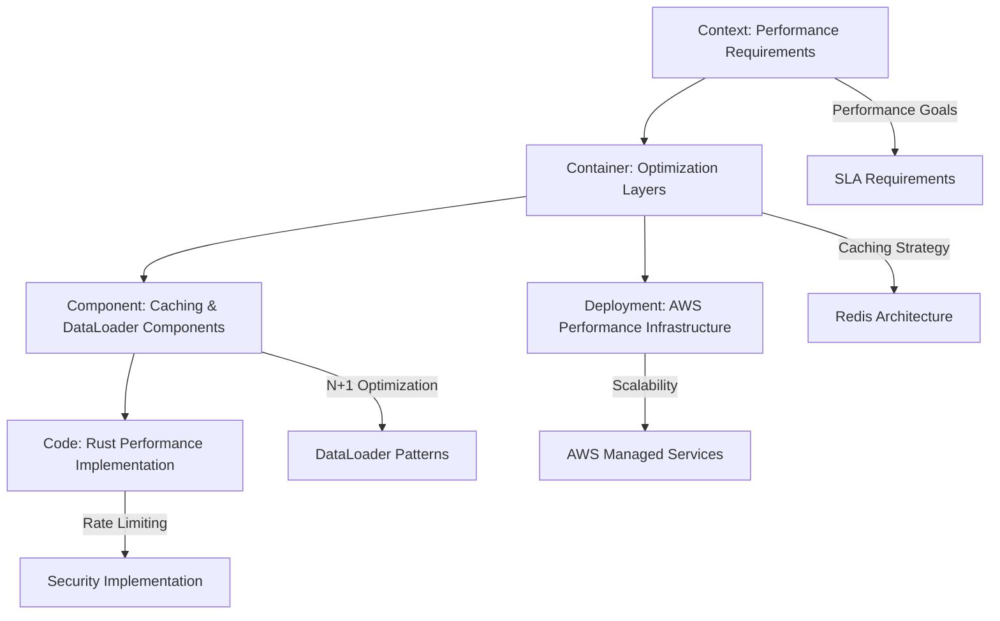

# Task 9: PlantUML Диаграммы - Индекс кеширования и оптимизации производительности

## 🎯 Обзор системы кеширования и оптимизации производительности

Этот документ служит **центральным индексом** для всех PlantUML диаграмм Task 9, демонстрирующих comprehensive систему кеширования и оптимизации производительности для GraphQL федерации Auto.ru. Каждая диаграмма представляет различный уровень архитектурной детализации оптимизации - от высокоуровневых требований производительности до конкретной реализации кеширования и DataLoader.

## 📊 Архитектурные уровни C4 Model для Performance Optimization

### 🌐 Level 1: Context Diagram - Контекст оптимизации производительности
**Файл диаграммы:** [`C4_ARCHITECTURE_CONTEXT.puml`](./C4_ARCHITECTURE_CONTEXT.puml)

**Что показывает:**
- Взаимодействие пользователей с оптимизированной системой
- Интеграцию с Redis кластером и performance monitoring
- Rate limiting и security компоненты для защиты от злоупотреблений
- Data access optimization через DataLoader и оптимизированную БД

**Ключевые системы:**
- Auto.ru Performance-Optimized Federation
- Performance & Monitoring Infrastructure (Redis, Query Analyzer)
- Data Access Optimization (DataLoader, Optimized Database)
- Rate Limiting & Security (Rate Limiter, Security Monitor)

**Архитектурная ценность:**
- Демонстрирует как performance optimization интегрируется в общую архитектуру
- Показывает взаимодействие между кешированием, rate limiting и мониторингом
- Определяет границы системы оптимизации производительности

---

### 🏗️ Level 2: Container Diagram - Контейнерная архитектура оптимизации
**Файл диаграммы:** [`C4_ARCHITECTURE_CONTAINER.puml`](./C4_ARCHITECTURE_CONTAINER.puml)

**Что показывает:**
- Детальную архитектуру слоев оптимизации производительности
- Caching Layer с Redis, Cache Manager и Cache Invalidator
- Performance Optimization Layer с DataLoader и Query Optimizer
- Rate Limiting & Security Layer с анализом сложности запросов

**Архитектурные слои:**
- **Caching Layer:** Redis Cache + Cache Manager + Cache Invalidator
- **Performance Optimization Layer:** DataLoader Service + Query Optimizer + Connection Pool Manager
- **Rate Limiting & Security Layer:** Rate Limiter + Query Complexity Analyzer + Security Guard
- **Instrumented Application Layer:** UGC GraphQL Server (Optimized) + Performance Middleware

**Технологические стеки:**
- Redis Cluster Mode для distributed caching
- Rust async-graphql DataLoader для N+1 optimization
- Token bucket алгоритм для rate limiting
- Prometheus для performance metrics

---

### ⚙️ Level 3: Component Diagram - Компонентная архитектура оптимизации
**Файл диаграммы:** [`C4_ARCHITECTURE_COMPONENT.puml`](./C4_ARCHITECTURE_COMPONENT.puml)

**Что показывает:**
- Внутреннюю структуру каждого performance слоя на уровне компонентов
- Redis integration компоненты (Client, Key Generator, Serializer)
- DataLoader batch loading система (Registry, Scheduler, Deduplicator)
- Query complexity analysis компоненты (AST Analyzer, Calculator, Limiter)

**Основные группы компонентов:**
- **Caching Components:** Redis Integration + Cache Strategies + Invalidation System
- **DataLoader Components:** Batch Loading System + Query Optimization
- **Rate Limiting Components:** Complexity Analysis + Rate Control + Security Monitoring
- **Performance Monitoring:** Metrics Collection + Profiling System

**Паттерны взаимодействия:**
- Cache-first pattern для query results
- Batch loading pattern для N+1 prevention
- Token bucket pattern для rate limiting
- Event-driven pattern для cache invalidation

---

### 💻 Level 4: Code Diagram - Реализация оптимизации
**Файл диаграммы:** [`C4_ARCHITECTURE_CODE.puml`](./C4_ARCHITECTURE_CODE.puml)

**Что показывает:**
- Конкретную реализацию оптимизации на уровне Rust кода
- Структуры данных для кеширования (CacheConfig, CacheService)
- DataLoader implementation для batch loading
- Rate limiting и query complexity analysis код

**Ключевые реализации:**
- **CacheConfig & CacheService:** Redis интеграция с connection pooling
- **ReviewDataLoader & BatchLoader:** N+1 optimization с deduplication
- **RateLimiter & QueryComplexityAnalyzer:** защита от злоупотреблений
- **PerformanceMetrics & CacheInvalidator:** мониторинг и управление кешем
- **OptimizedResolver & PerformanceMiddleware:** интеграция в GraphQL pipeline

**Практические примеры:**
```rust
// Cache-first resolver pattern
let cache_key = CacheKeyBuilder::query_key("reviews", &variables, user_id);
if let Some(cached) = cache_service.get(&cache_key).await? {
    return Ok(cached);
}
let result = dataloader.load(keys).await?;
cache_service.set(&cache_key, &result, ttl).await?;
```

---

### 🚀 Level 5: Deployment Diagram - Production инфраструктура оптимизации
**Файл диаграммы:** [`C4_ARCHITECTURE_DEPLOYMENT.puml`](./C4_ARCHITECTURE_DEPLOYMENT.puml)

**Что показывает:**
- Production-ready инфраструктуру оптимизации в AWS облаке
- Redis кластеры и ElastiCache интеграцию для distributed caching
- Performance monitoring и analytics инфраструктуру
- Development environment для тестирования производительности

**Инфраструктурные компоненты:**
- **AWS Compute:** EKS кластеры с performance-optimized pods
- **Caching Infrastructure:** Redis Cluster + ElastiCache + CloudFront edge caching
- **Database Optimization:** RDS с Performance Insights + Read Replicas + RDS Proxy
- **Monitoring Stack:** CloudWatch + Grafana + Jaeger для performance tracing

**Production паттерны:**
- Multi-AZ Redis deployment для high availability
- Connection pooling через RDS Proxy
- Edge caching через CloudFront
- Performance monitoring через CloudWatch и custom metrics

---

## 🔄 Навигация между диаграммами оптимизации

### Рекомендуемый порядок изучения оптимизации:

1. **Context Diagram** - понимание требований производительности и архитектурного контекста
2. **Container Diagram** - изучение слоев оптимизации и их взаимодействия
3. **Component Diagram** - детальное понимание компонентов кеширования и DataLoader
4. **Code Diagram** - конкретная реализация оптимизации в Rust коде
5. **Deployment Diagram** - production развертывание с AWS managed services

### Связи между диаграммами оптимизации:



## 🎯 Практическое применение диаграмм

### Для Performance Engineers:
- **Context & Container:** Понимание архитектуры оптимизации и integration points
- **Component & Code:** Детальная реализация кеширования и DataLoader для optimization
- **Deployment:** Production infrastructure для performance scaling

### Для Backend разработчиков:
- **Component & Code:** Паттерны кеширования и N+1 optimization
- **Container:** Интеграция с Redis и performance middleware
- **Deployment:** Understanding production performance constraints

### Для DevOps/SRE:
- **Container & Deployment:** Infrastructure requirements для performance optimization
- **Component:** Monitoring компоненты для performance tracking
- **Code:** Understanding instrumentation для troubleshooting performance issues

### Для Архитекторов:
- **Context:** Performance architecture decisions и trade-offs
- **Container & Component:** Optimization patterns и scalability considerations
- **Deployment:** Production readiness и operational requirements

## 📋 Чек-лист реализации оптимизации

### Phase 1: Базовое кеширование
- [ ] Изучить Context и Container диаграммы для понимания caching strategy
- [ ] Реализовать Redis integration (Code Diagram)
- [ ] Настроить cache key generation и TTL policies
- [ ] Развернуть локальный Redis для development (Deployment Diagram)

### Phase 2: DataLoader оптимизация
- [ ] Внедрить DataLoader для N+1 prevention (Component & Code)
- [ ] Оптимизировать SQL queries с batch loading
- [ ] Настроить connection pooling (Container & Deployment)
- [ ] Добавить performance monitoring для DataLoader efficiency

### Phase 3: Rate Limiting и Security
- [ ] Реализовать query complexity analysis (Code Diagram)
- [ ] Настроить rate limiting с token bucket algorithm
- [ ] Добавить security guards против abuse (Component Diagram)
- [ ] Интегрировать с monitoring и alerting

### Phase 4: Production Optimization
- [ ] Развернуть Redis Cluster в AWS (Deployment Diagram)
- [ ] Настроить ElastiCache для managed caching
- [ ] Оптимизировать RDS с Performance Insights
- [ ] Провести load testing и performance tuning

## 🔗 Дополнительные ресурсы

### Performance Optimization Patterns:
- **Cache-Aside Pattern:** Application manages cache explicitly
- **Write-Through Pattern:** Cache updated synchronously with database
- **Write-Behind Pattern:** Cache updated asynchronously
- **Circuit Breaker Pattern:** Prevent cascade failures in caching layer

### Monitoring и Metrics:
```rust
// Key performance indicators
cache_hit_rate{cache_type="query_result"} > 0.8  // Target 80%+ hit rate
dataloader_batch_efficiency{loader="review"} > 0.9  // 90%+ batch efficiency
query_complexity_avg{operation="query"} < 50  // Average complexity under 50
rate_limit_violations{user_type="anonymous"} < 0.01  // <1% violation rate
```

## 🎉 Заключение

Эти диаграммы представляют comprehensive подход к оптимизации производительности GraphQL федерации. Они обеспечивают:

- **Systematic Performance Optimization** через caching, DataLoader и rate limiting
- **Production-Ready Architecture** с AWS managed services и high availability
- **Practical Implementation Guidance** с конкретными Rust примерами
- **Operational Excellence** с comprehensive monitoring и alerting

Используйте эти диаграммы как roadmap для создания высокопроизводительной GraphQL федерации, способной обрабатывать enterprise-scale нагрузки с optimal user experience.