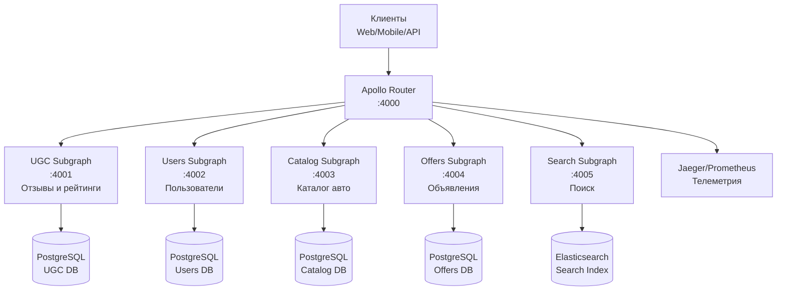

# Документ дизайна

## Обзор

Данный дизайн описывает федеративную GraphQL-архитектуру для Auto.ru, построенную на Apollo Router с подграфами на Rust. Система демонстрирует постепенную миграцию с монолитных REST API к федеративной экосистеме, начиная с UGC подграфа для отзывов и рейтингов.

Архитектура обеспечивает:
- Типобезопасность на всех уровнях благодаря Rust
- Независимое развитие доменов
- Обратную совместимость с существующими клиентами
- Горизонтальное масштабирование
- Комплексную observability

## Архитектура

### Высокоуровневая архитектура



### Федеративная схема

Система использует Apollo Federation 2.0 с следующими ключевыми типами:

```graphql
# Базовые типы, определенные в разных подграфах
type User @key(fields: "id") {
  id: ID!
  name: String!
  email: String!
}

type Offer @key(fields: "id") {
  id: ID!
  title: String!
  price: Int!
  # Расширяется в UGC подграфе
}

# Расширение в UGC подграфе
extend type Offer @key(fields: "id") {
  id: ID! @external
  reviews: [Review!]!
  averageRating: Float
  reviewsCount: Int!
}
```
## Компоненты и интерфейсы

### 1. Apollo Router

**Технологии:** Apollo Router (Rust), YAML конфигурация
**Порт:** 4000
**Ответственность:**
- Композиция супер-схемы из подграфов
- Планирование и выполнение федеративных запросов
- Аутентификация и авторизация на уровне шлюза
- Сбор телеметрии и метрик
- Rate limiting и защита от DDoS

**Конфигурация:**
```yaml
supergraph:
  listen: 0.0.0.0:4000
  introspection: true
  
subgraphs:
  ugc:
    routing_url: http://ugc-service:4001/graphql
    timeout: 30s
  users:
    routing_url: http://users-service:4002/graphql
    timeout: 30s
  # ... другие подграфы

telemetry:
  metrics:
    prometheus:
      enabled: true
  tracing:
    jaeger:
      endpoint: http://jaeger:14268/api/traces
```

### 2. UGC Подграф (User Generated Content)

**Технологии:** async-graphql, axum, sqlx, PostgreSQL
**Порт:** 4001
**Ответственность:**
- Управление отзывами и рейтингами
- Валидация пользовательского контента
- Модерация и фильтрация
- Агрегация рейтингов

**GraphQL Schema:**
```graphql
type Review @key(fields: "id") {
  id: ID!
  offerId: ID!
  authorId: ID!
  rating: Int! # 1-5
  text: String!
  createdAt: DateTime!
  updatedAt: DateTime!
  isModerated: Boolean!
  
  # Федеративные связи
  offer: Offer!
  author: User!
}

extend type Offer @key(fields: "id") {
  id: ID! @external
  reviews(first: Int, after: String): ReviewConnection!
  averageRating: Float
  reviewsCount: Int!
}

extend type User @key(fields: "id") {
  id: ID! @external
  reviews(first: Int, after: String): ReviewConnection!
}
```

### 3. Users Подграф

**Технологии:** async-graphql, axum, sqlx, PostgreSQL
**Порт:** 4002
**Ответственность:**
- Управление профилями пользователей
- Аутентификация и авторизация
- Персональные данные (с соблюдением GDPR)

### 4. Offers Подграф

**Технологии:** async-graphql, axum, sqlx, PostgreSQL
**Порт:** 4004
**Ответственность:**
- Управление объявлениями о продаже авто
- Фотографии и описания
- Статусы объявлений
- Интеграция с каталогом

### 5. Catalog Подграф

**Технологии:** async-graphql, axum, sqlx, PostgreSQL
**Порт:** 4003
**Ответственность:**
- Справочник марок и моделей автомобилей
- Технические характеристики
- Комплектации и опции

### 6. Search Подграф

**Технологии:** async-graphql, axum, elasticsearch-rs
**Порт:** 4005
**Ответственность:**
- Полнотекстовый поиск по объявлениям
- Фасетный поиск и фильтрация
- Автодополнение и подсказки
- Персонализированные рекомендации## Модел
и данных

### UGC Подграф - База данных отзывов

```sql
-- Таблица отзывов
CREATE TABLE reviews (
    id UUID PRIMARY KEY DEFAULT gen_random_uuid(),
    offer_id UUID NOT NULL,
    author_id UUID NOT NULL,
    rating INTEGER NOT NULL CHECK (rating >= 1 AND rating <= 5),
    text TEXT NOT NULL,
    created_at TIMESTAMPTZ NOT NULL DEFAULT NOW(),
    updated_at TIMESTAMPTZ NOT NULL DEFAULT NOW(),
    is_moderated BOOLEAN NOT NULL DEFAULT FALSE,
    moderation_status VARCHAR(20) DEFAULT 'pending',
    
    -- Индексы для производительности
    INDEX idx_reviews_offer_id (offer_id),
    INDEX idx_reviews_author_id (author_id),
    INDEX idx_reviews_created_at (created_at DESC),
    INDEX idx_reviews_rating (rating)
);

-- Таблица агрегированных рейтингов для производительности
CREATE TABLE offer_ratings (
    offer_id UUID PRIMARY KEY,
    average_rating DECIMAL(3,2) NOT NULL,
    reviews_count INTEGER NOT NULL DEFAULT 0,
    rating_distribution JSONB, -- {1: 5, 2: 10, 3: 20, 4: 30, 5: 35}
    updated_at TIMESTAMPTZ NOT NULL DEFAULT NOW()
);
```

### Rust структуры данных

```rust
use serde::{Deserialize, Serialize};
use sqlx::FromRow;
use uuid::Uuid;
use chrono::{DateTime, Utc};

#[derive(Debug, Clone, FromRow, Serialize, Deserialize)]
pub struct Review {
    pub id: Uuid,
    pub offer_id: Uuid,
    pub author_id: Uuid,
    pub rating: i32,
    pub text: String,
    pub created_at: DateTime<Utc>,
    pub updated_at: DateTime<Utc>,
    pub is_moderated: bool,
    pub moderation_status: ModerationStatus,
}

#[derive(Debug, Clone, Serialize, Deserialize, sqlx::Type)]
#[sqlx(type_name = "varchar", rename_all = "lowercase")]
pub enum ModerationStatus {
    Pending,
    Approved,
    Rejected,
    Flagged,
}

#[derive(Debug, Clone, FromRow)]
pub struct OfferRating {
    pub offer_id: Uuid,
    pub average_rating: rust_decimal::Decimal,
    pub reviews_count: i32,
    pub rating_distribution: serde_json::Value,
    pub updated_at: DateTime<Utc>,
}
```

### GraphQL Input Types

```rust
use async_graphql::{InputObject, SimpleObject};

#[derive(InputObject)]
pub struct CreateReviewInput {
    pub offer_id: Uuid,
    pub rating: i32,
    pub text: String,
}

#[derive(InputObject)]
pub struct UpdateReviewInput {
    pub rating: Option<i32>,
    pub text: Option<String>,
}

#[derive(InputObject)]
pub struct ReviewsFilter {
    pub offer_id: Option<Uuid>,
    pub author_id: Option<Uuid>,
    pub min_rating: Option<i32>,
    pub max_rating: Option<i32>,
    pub moderated_only: Option<bool>,
}
```## Обработка
 ошибок

### Стратегия обработки ошибок

1. **Типизированные ошибки на уровне Rust:**
```rust
use thiserror::Error;

#[derive(Error, Debug)]
pub enum UgcError {
    #[error("Review not found: {id}")]
    ReviewNotFound { id: Uuid },
    
    #[error("Unauthorized: user {user_id} cannot access review {review_id}")]
    Unauthorized { user_id: Uuid, review_id: Uuid },
    
    #[error("Validation error: {message}")]
    ValidationError { message: String },
    
    #[error("Database error: {0}")]
    DatabaseError(#[from] sqlx::Error),
    
    #[error("External service error: {service}")]
    ExternalServiceError { service: String },
}
```

2. **GraphQL Error Extensions:**
```rust
impl From<UgcError> for async_graphql::Error {
    fn from(err: UgcError) -> Self {
        let mut error = async_graphql::Error::new(err.to_string());
        
        match err {
            UgcError::ReviewNotFound { id } => {
                error = error.extend_with(|_, e| {
                    e.set("code", "REVIEW_NOT_FOUND");
                    e.set("reviewId", id.to_string());
                });
            }
            UgcError::Unauthorized { user_id, review_id } => {
                error = error.extend_with(|_, e| {
                    e.set("code", "UNAUTHORIZED");
                    e.set("userId", user_id.to_string());
                    e.set("reviewId", review_id.to_string());
                });
            }
            // ... другие варианты
        }
        
        error
    }
}
```

3. **Circuit Breaker для внешних сервисов:**
```rust
use circuit_breaker::CircuitBreaker;

pub struct ExternalServiceClient {
    client: reqwest::Client,
    circuit_breaker: CircuitBreaker,
}

impl ExternalServiceClient {
    pub async fn get_user(&self, user_id: Uuid) -> Result<User, UgcError> {
        self.circuit_breaker
            .call(|| async {
                let response = self.client
                    .get(&format!("/users/{}", user_id))
                    .send()
                    .await?;
                
                if response.status().is_success() {
                    Ok(response.json::<User>().await?)
                } else {
                    Err(UgcError::ExternalServiceError {
                        service: "users".to_string(),
                    })
                }
            })
            .await
            .map_err(|_| UgcError::ExternalServiceError {
                service: "users".to_string(),
            })
    }
}
```

### Graceful Degradation

При недоступности подграфов система должна:
- Возвращать частичные данные где возможно
- Кешировать критически важную информацию
- Предоставлять fallback-значения
- Логировать ошибки для мониторинга

```rust
// Пример graceful degradation для получения пользователя
async fn get_user_with_fallback(&self, user_id: Uuid) -> Option<User> {
    match self.users_client.get_user(user_id).await {
        Ok(user) => Some(user),
        Err(err) => {
            tracing::warn!("Failed to fetch user {}: {}", user_id, err);
            
            // Попытка получить из кеша
            if let Some(cached_user) = self.cache.get_user(user_id).await {
                Some(cached_user)
            } else {
                // Возвращаем минимальную информацию
                Some(User {
                    id: user_id,
                    name: "Пользователь".to_string(),
                    email: "".to_string(),
                })
            }
        }
    }
}
```## Стратеги
я тестирования

### 1. Unit тесты

Каждый подграф должен иметь комплексные unit тесты:

```rust
#[cfg(test)]
mod tests {
    use super::*;
    use sqlx::PgPool;
    use testcontainers::*;
    
    #[tokio::test]
    async fn test_create_review() {
        let pool = setup_test_db().await;
        let service = ReviewService::new(pool);
        
        let input = CreateReviewInput {
            offer_id: Uuid::new_v4(),
            rating: 5,
            text: "Отличный автомобиль!".to_string(),
        };
        
        let review = service.create_review(input, user_id).await.unwrap();
        
        assert_eq!(review.rating, 5);
        assert_eq!(review.text, "Отличный автомобиль!");
        assert_eq!(review.author_id, user_id);
    }
    
    #[tokio::test]
    async fn test_invalid_rating() {
        let pool = setup_test_db().await;
        let service = ReviewService::new(pool);
        
        let input = CreateReviewInput {
            offer_id: Uuid::new_v4(),
            rating: 6, // Невалидный рейтинг
            text: "Тест".to_string(),
        };
        
        let result = service.create_review(input, user_id).await;
        assert!(matches!(result, Err(UgcError::ValidationError { .. })));
    }
}
```

### 2. Интеграционные тесты

Тестирование взаимодействия между подграфами:

```rust
#[tokio::test]
async fn test_federated_query() {
    let router = setup_test_router().await;
    
    let query = r#"
        query GetOfferWithReviews($offerId: ID!) {
            offer(id: $offerId) {
                id
                title
                reviews(first: 5) {
                    edges {
                        node {
                            rating
                            text
                            author {
                                name
                            }
                        }
                    }
                }
                averageRating
            }
        }
    "#;
    
    let response = router
        .execute_query(query, json!({ "offerId": "test-offer-id" }))
        .await;
    
    assert!(response.errors.is_empty());
    assert!(response.data.is_some());
}
```

### 3. Contract тесты

Использование Pact или аналогичных инструментов для тестирования контрактов между подграфами:

```rust
// Контракт для Users подграфа
#[tokio::test]
async fn test_user_service_contract() {
    let mock_server = MockServer::start().await;
    
    Mock::given(method("GET"))
        .and(path_regex(r"/users/[0-9a-f-]+"))
        .respond_with(ResponseTemplate::new(200)
            .set_body_json(json!({
                "id": "user-123",
                "name": "Иван Иванов",
                "email": "ivan@example.com"
            })))
        .mount(&mock_server)
        .await;
    
    let client = UsersClient::new(mock_server.uri());
    let user = client.get_user(Uuid::parse_str("user-123").unwrap()).await.unwrap();
    
    assert_eq!(user.name, "Иван Иванов");
}
```

### 4. End-to-End тесты

Полные сценарии использования через GraphQL API:

```rust
#[tokio::test]
async fn test_review_creation_flow() {
    let test_env = setup_full_environment().await;
    
    // 1. Создание пользователя
    let user = test_env.create_test_user().await;
    
    // 2. Создание объявления
    let offer = test_env.create_test_offer().await;
    
    // 3. Создание отзыва через GraphQL
    let mutation = r#"
        mutation CreateReview($input: CreateReviewInput!) {
            createReview(input: $input) {
                id
                rating
                text
                author {
                    name
                }
                offer {
                    title
                    averageRating
                }
            }
        }
    "#;
    
    let response = test_env
        .execute_authenticated_query(
            mutation,
            json!({
                "input": {
                    "offerId": offer.id,
                    "rating": 5,
                    "text": "Отличная машина!"
                }
            }),
            user.token
        )
        .await;
    
    assert!(response.errors.is_empty());
    let review = response.data["createReview"].as_object().unwrap();
    assert_eq!(review["rating"], 5);
}
```

### 5. Performance тесты

Нагрузочное тестирование федеративных запросов:

```rust
use criterion::{black_box, criterion_group, criterion_main, Criterion};

fn benchmark_federated_query(c: &mut Criterion) {
    let rt = tokio::runtime::Runtime::new().unwrap();
    let router = rt.block_on(setup_test_router());
    
    c.bench_function("complex_federated_query", |b| {
        b.to_async(&rt).iter(|| async {
            let query = r#"
                query ComplexQuery {
                    offers(first: 10) {
                        edges {
                            node {
                                id
                                title
                                reviews(first: 3) {
                                    edges {
                                        node {
                                            rating
                                            author {
                                                name
                                            }
                                        }
                                    }
                                }
                            }
                        }
                    }
                }
            "#;
            
            black_box(router.execute_query(query, json!({})).await)
        })
    });
}

criterion_group!(benches, benchmark_federated_query);
criterion_main!(benches);
```## Безо
пасность и авторизация

### 1. JWT Authentication

```rust
use jsonwebtoken::{decode, DecodingKey, Validation, Algorithm};
use serde::{Deserialize, Serialize};

#[derive(Debug, Serialize, Deserialize)]
pub struct Claims {
    pub sub: String,      // User ID
    pub name: String,     // User name
    pub email: String,    // User email
    pub roles: Vec<String>, // User roles
    pub exp: usize,       // Expiration time
}

pub struct AuthService {
    decoding_key: DecodingKey,
    validation: Validation,
}

impl AuthService {
    pub fn new(secret: &str) -> Self {
        Self {
            decoding_key: DecodingKey::from_secret(secret.as_ref()),
            validation: Validation::new(Algorithm::HS256),
        }
    }
    
    pub fn validate_token(&self, token: &str) -> Result<Claims, AuthError> {
        let token_data = decode::<Claims>(
            token,
            &self.decoding_key,
            &self.validation,
        )?;
        
        Ok(token_data.claims)
    }
}
```

### 2. Authorization Middleware

```rust
use axum::{
    extract::{Request, State},
    http::{HeaderMap, StatusCode},
    middleware::Next,
    response::Response,
};

pub async fn auth_middleware(
    State(auth_service): State<AuthService>,
    headers: HeaderMap,
    mut request: Request,
    next: Next,
) -> Result<Response, StatusCode> {
    let token = headers
        .get("authorization")
        .and_then(|h| h.to_str().ok())
        .and_then(|s| s.strip_prefix("Bearer "))
        .ok_or(StatusCode::UNAUTHORIZED)?;
    
    let claims = auth_service
        .validate_token(token)
        .map_err(|_| StatusCode::UNAUTHORIZED)?;
    
    // Добавляем пользовательский контекст в запрос
    request.extensions_mut().insert(UserContext {
        user_id: claims.sub.parse().unwrap(),
        name: claims.name,
        email: claims.email,
        roles: claims.roles,
    });
    
    Ok(next.run(request).await)
}
```

### 3. Field-level Authorization

```rust
use async_graphql::{Context, Guard, Result};

pub struct RequireRole {
    role: String,
}

impl RequireRole {
    pub fn new(role: impl Into<String>) -> Self {
        Self { role: role.into() }
    }
}

#[async_trait::async_trait]
impl Guard for RequireRole {
    async fn check(&self, ctx: &Context<'_>) -> Result<()> {
        let user_context = ctx.data::<UserContext>()?;
        
        if user_context.roles.contains(&self.role) {
            Ok(())
        } else {
            Err("Insufficient permissions".into())
        }
    }
}

// Использование в резолверах
#[Object]
impl Mutation {
    #[graphql(guard = "RequireRole::new(\"moderator\")")]
    async fn moderate_review(
        &self,
        ctx: &Context<'_>,
        review_id: Uuid,
        status: ModerationStatus,
    ) -> Result<Review> {
        // Только модераторы могут модерировать отзывы
        let service = ctx.data::<ReviewService>()?;
        service.moderate_review(review_id, status).await
    }
}
```

### 4. Rate Limiting

```rust
use governor::{Quota, RateLimiter};
use std::num::NonZeroU32;

pub struct RateLimitGuard {
    limiter: RateLimiter<String, governor::state::InMemoryState, governor::clock::DefaultClock>,
}

impl RateLimitGuard {
    pub fn new() -> Self {
        let quota = Quota::per_minute(NonZeroU32::new(100).unwrap());
        Self {
            limiter: RateLimiter::keyed(quota),
        }
    }
}

#[async_trait::async_trait]
impl Guard for RateLimitGuard {
    async fn check(&self, ctx: &Context<'_>) -> Result<()> {
        let user_context = ctx.data::<UserContext>()?;
        
        match self.limiter.check_key(&user_context.user_id.to_string()) {
            Ok(_) => Ok(()),
            Err(_) => Err("Rate limit exceeded".into()),
        }
    }
}
```

### 5. Data Privacy и GDPR

```rust
// Чувствительные поля скрываются от неавторизованных пользователей
#[Object]
impl User {
    async fn id(&self) -> &Uuid {
        &self.id
    }
    
    async fn name(&self) -> &str {
        &self.name
    }
    
    // Email доступен только самому пользователю или админам
    async fn email(&self, ctx: &Context<'_>) -> Result<Option<&str>> {
        let user_context = ctx.data::<UserContext>()?;
        
        if user_context.user_id == self.id || user_context.roles.contains(&"admin".to_string()) {
            Ok(Some(&self.email))
        } else {
            Ok(None)
        }
    }
    
    // Телефон доступен только самому пользователю
    async fn phone(&self, ctx: &Context<'_>) -> Result<Option<&str>> {
        let user_context = ctx.data::<UserContext>()?;
        
        if user_context.user_id == self.id {
            Ok(self.phone.as_deref())
        } else {
            Ok(None)
        }
    }
}
```

## Мониторинг и Observability

### 1. Distributed Tracing

```rust
use tracing::{info, instrument, Span};
use tracing_opentelemetry::OpenTelemetrySpanExt;

#[instrument(skip(self), fields(user_id = %user_id, offer_id = %input.offer_id))]
pub async fn create_review(
    &self,
    input: CreateReviewInput,
    user_id: Uuid,
) -> Result<Review, UgcError> {
    let span = Span::current();
    span.set_attribute("review.rating", input.rating as i64);
    
    info!("Creating review for offer {}", input.offer_id);
    
    // Валидация
    self.validate_review_input(&input).await?;
    
    // Сохранение в БД
    let review = self.repository.create_review(input, user_id).await?;
    
    // Обновление агрегированных рейтингов
    self.update_offer_rating(input.offer_id).await?;
    
    info!("Review created successfully: {}", review.id);
    Ok(review)
}
```

### 2. Metrics Collection

```rust
use prometheus::{Counter, Histogram, register_counter, register_histogram};

lazy_static! {
    static ref REVIEWS_CREATED: Counter = register_counter!(
        "reviews_created_total",
        "Total number of reviews created"
    ).unwrap();
    
    static ref REVIEW_CREATION_DURATION: Histogram = register_histogram!(
        "review_creation_duration_seconds",
        "Time spent creating reviews"
    ).unwrap();
}

pub async fn create_review(&self, input: CreateReviewInput, user_id: Uuid) -> Result<Review, UgcError> {
    let _timer = REVIEW_CREATION_DURATION.start_timer();
    
    let result = self.create_review_impl(input, user_id).await;
    
    if result.is_ok() {
        REVIEWS_CREATED.inc();
    }
    
    result
}
```

### 3. Health Checks

```rust
use axum::{extract::State, Json};
use serde_json::{json, Value};

pub async fn health_check(State(pool): State<PgPool>) -> Json<Value> {
    let db_status = match sqlx::query("SELECT 1").fetch_one(&pool).await {
        Ok(_) => "healthy",
        Err(_) => "unhealthy",
    };
    
    Json(json!({
        "status": if db_status == "healthy" { "healthy" } else { "unhealthy" },
        "database": db_status,
        "timestamp": chrono::Utc::now().to_rfc3339(),
        "version": env!("CARGO_PKG_VERSION")
    }))
}
```